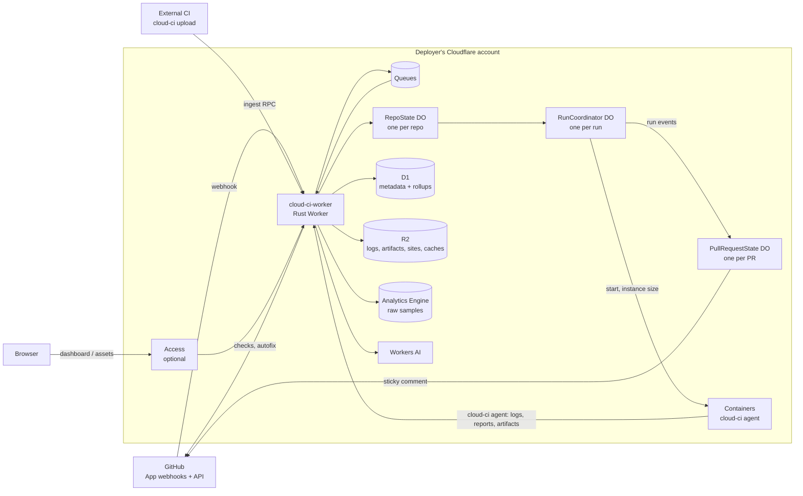

# Architecture

Status: **Proposed**. Nothing here is implemented yet; this describes the shape we intend to
build. Per-feature mechanics live in [`design/`](./design/), decisions and their reasons in
[`adr/`](./adr/).

## What cloud-ci is

A CI system you deploy into **your own Cloudflare account**. One deployment serves one GitHub
organization (or user) across any number of repositories. It does three jobs:

1. **Runs CI** on Cloudflare Containers, driven by `.cloud-ci/pipeline.yml` in each repo
   (*managed runs*).
2. **Accepts CI results from anywhere else** — GitHub Actions, Buildkite, a laptop — through an
   ingest API and the `cloud-ci` CLI (*external runs*).
3. **Turns both into one view**: a single PR comment, GitHub Check Runs, hosted HTML reports,
   analytics, runner rightsizing, and AI-assisted failure analysis.

Managed and external runs share one data model. Everything downstream of ingestion (comment,
analytics, AI, asset hosting) does not know or care which kind of run produced the data.

## System shape

## Packages

Monorepo following the protobuf-contract pattern ([ADR 0001](./adr/0001-monorepo-protobuf-contract.md)).
None exist yet; [roadmap](./roadmap.md) says when each arrives.

| Package | Language | Role |
| --- | --- | --- |
| `cloud-ci-proto` | protobuf | API contract source of truth: run/job/step/test/artifact model, ingest, query |
| `cloud-ci-proto-rust` | Rust | Generated bindings, imported as `cloud_ci_proto` |
| `cloud-ci-proto-typescript` | TypeScript | Generated bindings for the dashboard |
| `cloud-ci-core` | Rust (no `worker` dep) | Report parsers, merging, splitter, rightsizer — shared by Worker and CLI, tested natively |
| `cloud-ci-worker` | Rust → wasm32 | HTTP front door, webhooks, ingest, asset serving, queue consumers, Durable Objects, cron |
| `cloud-ci-cli` | Rust (native) | `cloud-ci` binary: `upload`, `split`, `merge`, `login`, `agent` |
| `cloud-ci-runner-image` | Dockerfile | Base container image that runs `cloud-ci agent` |
| `cloud-ci-web` | Svelte | Dashboard, served as Worker static assets |

The `agent` subcommand that executes jobs inside our containers uploads through **the same code
path** as `cloud-ci upload` in someone else's CI. That is deliberate: if BYO-CI ingestion
regresses, our own runs regress with it, so it cannot silently rot.

## Data model

| Concept | Identity | Lives in |
| --- | --- | --- |
| Repo | GitHub repo id (not name — renames happen) | D1 |
| Run | ULID; unique on (repo, sha, run key, attempt) | D1 row + `RunCoordinator` DO while active |
| Job | (run, job name) | D1 + DO |
| Shard | (job, index, total) | D1 + DO |
| Step | (job/shard, ordinal) | D1 |
| Report | (job/shard, kind) — junit, vitest, playwright, lcov, cobertura, timing, bench | parsed into D1 tables; raw in R2 |
| Artifact / site | (run, name) | R2 under `runs/{run}/artifacts/{name}/…` |
| Log | (job/shard, step) | R2, chunked |
| Metric sample | (job/shard, timestamp) | Analytics Engine; rolled up into D1 by cron |

### Run states

| State | Meaning | Terminal |
| --- | --- | --- |
| `queued` | Accepted, waiting on concurrency limits or container capacity | no |
| `running` | At least one job started | no |
| `merging` | All shards done, merge jobs/native merges in flight | no |
| `succeeded` | Every required job succeeded | yes |
| `failed` | A required job failed | yes |
| `cancelled` | Superseded by a newer push or cancelled by a user | yes |
| `abandoned` | External run never finalized before its deadline | yes |

External runs skip `queued`; they go straight to `running` on first upload.

## Core flows

### Managed run

1. GitHub `push`/`pull_request` webhook → Worker verifies signature, enqueues, returns 200
   immediately (GitHub's webhook timeout is short; all real work happens off the request).
2. Queue consumer fetches `.cloud-ci/pipeline.yml` at the commit sha, validates it, creates the
   run in D1, and hands it to the repo's `RepoState` DO, which applies concurrency rules
   (cancel-superseded, per-repo limits).
3. `RunCoordinator` DO for the run owns the job DAG. For each ready job it resolves the instance
   size (fixed, or chosen by the rightsizer for `runner: auto`), computes shard assignments, mints
   a short-lived job token, and starts a container.
4. Inside the container, `cloud-ci agent` pulls its job spec, runs steps, streams logs, samples
   cgroup CPU/memory, and uploads reports/artifacts through the ingest API.
5. On job completion the coordinator advances the DAG, runs merge barriers for shard groups,
   updates Check Runs, and notifies the `PullRequestState` of every PR whose head is this sha,
   which debounces and re-renders the sticky comment.
6. On run completion: post-run queue → analytics write, AI analysis (if enabled), final comment.

### External run

`cloud-ci upload` authenticates (GitHub Actions OIDC or API token), opens or joins a run keyed by
(repo, sha, run key, attempt), uploads reports/artifacts, and finalizes. From step 5 onward it is
the same path as a managed run. See [byo-ci](./design/byo-ci.md).

## Coordination invariants

- **Webhooks and uploads enqueue; coordinators decide.** Inputs record *that* something happened;
  the `RunCoordinator` re-reads its own state and decides what to do next. Duplicate webhook
  deliveries, retried uploads, and reordered queue messages are therefore harmless.
- **One writer per run, one writer per PR comment.** Only the run's `RunCoordinator` mutates
  run/job state and its Check Runs; D1 is its durable projection. Only the PR's
  `PullRequestState` edits that PR's sticky comment, since the comment aggregates many runs.
- **Every upload is idempotent** on (run, job/shard, report kind | artifact path, content hash).
- **Report HTML never shares an origin with the dashboard.** Hosted sites run arbitrary JS from
  the repo under test; serving them from the dashboard origin would hand that JS the user's
  session. See [assets](./design/assets.md).
- **GitHub is told, not asked.** We never block a run on a GitHub API call succeeding; Check Run
  and comment updates are retried from the coordinator's state, not from the event that caused
  them.

## Extension boundary

Two traits keep vendor specifics out of core logic:

| Trait | Implementations planned | Isolates |
| --- | --- | --- |
| `Forge` | GitHub | Webhook parsing, config fetch, checks, comments, permissions, autofix PRs |
| `Executor` | Cloudflare Containers | Start/stop, instance size, liveness; lets local `cloud-ci agent` runs and tests use a fake |

GitLab/Gitea support would be a second `Forge`, not a change to the coordinator.

## Cross-cutting design docs

| Doc | Covers |
| --- | --- |
| [pipeline-config](./design/pipeline-config.md) | `.cloud-ci/pipeline.yml` format |
| [pr-comment](./design/pr-comment.md) | Sticky PR comment, Check Runs, slash commands |
| [byo-ci](./design/byo-ci.md) | Ingest API, `cloud-ci upload`, external runs |
| [parallelization](./design/parallelization.md) | Sharding, test splitting, merging |
| [analytics](./design/analytics.md) | Metrics, insights, rightsizing/autoscaling |
| [ai](./design/ai.md) | Workers AI summaries, suggestions, autofix |
| [auth](./design/auth.md) | Access / GitHub OAuth, roles, machine tokens, GitHub App |
| [assets](./design/assets.md) | R2 artifact and HTML report hosting, caches |
