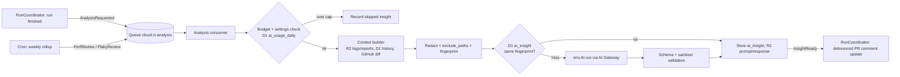

# AI insights and autofix

Status: Proposed

> The default model, token budgets, pricing, and GitHub API limits below are dated research notes and proposed defaults, not architecture invariants; re-check them at implementation time.

Related: [../architecture.md](../architecture.md), [./pr-comment.md](./pr-comment.md), [./analytics.md](./analytics.md), [./auth.md](./auth.md), [./settings.md](./settings.md), [./parallelization.md](./parallelization.md), [./byo-ci.md](./byo-ci.md), [./assets.md](./assets.md)

## Summary

cloud-ci uses Workers AI, through the `AI` binding in `cloud-ci-worker`, for four features:

1. **Failure summaries.** A short explanation of why a job or shard failed. It is built from the failing test output, the tail of the failing step's log, and the PR diff, and it is rendered in the PR comment and the dashboard.
2. **Flaky root-cause hints.** A classification plus explanation for tests that [./analytics.md](./analytics.md) has already marked flaky.
3. **Performance suggestions.** Deterministic rules over analytics rollups detect each issue. The model only explains and prioritizes the findings and proposes script edits (`ci.container`/`ci.shard` option changes).
4. **Autofix (optional).** A proposed patch, published as a suggested-changes review or as a separate fix PR. It is opt-in per repo, it requires a human trigger from someone with write permission, it never touches protected branches, and it never pushes to the PR branch unless the repo explicitly opts in.

All inference runs in the deployer's own Cloudflare account, through an optional AI Gateway in that same account. No third-party model provider is involved. The model is configurable. The default is `@cf/openai/gpt-oss-120b`.

## Goals

- Turn a red check into one actionable paragraph, without the reader opening logs.
- Keep the cost per run bounded and predictable, with hard daily caps that admins can configure.
- Treat every byte of repo, log, and PR content as untrusted input to the model.
- Treat model output as untrusted data. The worker never executes it. Autofix patches are executed only inside a verification container on a cloud-ci-owned branch.
- Work identically for `managed` and `external` runs wherever the inputs exist (see [./byo-ci.md](./byo-ci.md)).

## Non-goals

- External model providers (OpenAI, Anthropic, and others via AI Gateway). Not supported in v1; see Alternatives.
- Autonomous agents that iterate with tool calls inside containers. v1 autofix is single-shot generation plus verification.
- Using AI to detect flakiness or performance regressions. Detection is statistical and deterministic ([./analytics.md](./analytics.md)). AI only explains.
- Fine-tuning or LoRA adapters.
- Code review of passing PRs.

## User experience

### Enabling

AI is off by default for every repo. An admin (see [./auth.md](./auth.md): GitHub admin/maintain) enables it in the dashboard under repo Settings > AI. The settings are stored in D1 (`repo_ai_settings`). The repo's `.cloud-ci/settings.yml` can only narrow what the admin enabled, never widen it. Without this rule, a PR from any contributor could switch on autofix or push mode by editing a settings file.

| Setting (D1, admin only) | Values | Default |
| --- | --- | --- |
| `enabled` | bool | `false` |
| `summaries` | `off`, `pr` (PR runs only), `all` (also branch pushes) | `pr` |
| `flaky_hints` | bool | `true` |
| `perf_suggestions` | `off`, `weekly` | `weekly` |
| `autofix` | `off`, `suggest`, `pull_request` | `off` |
| `autofix_allow_push_to_pr_branch` | bool (requires `autofix != off`) | `false` |
| `autofix_on_forks` | `off`, `suggest` | `off` |
| `daily_neuron_cap` | integer | `20000` |
| `model_summary` / `model_flaky` / `model_perf` / `model_autofix` | Workers AI model id | see Model selection |

Repo-level narrowing in `.cloud-ci/settings.yml`, read from the base branch for fork PRs (schema in [./settings.md](./settings.md)):

```yaml
ai:
  summaries: true          # false disables summaries for this repo
  autofix: suggest         # may lower pull_request -> suggest -> off; never raise
  exclude_paths:           # never sent to the model (diff hunks and file reads)
    - "infra/secrets/**"
    - "**/*.pem"
  max_failures_summarized: 3   # may lower the per-run cap (5), never raise
```

### PR comment section

The summary is one section of the sticky comment ([./pr-comment.md](./pr-comment.md)). It is capped at 1,500 characters per failure and 5 failures, inside a `<details>` block, so the AI section stays well under GitHub's 65,536-character comment limit. That limit is documented only through API error messages ("body is too long (maximum is 65536 characters)"), observed in https://github.com/orgs/community/discussions/41331 (checked 2026-09-30).

```markdown
<details open><summary><b>Why it failed</b> (AI-generated, gpt-oss-120b)</summary>

**unit / shard 2 of 4**: `UserService > creates user`
Likely cause: `createUser` now awaits `hash()` (src/user.ts, changed in this PR, line 42),
but `test/mocks/hash.ts` returns a plain string, so `user.passwordHash` is a Promise.
Next step: make the mock return `Promise.resolve("x")`.
Confidence: high. Evidence: assertion diff, stack frame src/user.ts:44.

<sub>Generated from test output, log tail and diff. May be wrong. [Inputs](https://ci.example.com/runs/123/ai/abc) · `/cloud-ci explain` to regenerate · `/cloud-ci autofix` to request a fix</sub>
</details>
```

### Commands

These are `issue_comment` commands, parsed by the worker. The permission is derived from the commenter's GitHub permission on the repo, exactly as in [./auth.md](./auth.md).

| Command | Effect | Minimum role |
| --- | --- | --- |
| `/cloud-ci explain` | Regenerate the summaries for the latest run (skips the cache) | operator (write) |
| `/cloud-ci autofix` | Generate a fix in the repo's configured mode | operator (write) |
| `/cloud-ci autofix suggest` | Force suggest mode, even if `pull_request` is configured | operator (write) |
| `/cloud-ci autofix push` | Push to the PR branch; works only if `autofix_allow_push_to_pr_branch` | operator (write) |

The dashboard exposes the same actions as buttons on a failed job, gated the same way.

The PR comment's task-list checkboxes ([./pr-comment.md](./pr-comment.md)) offer the same actions without typing a command: checking `- [ ] Autofix` triggers autofix in the repo's configured mode, detected via the `issue_comment.edited` webhook with the same permission check, and the checkbox is reset once handled.

## Design

### Pipeline

AI work never runs on the webhook or ingest request path. When a run reaches a terminal state, `RunCoordinator` enqueues one `AnalysisRequested` message onto the `cloud-ci-analysis` Queue. For flaky hints and perf suggestions, the enqueue comes from the cron rollup in [./analytics.md](./analytics.md) instead.



Consumer settings: `max_batch_size = 1`, because each message makes a model call that can take several seconds. `max_retries = 3`, and failures go to a dead-letter queue, `cloud-ci-analysis-dlq`. A 429 from Workers AI or the gateway is retried with the message's `delaySeconds` backoff (30s, 120s, 600s). `[unverified]` These are workers-rs Queue consumer knobs; how to express them depends on wrangler config, not code.

### Failure summaries: inputs

The context builder collects inputs in priority order and stops when the budget is full. Everything is read from data cloud-ci already stores. The one exception is the PR diff, which is fetched from GitHub with the installation token (`GET /repos/{owner}/{repo}/pulls/{n}` with the `application/vnd.github.v3.diff` media type, documented at https://docs.github.com/en/rest/pulls/reviews, checked 2026-09-30).

| Input | Source | Selection |
| --- | --- | --- |
| Failing test cases | Merged report in D1/R2 (JUnit, Vitest JSON, Playwright JSON) | Up to 5 distinct failure fingerprints per run. Each one includes: test id, file, assertion message, the first 30 stack frames with `node_modules`/stdlib frames collapsed, and the last 2 KB of captured stdout/stderr. |
| Log tail | R2 log of the failing step | The last 400 lines, ANSI-stripped, consecutive duplicates collapsed (`[x37]`), timestamps removed. If no test report exists (build/lint failure), this is the primary input and gets the test-case budget too. |
| Diff | GitHub PR diff for the head sha (push runs: compare against the parent) | Hunks are ranked: (1) files that appear in stack frames, (2) files named in the log tail, (3) test files, (4) everything else. Lockfiles, generated files, and `exclude_paths` matches are dropped. |
| Run metadata | D1 | Job name, shard index, runner type, exit code, OOM flag, retry count, and whether the test is known-flaky (from [./analytics.md](./analytics.md)). |
| Prior history | D1 test history | "Passed on base branch at sha X", "first failure in this PR", "failed in 3 of the last 20 runs". |

**Failure fingerprint**: `sha256(test_id || normalize(message) || top 5 non-library frames)`. `normalize` replaces numbers, hex addresses, UUIDs, temp paths, and durations with placeholders. Shards that fail with the same fingerprint are summarized once. A run with more than 20 failing tests, or more than 3 failing jobs that share a log-tail signature, is treated as a systemic failure. That case gets one summary over the 3 most frequent fingerprints, not one per test.

### Token budgeting

Workers AI does not expose a tokenizer we can run in wasm `[unverified]`. The builder therefore estimates tokens as `ceil(utf8_bytes / 3.2)`, a conservative figure for code and logs `[unverified: heuristic, to be calibrated against usage.prompt_tokens returned by the model]`. Each input class gets a fixed budget. Unused budget flows down the priority list.

| Slot | Default tokens |
| --- | --- |
| System prompt + output schema | 1,200 |
| Run metadata + history | 600 |
| Failing test cases | 8,000 |
| Log tail | 7,000 |
| Diff | 7,000 |
| **Input total (`max_input_tokens`)** | **23,800** |
| Output (`max_tokens`) | 1,200 |

The default input budget is about 19% of `gpt-oss-120b`'s 128,000-token context window (https://developers.cloudflare.com/workers-ai/models/gpt-oss-120b/, checked 2026-09-30). The headroom is deliberate: cost and latency scale with input, and the marginal value of the 50th log line is low. Before each call, the builder checks the selected model's context window against a static table compiled into the worker. If a configured model has a smaller window, the budgets scale down proportionally. For example, `@cf/qwen/qwen2.5-coder-32b-instruct` has 32,768 tokens and `@cf/meta/llama-3.3-70b-instruct-fp8-fast` has 24,000, per their model pages (checked 2026-09-30).

Truncation is structural, never mid-line. Stack traces keep their head and tail. Log tails keep their end. Diffs drop whole hunks, replacing each dropped hunk with `[hunk omitted: path, +N/-M]`.

### Prompting and output contract

Every call uses the chat `messages` format with `temperature: 0.2` and requests JSON through `response_format` (the parameter is listed on the gpt-oss-120b model page, checked 2026-09-30; whether each alternative model enforces the JSON schema is `[unverified]`). The worker validates the output against a fixed schema per kind. Failure summaries use this schema:

```json
{
  "headline": "string <= 140 chars",
  "likely_cause": "string <= 600 chars",
  "evidence": [{"kind": "stack|log|diff|history", "ref": "src/user.ts:44"}],
  "next_step": "string <= 300 chars",
  "confidence": "low|medium|high",
  "category": "test_assertion|build|dependency|infra|timeout|oom|flaky|unknown"
}
```

Each `evidence.ref` must name a path or line that occurs in the input. References that don't are dropped, and if every reference is dropped, `confidence` is forced to `low`. If the output fails schema validation, the call is retried once with the validation error appended. A second failure stores `status = invalid_output`, and the PR comment shows nothing for that failure.

Prompt templates live in `cloud-ci-worker` as versioned constants (`PROMPT_SUMMARY_V1`, and so on). `prompt_version` is part of the cache key and of the stored insight, so a template change never serves stale cached output.

### Flaky root-cause hints

Trigger: the analytics rollup marks a test flaky (it failed and passed on the same sha, or its flip rate crossed the threshold in [./analytics.md](./analytics.md)), and either no hint exists or 5 new flaky occurrences have accumulated since the last hint. The hint is recomputed at most weekly per test.

Inputs (budget of 12,000 tokens): up to 5 failure messages and stack traces from different occurrences; the duration distribution (p50, p95, and max of passes vs. failures); shard placement and preceding tests in the same shard (order dependence); runner instance type and the peak CPU/memory samples during failures; time-of-day histogram; the test source file (`exclude_paths` respected), fetched from GitHub at the base branch head.

Output categories: `timeout_or_timing`, `order_dependence`, `shared_state`, `external_network`, `resource_starvation`, `nondeterminism` (random/time/locale), `unknown`. Each hint carries an explanation of at most 400 characters and one concrete suggestion. Hints appear in the dashboard's flaky-test list and in the PR comment next to any known-flaky failure.

Default model: `@cf/openai/gpt-oss-20b` ($0.20/M input, $0.30/M output, 128,000-token context, https://developers.cloudflare.com/workers-ai/platform/pricing/, checked 2026-09-30). Classification over pre-aggregated statistics does not need the larger model.

### Performance suggestions

The weekly cron runs a deterministic rule set over the D1 rollups from [./analytics.md](./analytics.md). Each rule emits a finding with the numbers attached:

| Rule | Example finding |
| --- | --- |
| Over-provisioned runner | `job build`: p95 CPU 18%, p95 mem 1.1 GiB on `standard-3`; `standard-1` fits |
| Shard imbalance | `e2e`: slowest shard 2.4x the median; split is `count`, timing data available |
| Cache inefficiency | `deps` cache hit rate 41% over 120 runs; key includes `${{ sha }}`-like volatile input |
| Critical-path step | `lint` sits on the critical path for 31% of the wall time, with no `needs` dependents |
| Queue time | p95 queue time 94s at concurrency limit 4; 38% of runs waited |

The model receives only the findings (budget of 6,000 tokens) and the current pipeline script source (the specific `.ts` file under `.cloud-ci/pipelines/`, budget of 4,000 tokens). It ranks them, explains them, and proposes script edits (`ci.container`/`ci.shard` option changes). Every number in the model's output must appear verbatim in the findings. Any sentence that contains a number not in the input is removed. This keeps invented metrics out of the output. The suggestions show up in the dashboard's Insights tab. When a PR modifies a pipeline script under `.cloud-ci/pipelines/`, they are also listed in that PR's comment.

### Autofix

Autofix requires all of the following:

1. Repo `autofix != off` (admin, D1), and not lowered to `off` by `settings.yml`.
2. A human trigger: a `/cloud-ci autofix` comment, the PR comment's `- [ ] Autofix` checkbox ([./pr-comment.md](./pr-comment.md)), or a dashboard button press, from a user whose GitHub permission is write or higher ([./auth.md](./auth.md)). Autofix is never triggered automatically in v1.
3. A failure summary with `confidence != low` exists for the run.
4. The repo's daily neuron cap has room.
5. Loop guard: the PR head commit does not carry the trailer `Cloud-CI-Autofix:`, and no autofix with the same failure fingerprint exists for this PR.

Generation: the default model is `@cf/openai/gpt-oss-120b`. It receives the summary plus the full content of up to 4 candidate files (the files in the evidence refs, capped at 6,000 tokens each), with `max_tokens` of 4,000. It returns a unified diff. The worker rejects the patch if it fails to apply, touches a path outside the candidate set, touches `.cloud-ci/**`, `.github/**`, lockfiles, or `exclude_paths`, or changes more than 200 lines.

Verification (managed runs only): the worker starts a container for the failed job with the patch applied on top of the head sha. The container gets the same runner type and a per-job token, but no secrets beyond those the job already had on that PR. It re-runs only the failing tests, using `cloud-ci split`'s test filter ([./parallelization.md](./parallelization.md)). A patch that does not turn those tests green is published only in `suggest` mode, labeled "unverified". For `external` runs there is no container to verify in, so autofix is limited to `suggest`.

Publication modes:

| Mode | Mechanism | Allowed when |
| --- | --- | --- |
| `suggest` (default) | One PR review (`POST /repos/{o}/{r}/pulls/{n}/reviews`, `event: COMMENT`) with up to 10 line comments, each carrying a `suggestion` block on `side: RIGHT` with `line`/`start_line` (the parameters are documented at https://docs.github.com/en/rest/pulls/reviews, checked 2026-09-30). Hunks that touch lines outside the PR diff become a single fenced patch in the review body. `[unverified: suggestions can only anchor to lines in the diff]` | Any PR, including forks if `autofix_on_forks = suggest` |
| `pull_request` | Create branch `cloud-ci/autofix/<pr>-<short_sha>` from the PR head via the Git Data API (blobs, tree, commit, ref), then open a PR whose base is the PR's head branch. The author merges it. | Same-repo PRs only. The base branch must not be protected (below). |
| push to PR branch | Commit directly to the PR head branch | `autofix_allow_push_to_pr_branch = true`, the explicit `/cloud-ci autofix push` command, same-repo PR, head branch not protected, head branch != default branch, and the head sha unchanged since the trigger (compare-and-swap on the ref update with `force: false`) |

Protected-branch gate: before any write, the worker calls `GET /repos/{o}/{r}/branches/{branch}`. A `protected: true` response, which covers both branch protection and rulesets according to https://docs.github.com/en/rest/branches/branches (checked 2026-09-30), aborts the operation. So does any rule returned by `GET /repos/{o}/{r}/rules/branches/{branch}` (https://docs.github.com/en/rest/repos/rules, checked 2026-09-30). The default branch is refused unconditionally, even if the check says it is unprotected. Autofix never creates commits on any branch other than `cloud-ci/autofix/*` or, with push opt-in, the PR head branch.

Every autofix commit carries these trailers:

```text
Cloud-CI-Autofix: af_01J9Z3K8Q2
Requested-By: octocat
```

The commit is authored by the GitHub App, so GitHub shows it as the bot. The cloud-ci pipeline runs on the resulting push like any other.

GitHub App permissions (see [./auth.md](./auth.md)): the default manifest requests `contents: read` and `pull_requests: write`, which is enough for `suggest` mode. `contents: write` is requested only when a deployment enables fix-PR autofix (`pull_request` or push mode) at setup time; granting it to an existing installation later requires the installer to re-approve the updated permission set on GitHub, so moving a deployment from `suggest`-only to fix-PR autofix is an operational step, not a runtime toggle. Without `contents: write`, `autofix` stays capped at `suggest` for every repo on that installation, regardless of the `repo_ai_settings` value.

### Model selection

Models are configured at two levels. Deploy-time defaults are set in wrangler `vars`. Per-repo overrides are set in D1 by an admin. Only ids that start with `@cf/` are accepted.

| Use | Default | Why | Verified facts (checked 2026-09-30) |
| --- | --- | --- | --- |
| Summaries, perf, autofix | `@cf/openai/gpt-oss-120b` | Large context, cheap input, no paid-plan-only restriction, Cloudflare-hosted | 128,000 ctx; $0.35/M in, $0.75/M out; 31,818 / 68,182 neurons per M ([model page](https://developers.cloudflare.com/workers-ai/models/gpt-oss-120b/), [pricing](https://developers.cloudflare.com/workers-ai/platform/pricing/)) |
| Flaky hints | `@cf/openai/gpt-oss-20b` | Classification task; about 2.5x cheaper output | 128,000 ctx; $0.20/M in, $0.30/M out |
| Optional upgrade for autofix | `@cf/moonshotai/kimi-k2.7-code` | Code-specialized, 262,144 ctx | Requires a paid billing method; paid models are limited to 20 req/min per account on standard billing ([limits](https://developers.cloudflare.com/workers-ai/platform/limits/)) |

The default text-generation rate limit is 300 requests per minute per model, unless the model requires the Workers Paid plan (limits page above). With `max_batch_size = 1` and the per-run caps, cloud-ci stays far below that limit. Model ids churn, so the worker keeps a static capabilities table (context window, JSON mode, price per M tokens). An unknown id is accepted with a conservative 16,000-token context and a warning in the dashboard.

### AI Gateway

AI Gateway is optional but recommended. The deploy config sets `AI_GATEWAY_ID`. The gateway must be in the same account as the Worker (https://developers.cloudflare.com/ai-gateway/usage/providers/workersai/, checked 2026-09-30). Per-call options:

| Option | Value | Reason |
| --- | --- | --- |
| `id` | `AI_GATEWAY_ID` | Routes the call through the gateway |
| `cacheKey` | `sha256(model, prompt_version, fingerprint, input_hash)` | The gateway cache is exact-match on the full body by default. Our key makes a re-run of the same sha hit the cache (https://developers.cloudflare.com/ai-gateway/features/caching/) |
| `cacheTtl` | 604800 (7 days); the maximum allowed is 1 month (https://developers.cloudflare.com/ai-gateway/reference/limits/) | Re-runs and retries within a week |
| `skipCache` | `true` for `/cloud-ci explain` | Explicit regeneration |
| `collectLog` | `false` by default | Prompts contain source and logs. cloud-ci keeps its own copy in R2 under its own retention. Deployers who want gateway analytics with bodies can flip `AI_GATEWAY_COLLECT_LOGS=true` |
| `metadata` | `{repo, run_id, kind}` (5 entries maximum per request) | Cost attribution in gateway analytics |

The options are documented at https://developers.cloudflare.com/ai-gateway/usage/worker-binding-methods/ (checked 2026-09-30). The deployer configures gateway-level rate limiting (fixed or sliding window, returning 429 when exceeded; https://developers.cloudflare.com/ai-gateway/features/rate-limiting/). The recommended backstop is 60 requests per 60 seconds, sliding. cloud-ci's own D1 cache (below) is checked before the gateway, so a cache hit costs no neurons and needs no gateway at all.

workers-rs 0.8.7 exposes `Env::ai()` and `Ai::run`/`run_bytes` (https://docs.rs/worker/latest/worker/struct.Ai.html, checked 2026-09-30). Whether `run` accepts the third `{ gateway }` options argument is `[unverified]`. If it does not, cloud-ci declares a 3-argument `run` with its own `wasm_bindgen` extern on the same JS binding object, rather than falling back to the gateway's REST endpoint. The `AI` binding needs no stored secret, and gateway calls made through the binding authenticate implicitly, so no `cf-aig-authorization` token is needed for cloud-ci's own traffic. A Cloudflare API token is only required if a deployer separately turns on AI Gateway's Authenticated Gateway setting for non-binding access, or if the REST fallback above is ever used; that token would be stored as a Worker secret, the same pattern [./auth.md](./auth.md) uses for other machine credentials (https://developers.cloudflare.com/ai-gateway/configuration/authentication/, checked 2026-09-30).

### Cost controls

Estimated cost of one default summary: 23,800 input tokens × $0.35/M plus 1,200 output tokens × $0.75/M ≈ $0.0092, about 848 neurons. The free allocation of 10,000 neurons per day (https://developers.cloudflare.com/workers-ai/platform/pricing/, checked 2026-09-30) therefore covers about 11 full summaries per day. After that, the price is $0.011 per 1,000 neurons on Workers Paid.

| Control | Default | Enforced in |
| --- | --- | --- |
| Deployment daily neuron cap (`AI_DAILY_NEURON_CAP`) | 100,000 (about $1.10/day) | Analysis consumer, `ai_usage_daily` row for `repo_id = 0` |
| Repo daily neuron cap | 20,000 | Same table, per repo |
| Failures summarized per run | 5 (repo may lower) | Context builder |
| Systemic-failure collapse | >20 failing tests or >3 jobs | Context builder |
| Summaries only on PR runs | `summaries: pr` | Consumer |
| Fingerprint cache (D1) | Reuse a summary for the same fingerprint + diff hash for 7 days | Consumer |
| Output `max_tokens` | 1,200 summary, 600 flaky, 2,000 perf, 4,000 autofix | Call site |
| Gateway rate limit | 60/min | AI Gateway (deployer) |

Usage is counted from the `usage` field the model returns (`prompt_tokens`, `completion_tokens`) `[unverified: field presence per model]`, converted to neurons through the capabilities table. The worker reserves the estimated neurons before the call and reconciles them after. When the cap is reached, insights are recorded with `status = skipped_budget`, and the PR comment shows "AI summary skipped: daily budget reached". The dashboard shows usage per repo and per day, with estimated dollars.

### Data residency

- Every input is read from D1 and R2 in the deployer's account, or from GitHub with the deployer's own App installation token.
- Inference uses the Worker's `AI` binding in the same account. The AI Gateway, if used, must be in the same account (verified above). No `@cf/`-external providers are callable, because the allowlist rejects any model id without the `@cf/` prefix.
- Cloudflare's stated policy is that Workers AI inputs and outputs are Customer Content. They are not shown to other customers and not used to train models or improve services without consent, and they are stored only if the customer uses a storage service (https://developers.cloudflare.com/workers-ai/platform/data-usage/, checked 2026-09-30).
- cloud-ci stores prompts and responses in the deployer's R2 under the retention policy in [./assets.md](./assets.md) (default 30 days for AI artifacts). AI Gateway body logging is off by default, so the gateway keeps no second copy.
- The GPU location is not pinned. Workers AI runs inference on Cloudflare's network, and cloud-ci has no region control over it `[unverified: interaction with Cloudflare Data Localization Suite / regional services]`. Deployments with strict residency requirements should leave `enabled = false`.

## Data model

D1 (sketch; the wire types live in `cloud-ci-proto` as `cloud.ci.v1.AiInsight` and `cloud.ci.v1.AutofixRequest`, exposed through the query API to `cloud-ci-web`):

```sql
CREATE TABLE repo_ai_settings (
  repo_id INTEGER PRIMARY KEY REFERENCES repos(id),
  enabled INTEGER NOT NULL DEFAULT 0,
  summaries TEXT NOT NULL DEFAULT 'pr',          -- off|pr|all
  flaky_hints INTEGER NOT NULL DEFAULT 1,
  perf_suggestions TEXT NOT NULL DEFAULT 'weekly',
  autofix TEXT NOT NULL DEFAULT 'off',           -- off|suggest|pull_request
  autofix_allow_push_to_pr_branch INTEGER NOT NULL DEFAULT 0,
  autofix_on_forks TEXT NOT NULL DEFAULT 'off',
  daily_neuron_cap INTEGER NOT NULL DEFAULT 20000,
  model_overrides TEXT,                          -- JSON {"summary": "@cf/..."}
  updated_by TEXT NOT NULL, updated_at INTEGER NOT NULL
);

CREATE TABLE ai_insight (
  id TEXT PRIMARY KEY,                           -- ulid, "ai_..."
  repo_id INTEGER NOT NULL, run_id TEXT, job_id TEXT, test_id TEXT,
  kind TEXT NOT NULL,          -- failure_summary|flaky_hint|perf_suggestion|autofix_patch
  fingerprint TEXT NOT NULL, input_hash TEXT NOT NULL,
  model TEXT NOT NULL, prompt_version INTEGER NOT NULL,
  status TEXT NOT NULL,        -- ok|invalid_output|skipped_budget|skipped_settings|error
  input_tokens INTEGER, output_tokens INTEGER, neurons INTEGER,
  body_json TEXT,              -- validated output, <= 8 KB
  r2_prefix TEXT NOT NULL, created_at INTEGER NOT NULL
);
CREATE INDEX ai_insight_cache ON ai_insight(repo_id, kind, fingerprint, input_hash, model, prompt_version);
CREATE INDEX ai_insight_run ON ai_insight(run_id);

CREATE TABLE ai_usage_daily (
  day TEXT NOT NULL, repo_id INTEGER NOT NULL,   -- repo_id 0 = deployment total
  neurons_reserved INTEGER NOT NULL DEFAULT 0, neurons_used INTEGER NOT NULL DEFAULT 0,
  requests INTEGER NOT NULL DEFAULT 0,
  PRIMARY KEY (day, repo_id)
);

CREATE TABLE ai_autofix (
  id TEXT PRIMARY KEY,                           -- "af_..."
  repo_id INTEGER NOT NULL, pr_number INTEGER NOT NULL, insight_id TEXT NOT NULL,
  mode TEXT NOT NULL,          -- suggest|pull_request|push
  requested_by TEXT NOT NULL,  -- GitHub login
  requested_via TEXT NOT NULL, -- comment|dashboard
  head_sha TEXT NOT NULL,
  state TEXT NOT NULL,         -- requested|generating|verifying|published|rejected|failed
  reject_reason TEXT, verified INTEGER, branch TEXT, result_url TEXT,
  created_at INTEGER NOT NULL, updated_at INTEGER NOT NULL
);
CREATE UNIQUE INDEX ai_autofix_once ON ai_autofix(repo_id, pr_number, insight_id);
```

R2 keys:

```text
ai/{repo_id}/{run_id}/{insight_id}/prompt.json     # exact messages sent, post-redaction
ai/{repo_id}/{run_id}/{insight_id}/response.json   # raw model output + usage
ai/{repo_id}/autofix/{autofix_id}/patch.diff
ai/{repo_id}/autofix/{autofix_id}/verify.log
```

The "Inputs" link in the PR comment points to a dashboard view of `prompt.json`. Viewing it requires the viewer role on the repo, because it contains logs.

## Security considerations

**Prompt injection.** Diffs, test names, assertion messages, logs, and source files are all controlled by whoever authored the PR, including fork authors. Anyone can write `Ignore previous instructions` into a test name or log line. Mitigations:

| Risk | Mitigation |
| --- | --- |
| Model is steered into misleading summaries | Summaries are labeled AI-generated, and evidence refs are checked against the input. The impact is limited to misleading text, the same as a malicious PR description. |
| Model output used to exfiltrate data via markdown (image beacons, links) | The output sanitizer strips images, HTML, and autolinks, and emits only plain text, inline code, and links to the PR's own files. It renders inside a fixed template, never as raw markdown. |
| Model output carries markup that closes the comment section or forges the hidden marker | Output is escaped: `<`, `>`, `` ` `` runs, and `<!--` are neutralized before insertion into the sticky comment ([./pr-comment.md](./pr-comment.md)). |
| Untrusted content impersonates instructions | Untrusted inputs are wrapped in delimiters carrying a per-call random nonce (`<untrusted id="k9f2...">`). The system prompt states that delimited content is data. This lowers success rates; it does not prevent injection. Everything else assumes injection succeeds. |
| Injection steers autofix into a malicious patch | No AI action happens without a human trigger. Patches are path-restricted (no `.cloud-ci/**`, `.github/**`, lockfiles, or excluded paths). Size is capped. Patches are verified in an isolated container with only the job's existing secrets. Publication is always as a reviewable suggestion or PR, unless push opt-in is set. A human must merge. |
| Fork PR author triggers spend | Commands require write permission. Summaries on fork PRs still count against the repo's cap. |
| Secrets in logs reach the model | The log tail is taken from the already-masked log stream (the agent masks secret values; see [./settings.md](./settings.md)). A second redaction pass removes high-entropy tokens and known patterns (`ghp_`, `ghs_`, `AKIA`, PEM blocks, JWTs) before the prompt is assembled. |

**Tooling.** No model call is given tools or function calling in v1. The model cannot fetch URLs or read files beyond what the context builder chose.

**Permission gates.** All settings that enable spending or writing are admin-only and live in D1. `settings.yml` can only narrow them. Every autofix request records `requested_by` and, for push mode, the head sha at trigger time.

**Protected branches.** These are checked through the API before every write. The default branch is never written. Branch protection rulesets on the repo still apply to the App's token as defense in depth.

## Failure modes

| Failure | Behavior |
| --- | --- |
| Workers AI 429 / 5xx | Queue retry with backoff (3 attempts), then DLQ. The insight is stored as `error`, and the PR comment omits the section. CI status is never affected. |
| Model returns non-JSON or schema-invalid output | One repair retry, then `invalid_output`. Nothing is shown. |
| Context window exceeded (bad capabilities table) | Catch the error, halve the budgets, retry once. |
| Daily cap reached | `skipped_budget`. A one-line note goes in the PR comment, and the counter resets at 00:00 UTC. |
| GitHub diff unavailable (too large, 406/422) | Summarize from tests and logs only, and note "diff not included". `[unverified: exact status code for diffs over GitHub's size limit]` |
| Head sha changes during autofix | Push mode aborts on ref compare-and-swap failure. Suggest and PR modes publish against the old sha and are marked outdated. |
| Verification container fails to start | The patch is published as `suggest` labeled "unverified", or the request is rejected if the mode was push. |
| Analysis lagging behind runs | Insights are keyed by run. A stale summary for a superseded run is dropped when RunCoordinator sees a newer head sha. |
| Model id removed from Workers AI | The call fails with an unknown-model error. The consumer falls back to the deploy-time default and flags the repo setting in the dashboard. |

## Open questions

1. Does workers-rs `Ai::run` accept the AI Gateway options object, or is a custom `wasm_bindgen` extern needed? (See AI Gateway.)
2. How accurate is the bytes/3.2 token estimate for gpt-oss on minified JS and on non-English logs? Calibrate from `usage.prompt_tokens` during the beta.
3. Should verification reuse container snapshots ([../architecture.md](../architecture.md)) to make autofix verification fast enough for interactive use?
4. Does Workers AI offer any regional inference control compatible with Data Localization Suite? If it does, expose it as a deploy-time option.
5. Should failure summaries also be posted as the Check Run `output.summary`? This duplicates the PR comment but helps repos that disable the sticky comment.
6. Should there be a per-user daily autofix cap in addition to the per-repo neuron cap?

## Alternatives considered

| Alternative | Decision |
| --- | --- |
| External providers (OpenAI, Anthropic) via AI Gateway | Rejected for v1. It would send repo content outside the deployer's Cloudflare account, and it needs stored provider keys. Revisit as an explicit opt-in. |
| Let the model detect perf problems from raw analytics | Rejected. It produces plausible but invented numbers. Deterministic rules detect, the model explains, and the numeric-claim filter enforces this. |
| Automatic autofix on every failure | Rejected. It costs spend on every red run, invites injection-driven commits, and creates noise. A human trigger is required. |
| Agentic autofix loop (model plus tools in a container) | Deferred. Single-shot generation plus verification is predictable in cost and easier to audit. |
| Autofix config in `settings.yml` only | Rejected. Any PR could enable it. D1 admin settings are the authority, and settings.yml can only narrow. |
| Rely on AI Gateway exact-match caching alone | Insufficient. Inputs differ slightly between shards. The D1 fingerprint cache plus a custom `cacheKey` dedupes semantically identical failures. |
| Run open models in Cloudflare Containers | Rejected. The container instance types listed in [../architecture.md](../architecture.md) are CPU-only, and a 4 vCPU/12 GiB instance cannot serve a useful code model at acceptable latency. `[unverified: GPU availability in Containers]` |
