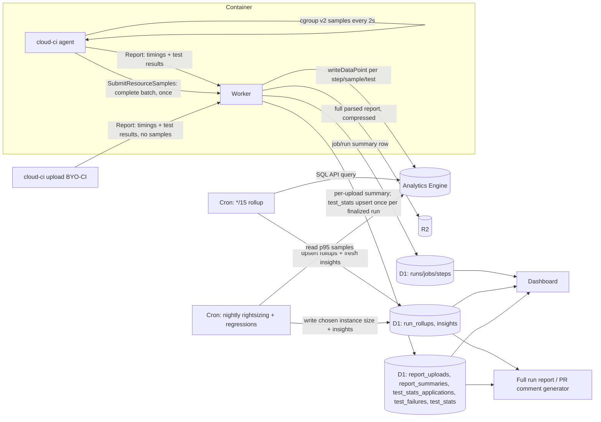
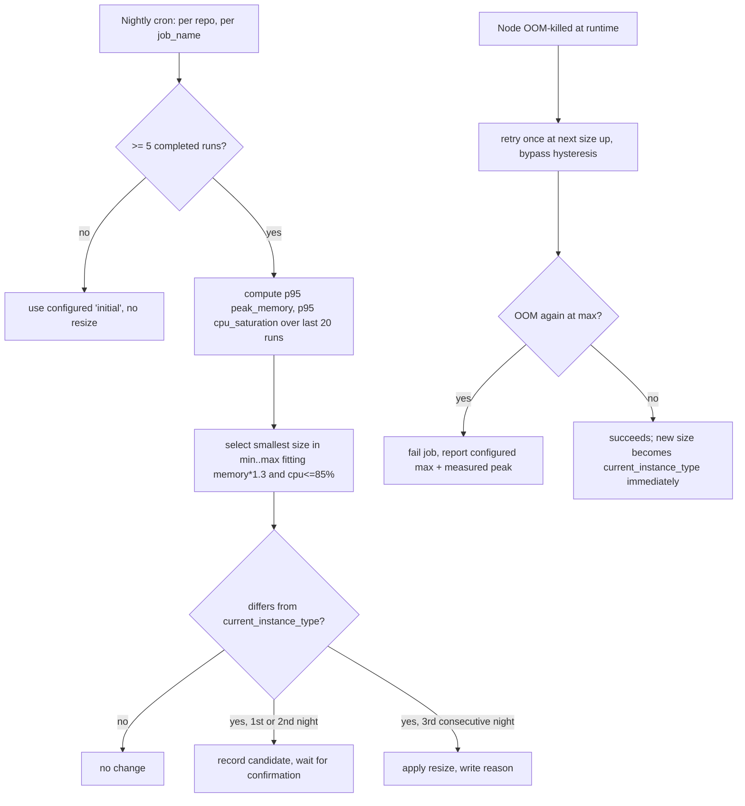

# Analytics & Autoscaling

Status: Proposed

> The thresholds below (1.3x memory headroom, 85% CPU ceiling, three-night hysteresis, rollup
> cadence) and the cost figures are proposed starting points and dated research notes, not
> requirements; tune them against real data before relying on them.

## Summary

Every `managed` run (executed on a cloud-ci `Executor`, Cloudflare Containers by default — see
[ADR 0010](../adr/0010-pluggable-executors.md)) and every `external` run (bring-your-own CI,
ingested via the API — see [./byo-ci.md](./byo-ci.md)) emits timing and resource-usage data. This
document specifies what is collected, how it is stored (raw high-cardinality events in Workers
Analytics Engine; small, fast D1 summaries and rolling aggregates for dashboard/PR-comment reads;
full per-run parsed results in R2), what insights are derived from it (slow/flaky/regressing
spots, and improvements), how it is surfaced (dashboard views, the full run report, PR comment
sections), how run cost is estimated, and the rightsizing algorithm that powers `runner: "auto"`
— picking an instance size per node from historical p95 peak memory and CPU saturation, with
bounds, OOM-retry-one-size-up, hysteresis, and an explainable decision recorded for the dashboard.

Analytics treats `managed` and `external` runs identically: both produce the same `Report` and
resource-sample shapes, so a BYO-CI job split across a GitHub Actions matrix shows up in the same
dashboards and PR comment sections as a node we scheduled ourselves. The one exception is
rightsizing: cost/resource recommendations only make sense for nodes we schedule, so
`runner: "auto"` and OOM-retry are no-ops for `external` runs (no container to size).

## Goals

- Collect, per run/job/step/shard: queue time, duration, critical path contribution, cache
  hit/miss, test durations and pass/fail/flaky state, and (for `managed` jobs) cgroup v2 CPU and
  memory samples from the agent.
- Store raw samples cheaply and at high cardinality (Analytics Engine), keep D1 small and
  SQL-joinable (summaries and rolling per-test aggregates updated in place, not one row per test
  case per run), and keep full per-run parsed results in R2.
- Derive durable insights: slowest tests/steps, flaky tests, duration/queue-time regressions vs. a
  baseline, and cache-efficiency and sharding-balance improvements.
- Provide dashboard views: run detail (DAG + critical path), repo trends, flaky test tracker,
  cost/runner report.
- Estimate run cost from measured CPU-active-time and memory/disk-provisioned-time against the
  active executor's billing rates.
- Implement `runner: "auto"`: pick the smallest instance size that comfortably fits a node's
  historical resource profile, within configured bounds, with explicit hysteresis and OOM
  recovery, and record *why* a size was chosen so it can be rendered in the full run report (see
  [./pr-comment.md](./pr-comment.md)).

## Non-goals

- Rightsizing of Durable Objects or Worker CPU time — those are Cloudflare-billed separately and
  not job-shaped.
- Cross-repo or cross-account benchmarking — all analytics are scoped to the single tenant
  deployment.
- Real-time (sub-second) streaming dashboards — rollups are cron-driven, on the order of minutes.
- Suggesting *what* to change to fix a slow test — that is [./ai.md](./ai.md)'s job; this doc only
  identifies *that* something is slow, flaky, or regressed, and classifies it as a bad or good
  spot.
- Billing passthrough or chargeback — cost estimation here is informational (dashboard/run
  report), not an invoice.

## User experience

### Script

Resource bounds and sizing hints live on the node, as `ci.container`'s `runner` option
([dynamic-pipelines](./dynamic-pipelines.md)):

```ts
await ci.container("test", {
  runner: "auto",                     // shorthand for settings.yml's runners.auto defaults
  run: "cargo test --workspace",
});

await ci.container("build-wasm", {
  runner: { auto: true, min: "basic", max: "standard-3", initial: "standard-1" },
  run: "cargo build --release --target wasm32-unknown-unknown",
});

await ci.container("lint", {
  runner: "standard-1",               // fixed size: no sizing engine involvement
  run: "cargo clippy --workspace",
});
```

`runner: "auto"` with no fields is shorthand for the deployment-wide
`runners.auto: { min: "basic", max: "standard-4", initial: "standard-2" }` in settings.yml (field
reference: [./settings.md](./settings.md)). Analytics only reads `min`/`max`/`initial` and writes
back a chosen size per node to `sizing_decisions`; the instance-size ladder itself (vCPU/memory per
size) is this doc's concern, below.

### CLI

```
$ cloud-ci agent --job-id <id> --shard <n> --attempt <n> --instance-type standard-2 ...
# agent samples /sys/fs/cgroup/{memory.current,memory.peak,cpu.stat} every 2s,
# submits the complete batch once via SubmitResourceSamples on exit (its own
# typed RPC, not embedded in the job's Report — see "Data flow", below).

$ cloud-ci upload --report junit:./target/junit.xml --report timing:./target/step-timings.json
# BYO-CI path (same binary, no agent/cgroup sampling since there's no container we control).
```

### Dashboard

- **Run detail**: DAG view, each node colored by duration; critical path highlighted; click a node
  for its step timeline and resource-sample chart (CPU% and memory vs. its instance size's limit).
- **Repo trends**: p50/p95 run duration and queue time over time, cache hit rate, cost per
  day/week.
- **Flaky tests**: table of tests ranked by `test_stats.flakiness_score`, with recent pass/fail
  history sparkline (`test_stats.recent_outcomes`).
- **Runner sizing**: table of `runner: "auto"` nodes, current chosen size, p95 peak memory, p95 CPU
  saturation, last resize date and reason.

### PR comment and full report

Per [dynamic-pipelines](./dynamic-pipelines.md)'s GitHub status checks model and
[./pr-comment.md](./pr-comment.md)'s template design, the
default sticky PR comment is short: it does **not** include a per-test status table, a critical
path breakdown, or the Runner sizing section — those restate what the checks already show, or are
secondary detail. This doc's rollups feed two surfaces instead:

- **The sticky PR comment** (short, default template): a one-line test summary from
  `report_summaries` (total/passed/failed/skipped), and flaky-test labels on failing tests, from
  `test_stats`.
- **The full run report** (dashboard page, linked from the comment): the Performance section
  (regressions/improvements vs. the default-branch baseline, total critical path) and the Runner
  sizing section — for each `runner: "auto"` node, chosen size, previous size (if changed this
  run), and a one-line reason, e.g.
  `standard-2 → standard-3: p95 working set 5.1 GiB × 1.3 headroom = 6.6 GiB > standard-2's 6 GiB`.

A repo can opt a template into showing these sections inline (see
[./pr-comment.md](./pr-comment.md)'s template model); the default does not.

## Design

### Data flow



Resource samples travel over their own typed RPC, `SubmitResourceSamples`
(`job_id`, `shard_index`, `attempt`, `instance_type`, `repeated ResourceSample samples`,
optional `memory_peak_bytes`, `oom_detected`) — not embedded in the job's end-of-run
`Report` the way an earlier design sketch described. `run_id`/`repo_id` are never
client-supplied fields on this RPC: the Worker authenticates the caller's
run-scoped ingest token (the same HMAC token `BeginRun` mints and the raw
upload-part PUT path already verifies) and cross-checks its `repo_id`/`run_id`
claims against the job's real owning run (resolved independently via D1), so a
request can never attribute samples to a run/repo it does not hold a credential
for. `(job_id, shard_index, attempt)` is this batch's execution identity:
`RunCoordinator` accepts exactly one immutable content hash per identity — an
identical redelivery is a clean no-op, a *different* batch for the same identity
is rejected (409), never silently overwritten.

RunCoordinator (per-run Durable Object, see [../architecture.md](../architecture.md)) writes
job/step start and end timestamps directly to D1 as the run progresses (`runs`, `jobs`, `steps`
tables — "live" tables, small, always current). High-cardinality and high-frequency data (every
resource sample, every test case result, every step's fine-grained duration) goes to Analytics
Engine via `writeDataPoint`, because D1 is not suited to write volumes of that shape and because
Analytics Engine's 3-month retention and sampling-at-scale are a better fit for raw time series
(verified 2026-09-30, developers.cloudflare.com/analytics/analytics-engine/limits/: 3-month
retention, up to 20 blobs/20 doubles/1 index per data point, 16 KB blob budget per data point).
The 250 figure is a **per-Worker-invocation data-point cap**, not a call cap — "You can write a
maximum of 250 data points per Worker invocation (client HTTP request). Each call to
`writeDataPoint` counts towards this limit" (same source) — the Workers `analytics_engine`
binding exposes only a single-point `write_data_point`, no platform batch call, so this is
enforced as a hard cap on how many of a request's events/samples one invocation writes
immediately. A single `SubmitReport` call whose report has more than 250 individual test-case
outcomes cannot write all of them in that call's own invocation; the overflow beyond the first 250
is persisted to `RunCoordinator`'s own DO-local `test_event_overflow` table (never dropped) for a
later alarm-triggered flush. `SubmitResourceSamples` is stricter: **every** sample in the batch —
not only the tail beyond one invocation's 250-point budget — is durably queued into
`sample_event_overflow` inside one atomic DO-storage transaction before any `write_data_point`
call is attempted, so a crash between acceptance and delivery can only delay delivery, never lose
a sample (a replay of the same batch is also a clean no-op via its content hash — see "Data flow",
above). Once that queue is durably committed, up to one invocation's own 250-point budget is
delivered immediately; any remainder drains across one or more later alarm-triggered invocations,
sharing **one** 250-data-point budget with `test_event_overflow` per alarm fire rather than
letting each spend an independent 250 (which would exceed the real per-invocation cap) — see
`coordinator/mod.rs`'s `write_test_events`/`write_sample_events`/`flush_test_event_overflow`/
`flush_sample_event_overflow`/`alarm` and `coordinator/logic.rs`'s `allocate_shared_overflow_budget`
doc comments for the exact mechanism.
The same ingest path also writes a per-upload summary row and that upload's full parsed report to
R2 immediately on ingest, and separately applies the touched tests' rolling aggregates exactly
once per finalized run — see D1 rollup tables and R2, below.

### What is collected

| Metric | Granularity | Source | Collected for |
| --- | --- | --- | --- |
| Queue time (dispatch requested → container running) | per job/shard | RunCoordinator timestamps | managed only |
| Step duration | per step | agent (managed) / `cloud-ci upload` (external) | both |
| Job/shard duration | per job/shard | agent / upload | both |
| Critical path | per run (derived) | computed from job DAG + durations | both |
| Cache hit/miss + bytes restored | per job | agent (cache restore step) | managed; external if the pipeline reports it |
| Test duration, pass/fail/skip | per test case | Report (JUnit/Vitest/Playwright JSON) | both |
| Flakiness | per test (derived) | computed incrementally from `test_stats.recent_outcomes` | both |
| CPU sample (`usage_usec` delta) | every 2s | agent reads `/sys/fs/cgroup/cpu.stat` | managed only |
| Memory sample (`memory.current`, `memory.peak`) | every 2s | agent reads `/sys/fs/cgroup/memory.current`, `memory.peak` | managed only |
| OOM event | per job | agent reads `memory.events` `oom_kill` counter | managed only |

cgroup v2 fields used: `cpu.stat` exposes `usage_usec` (cumulative CPU time) which the agent diffs
between samples to compute instantaneous CPU; `memory.current` is live resident usage;
`memory.peak` is the high-water mark since the cgroup was created (reset not required — the agent
reads it once at job end instead of tracking its own max, since the container's cgroup is created
fresh per job); `memory.events`' `oom_kill` field increments when the kernel OOM-killer fires
inside the cgroup, which is how the agent (or, if the agent itself was killed, the Worker's
"container exited non-zero with no final Report" fallback) detects an OOM to trigger
retry-one-size-up [source: docs.kernel.org cgroup-v2.rst, `cpu.stat`/`memory.peak`/`memory.events`
sections; exact kernel doc version not pinned, cross-checked 2026-09-30].

The agent samples every 2 seconds and keeps all samples in memory for the duration of the job (a
1-hour job at 2s intervals is 1800 samples × 4 fields × 8 bytes ≈ 58 KB, well inside per-job
memory), then submits the complete batch once, at job end, via `SubmitResourceSamples` — one
typed RPC call, not a stream of per-sample calls. The Worker's own `write_data_point` calls
against that batch (the Workers `analytics_engine` binding exposes only a single-point call, no
platform batch API) still face the real 250-data-point-per-invocation cap on that one RPC call's
own Worker invocation: for a job whose batch exceeds 250 samples (anything over ~8 minutes at this
cadence — the common case, not an edge case), every sample in the batch is durably queued into
`sample_event_overflow` in one atomic transaction first, then up to 250 are delivered immediately
and the remainder drains via later DO-alarm-triggered flushes rather than being dropped — see
"Data flow", above, for the exact mechanism.

### Analytics Engine schema

One dataset, `cloud_ci_metrics`, indexed by `repo_id` (the index field — see "why `repo_id`"
below). Event kind lives in `blob1` so a single dataset can hold several row shapes without
needing one dataset per metric (Analytics Engine datasets are provisioned per Worker binding, and
one binding is simplest to operate for a single-tenant deployment):

| blob1 (kind) | blob2 | blob3 | blob4 | double1 | double2 | double3 | index1 |
| --- | --- | --- | --- | --- | --- | --- | --- |
| `step` | run_id | job_id | step_name | duration_ms | queue_ms | — | repo_id |
| `sample` | run_id | job_id | instance_type | cpu_usage_usec_delta | memory_current_bytes | memory_peak_bytes | repo_id |
| `test` | run_id | job_id | test_id | duration_ms | pass(1)/fail(0)/skip(-1) | — | repo_id |
| `cache` | run_id | job_id | cache_key_prefix | hit(1)/miss(0) | bytes_restored | — | repo_id |

`sample` rows carry five more fields than fit in the generic table above — `SubmitResourceSamples`'s
execution identity (`shard_index`, `attempt`) and the batched
[`ResourceSample`](#data-flow)'s own elapsed and wall-clock timing — well inside Analytics Engine's
documented 20-blob/20-double per-data-point budget: `blob5=shard_index` (decimal string),
`blob6=attempt` (decimal string), `double4=elapsed_usec` (monotonic time since the *previous*
sample on this shard/attempt, per the agent's own `Instant`-based clock — never derived from
wall-clock subtraction, which a backward clock jump could corrupt), `double5=timestamp_unix_ms`
(wall-clock capture time, for display/ordering only), `double6=memory_peak_known` (`1.0` if
`memory_peak_bytes` (`double3`) is a real reading, `0.0` if the batch's peak was unset — the kernel
never recorded one, `memory.peak` reading `max` — in which case `double3` itself is a harmless
`0.0` placeholder, never `NaN`; downstream readers must consult `double6`, not treat an unflagged
zero `double3` as a genuine zero-byte peak). There is no `oom_detected` column in any `sample` row;
that flag lives only on `RunCoordinator`'s own `resource_sample_batch` DO row (no D1 projection
yet — no reader needs one).

`repo_id` is the index because the brief's deployment model is single-tenant-per-org-but-many-repos:
repos are the natural "customer" subgroup for Analytics Engine's equitable sampling (see Sampling,
below), and nearly every dashboard view and query is scoped to one repo at a time.

Querying for rollups uses the SQL API (`POST
https://api.cloudflare.com/client/v4/accounts/<account_id>/analytics_engine/sql`, bearer token
with *Account Analytics Read* permission — verified 2026-09-30,
developers.cloudflare.com/analytics/analytics-engine/sql-api/). The cron job holds this token as a
Worker secret; it is never exposed to the dashboard or to end users.

Because Analytics Engine applies equitable, adaptive sampling per index value at high write volume
(verified 2026-09-30, developers.cloudflare.com/analytics/analytics-engine/sampling/), every
rollup query that aggregates counts or sums MUST weight by `_sample_interval` (e.g.
`SUM(_sample_interval)` instead of `COUNT()`, and `quantileExactWeighted(0.95)(double1,
_sample_interval)` instead of a plain quantile). For a single-tenant deployment driven by one
org's CI traffic, sustained sampling is expected to be rare except for very high-volume
monorepos, but the rollup cron treats it as the common case rather than special-casing it, since
getting this wrong silently understates p95s for the busiest repos.

### D1 rollup tables

The storage-growth constraint (per [ADR 0010](../adr/0010-pluggable-executors.md)'s accompanying
decision) is that **D1 must never hold one row per test case per run** — that scales with total
test executions across all history, not with anything bounded. D1 instead holds five kinds of
rows, all either bounded by a count that does not grow with run volume, or swept by retention:

```sql
-- One immutable row per parsed upload, 1:1 with [./byo-ci.md](./byo-ci.md)'s `reports` row
-- (the same `SubmitReport` call writes both, in the same D1 `batch()`); never updated after
-- insert, so a retried `SubmitReport` resolves to this row via the PRIMARY KEY instead of
-- re-parsing or duplicating it.
CREATE TABLE report_uploads (
  run_id          INTEGER NOT NULL,
  job_name        TEXT NOT NULL,
  shard_index     INTEGER NOT NULL,
  report_type     TEXT NOT NULL,     -- junit | playwright-json | vitest-json | coverage | ...
  report_name     TEXT NOT NULL,
  scope           TEXT NOT NULL,     -- metadata only, not part of the key (byo-ci.md § Idempotency)
  content_sha256  TEXT NOT NULL,
  total           INTEGER NOT NULL,
  passed          INTEGER NOT NULL,
  failed          INTEGER NOT NULL,
  skipped         INTEGER NOT NULL,
  duration_ms     INTEGER NOT NULL,
  r2_key          TEXT NOT NULL,     -- full parsed report, compressed, content-addressed (see R2, below)
  created_at      INTEGER NOT NULL,
  PRIMARY KEY (run_id, job_name, shard_index, report_type, report_name, content_sha256)
);

CREATE TABLE report_summaries (
  run_id        INTEGER NOT NULL,
  job_name      TEXT NOT NULL,
  report_type   TEXT NOT NULL,
  report_name   TEXT NOT NULL,
  scope         TEXT NOT NULL,
  shards_total  INTEGER NOT NULL,    -- the job's declared shard_total as of this recomputation
  shards_in     INTEGER NOT NULL,    -- distinct shard_index values currently contributing
  total         INTEGER NOT NULL,
  passed        INTEGER NOT NULL,
  failed        INTEGER NOT NULL,
  skipped       INTEGER NOT NULL,
  duration_ms   INTEGER NOT NULL,
  updated_at    INTEGER NOT NULL,
  PRIMARY KEY (run_id, job_name, report_type, report_name, scope)
);

-- One row per failing or flaky test *occurrence* — not every passing test. Retention-swept.
CREATE TABLE test_failures (
  repo_id      INTEGER NOT NULL,
  test_id      TEXT NOT NULL,        -- hex(sha256(file_path || 0x1f || full_test_name))[0:16]
  run_id       INTEGER NOT NULL,
  job_name     TEXT NOT NULL,
  sha          TEXT NOT NULL,
  branch       TEXT NOT NULL,
  status       TEXT NOT NULL,        -- fail | flaky
  duration_ms  INTEGER NOT NULL,
  message      TEXT,                 -- truncated assertion/failure message, for drill-down
  occurred_at  INTEGER NOT NULL,
  PRIMARY KEY (repo_id, test_id, run_id)
);
CREATE INDEX idx_test_failures_recent ON test_failures (repo_id, occurred_at);

-- One row per (repo_id, test_id), updated in place on every default-branch run. Never grows
-- with run count — bounded by the number of distinct tests a repo has.
CREATE TABLE test_stats (
  repo_id           INTEGER NOT NULL,
  test_id           TEXT NOT NULL,
  file_path         TEXT NOT NULL,
  test_name         TEXT NOT NULL,
  runs              INTEGER NOT NULL DEFAULT 0,
  duration_ewma_ms  REAL NOT NULL,    -- exponential moving average, alpha = 0.2
  last_duration_ms  INTEGER NOT NULL,
  last_status       TEXT NOT NULL,    -- pass | fail | skip
  recent_outcomes   TEXT NOT NULL,    -- last 20 outcomes, one char each ('P'/'F'/'S'), newest last
  flakiness_score   REAL NOT NULL DEFAULT 0,  -- flips / (len(recent_outcomes) - 1)
  last_run_id       INTEGER NOT NULL,
  last_sha          TEXT NOT NULL,
  updated_at        INTEGER NOT NULL,
  PRIMARY KEY (repo_id, test_id)
);
CREATE INDEX idx_test_stats_flaky ON test_stats (repo_id, flakiness_score);

-- Gate for applying one run's finalized groups to test_stats/test_failures exactly once — see
-- "Idempotency" below.
CREATE TABLE test_stats_applications (
  run_id        INTEGER NOT NULL,
  job_name      TEXT NOT NULL,
  report_type   TEXT NOT NULL,
  report_name   TEXT NOT NULL,
  scope         TEXT NOT NULL,
  applied_at    INTEGER NOT NULL,
  PRIMARY KEY (run_id, job_name, report_type, report_name, scope)
);

CREATE TABLE run_rollups      (run_id PK, repo_id, head_sha, started_at, duration_ms, queue_ms, critical_path_ms, cache_hit_rate, cost_usd_estimate, status);
CREATE TABLE insights         (repo_id, kind, subject_id, severity, detail_json, created_at, PRIMARY KEY (repo_id, kind, subject_id, created_at));
CREATE TABLE sizing_decisions (repo_id, job_name PK, current_instance_type, p95_memory_bytes, p95_cpu_frac, last_resized_at, reason, PRIMARY KEY (repo_id, job_name));
```

`report_uploads` is a pure content-addressed log: its PRIMARY KEY omits `scope` because `scope`
is metadata on the row, not part of upload identity (matching [byo-ci.md](./byo-ci.md)'s
`reports`/`uploads` keys — see that doc's § Idempotency). `report_summaries` is the opposite: it
is recomputed wholesale (overwritten, never incremented) by summing, per `shard_index`, whichever
`report_uploads` row is *currently* canonical (byo-ci.md `reports.is_canonical`) for that slot,
grouped by each canonical row's own `(report_type, report_name, scope)` — never a sum over every
`report_uploads` row ever inserted, which would double-count a replaced or stale upload. Because
it is a pure function of current canonical state, recomputing it from any trigger (a new upload
landing, a duplicate/retried trigger, a late replacement) always converges to the same answer
rather than drifting. `shards_in < shards_total` marks a partial aggregate (the job is still
running, or some shards are missing) — this is what makes the same table serve both a live,
partial dashboard view and the final one.

`report_uploads`, `report_summaries`, `test_failures`, `test_stats`, and `test_stats_applications`
are populated by two distinct events on the same ingest path (not the cron):

1. **Per upload** (every `SubmitReport` call, inline or upload-backed): the
   `post-run-analysis` Queue consumer parses the report via `cloud-ci-reports`, writes its
   immutable parsed result to R2, and sends that result's identity to `RunCoordinator`.
   The coordinator inserts the `report_uploads` row and selects
   [byo-ci.md](./byo-ci.md)'s `reports.is_canonical` in one D1 `batch()`, using the highest
   original `accepted_seq` among parsed reports for the
   `(job_name, shard_index, report_type, report_name)` slot. A delayed parse or a retry never
   promotes older content over newer content. The coordinator recomputes the affected
   `report_summaries` from canonical rows, without incrementing previous totals. If a
   replacement changes scope, it also recomputes the old scope's group, deleting that
   aggregate if no canonical row still contributes. The coordinator persists pending
   projection work and retries it in order before processing the next canonical change.
2. **Once per run** (not per job, and not per upload): `RunCoordinator` detects the run reaching
   a terminal state ([byo-ci](./byo-ci.md)'s Completion semantics), then waits for every
   `accepted_seq` issued before terminal to resolve — each either produces a `report_uploads`
   row or a recorded parse failure — before freezing the run's canonical set: for every
   `(job_name, report_type, report_name, scope)` group any job in the run produced, the current
   canonical content for that group. `RunCoordinator` then drives one finalization `batch()`
   covering every group in that frozen set, applying each group's canonical content to
   `test_stats`/`test_failures` (see Idempotency, below).

Because the run rejects any ingest call once it is terminal ([byo-ci](./byo-ci.md)'s Completion
semantics), nothing can land after the frozen set is computed — there is no "replacement arrives
after finalization" case to reconcile; a correction only counts if its `accepted_seq` landed
before the run went terminal, in which case the drain above already waited for its parse.

**Merged vs. raw reports never double-count history.** `report_summaries`/`test_stats` group by
`(job_name, report_type, report_name, scope)`, and within a group, `report_summaries` sums at
most one canonical row per `shard_index` — so there is exactly one path by which a job's test
history can be counted, never two. Concretely:
- For formats the Worker merges inline (JUnit, coverage — see
  [parallelization.md](./parallelization.md)'s merge strategies), there is no second, separately
  uploaded "merged" report: the job-level aggregate *is* the union, computed once at
  finalization from each shard's canonical per-shard upload. No merge step re-submits through
  `SubmitReport`, so there is nothing to double-count.
- For opaque framework-blob formats (Playwright blob, Vitest blob), the raw per-shard blob
  uploads are never parsed (no test-case data, so they contribute nothing to any
  `report_summaries` row's totals, or to `test_stats`); only an explicit, separately-kinded
  re-upload from the generated merge node (e.g. `playwright-json`, under its own `job_name` per
  [parallelization.md](./parallelization.md)) produces test rows, under its own
  `(job_name, report_type, report_name)` group — distinct from the raw blob group, so it is
  never summed alongside it.
- A pipeline that re-submits an already-named report's merged content under the *same*
  `(job_name, shard_index, report_type, report_name)` as an earlier upload is a replacement
  (highest-`accepted_seq`-wins), not an addition — it supersedes that slot's contribution in the
  next recomputation rather than adding a second one.

**Upsert pattern for `test_stats`.** A run's finalization can span thousands of test cases
across many groups and must not become thousands of D1 queries (D1's per-Worker-invocation cap
is 1000 queries on Workers Paid, verified 2026-09-30,
developers.cloudflare.com/d1/platform/limits/). `RunCoordinator` reads every currently-canonical
shard's full parsed object (content-addressed keys recorded on their `report_uploads` rows)
across every group in the run's frozen set, and concatenates their per-test entries into one
JSON array of `{test_id, file_path, test_name, duration_ms, status}`. Two groups can describe the
same test (for example a JUnit report and a hand-rolled timing report covering the same suite),
so before binding the array it is deduplicated by `test_id`, keeping one entry per distinct
test — SQLite's row-by-row `INSERT ... SELECT ... ON CONFLICT` semantics apply the `runs`/EWMA
update once per row of the `SELECT`, so an array with the same `test_id` twice would silently
count one run as two. Raw, unparsed blob uploads never reach this array (they produce no
`report_uploads` row to read from). The deduplicated array is then bound as a single parameter to
one batched upsert using `json_each` (so the 100 bound-parameters-per-query limit, same source,
never applies regardless of test count); the `WHERE true` after `FROM json_each(:tests)` is
required — without it, SQLite's parser reads the following `ON` as a join condition on
`json_each`'s result, not as the start of the `ON CONFLICT` clause, and the statement fails to
parse (verified 2026-09-30, sqlite.org/lang_upsert.html § 2.2, sqlite.org/lang_insert.html):

```sql
INSERT INTO test_stats (repo_id, test_id, file_path, test_name, runs, duration_ewma_ms,
                         last_duration_ms, last_status, recent_outcomes, last_run_id, last_sha, updated_at)
SELECT :repo_id, value->>'test_id', value->>'file_path', value->>'test_name', 1,
       value->>'duration_ms', value->>'duration_ms', value->>'status',
       upper(substr(value->>'status', 1, 1)), :run_id, :sha, :now
FROM json_each(:tests)
WHERE true
ON CONFLICT (repo_id, test_id) DO UPDATE SET
  runs             = test_stats.runs + 1,
  duration_ewma_ms = 0.2 * excluded.last_duration_ms + 0.8 * test_stats.duration_ewma_ms,
  last_duration_ms = excluded.last_duration_ms,
  last_status      = excluded.last_status,
  recent_outcomes  = substr(test_stats.recent_outcomes || excluded.recent_outcomes, -20),
  last_run_id      = excluded.last_run_id,
  last_sha         = excluded.last_sha,
  updated_at       = excluded.updated_at;
```

`recent_outcomes` is always a single uppercase `P`/`F`/`S` char per run, never the full
`last_status` word: the insert branch normalizes with `upper(substr(value->>'status', 1, 1))`,
and the conflict branch appends `excluded.recent_outcomes` (that same normalized char), not
`excluded.last_status` (the full word) — appending the full word would silently corrupt the
sparkline and the flip-count `flakiness_score` is computed from.

`flakiness_score` is deliberately **not** computed inline (it needs a flip-count scan over
`recent_outcomes`, not a constant-time expression); the `*/15` cron recomputes it for every
`test_stats` row touched since its last tick and writes it back in the same batched-upsert style.
This keeps the finalization-path write cheap and moves the slightly heavier string scan to the
async cron, off the request path.

**Idempotency.** `RunCoordinator` owns report acceptance, canonical selection, and the
finalization decision. It records these decisions in a serialized local storage transaction;
it does not hold a transaction across R2 reads or D1 calls. After the parse drain, it persists
the frozen report IDs and pending finalization work before dispatching the D1 batch. A restart
or retry reuses that same snapshot. A single Durable Object instance alone is not an
exactly-once guarantee: asynchronous requests can interleave, so pending projection work is
processed in order, and D1's atomic markers below prevent duplicate history updates.

**This implementation's snapshot.** `cloud-ci-worker`'s `RunCoordinator` does not write a
separate, explicit "frozen report IDs" record before dispatching the finalization batch, despite
the general description above. It instead re-queries its own durable DO SQLite storage for
`report WHERE is_canonical = 1 AND parsed = 1` directly at finalization time, on every
invocation, including after a restart. This is a deliberate, reasoned choice, not an
approximation: `RunCoordinator`'s `SubmitReport` RPC already rejects (409) any call once the run
is terminal (`upload_allowed_for_shard`'s `run_terminal` check), which structurally prevents the
in-flux-canonical-selection scenario the general "persist a frozen snapshot" mechanism exists to
guard against. By the time finalization runs, the run is already terminal, so no further report
can ever be accepted — the live query's result set is therefore identical on every call for a
given run, by construction, making it equivalent to reusing a persisted snapshot without the
added complexity and D1 writes a separate snapshot table would cost. This equivalence is specific
to this codebase's data model (the terminal-rejection gate existing at all); a design without
that gate would still need the explicit snapshot the general paragraph above describes.

D1's own `test_stats_applications` table remains as a backstop against Queue redelivery replaying
the same finalization `batch()` (not against two independent coordinators racing, which the
Durable Object model already rules out). The finalization batch's first statements are plain
`INSERT`s into `test_stats_applications`, one per `(run_id, job_name, report_type, report_name,
scope)` group in the frozen set — no `OR IGNORE`. The `PRIMARY KEY` is the concurrency-safe
marker: if any of those rows already exist, the corresponding `INSERT` fails with a constraint
violation, and D1's `batch()` is documented to run its statements as a SQL transaction that
aborts/rolls back the *entire* sequence when any one statement fails (verified 2026-09-30,
developers.cloudflare.com/d1/worker-api/d1-database/#batch) — so a redelivered finalization
message, replaying a batch whose groups are already marked applied, commits nothing a second
time. A caller that gets this failure treats the whole batch as "already applied," not an error
to retry.

**D1 size budget.** D1's maximum database size is 10 GB on Workers Paid (500 MB on Free; cannot be
increased past 10 GB even on Paid — verified 2026-09-30,
developers.cloudflare.com/d1/platform/limits/). Every table above is bounded by something other
than cumulative run count: `test_stats` by distinct test count (a repo with 100,000 tests at
~250 bytes/row is ~25 MB); `report_uploads` by run × job × shard × report count (one row per
upload, not per test case); `report_summaries`, `test_stats_applications`, and `run_rollups` by
run × job × report-group count, all swept by the retention cron below; `test_failures` similarly
swept, and inherently low-cardinality relative to total test executions since only
failures/flakes are stored. This is the design property D5 was written to guarantee: no table
here scales with *(runs × tests per run)*, which is the dimension that would otherwise threaten
the 10 GB ceiling for an active monorepo.

**Retention.** `report_uploads`, `report_summaries`, `test_stats_applications`, `test_failures`,
and `run_rollups` are pruned by the retention cron mentioned in the brief (age-based,
deployment-configurable, default 90 days — exact knob deferred to the migration); a group's
`test_stats_applications` row is only safe to prune once its run is old enough that no retry of
its finalization could still arrive, which the age-based window already guarantees. `test_stats`
is never pruned by age (it is a bounded aggregate, not an event log) — a row is only removed when
its test hasn't appeared in any report for a configurable number of days (default 180), as a
signal the test was deleted/renamed.

`test_stats` is read by [./parallelization.md](./parallelization.md)'s `timing` split strategy and
`auto` shard-count resolution; that doc never defines or writes this table.

Full column lists (types, FKs to `runs`/`jobs`/`repos`) beyond what's shown above are an
implementation detail deferred to the migration that creates these tables; the names and primary
keys above are the contract other docs can rely on.

### R2

The full parsed result of each upload — every test case's id, name, duration, and status, not
just failures — is stored in R2, not D1, as one compressed, content-addressed file per upload
(matching `report_uploads`' primary key, so a replacement upload never overwrites an older one):

```
runs/{run_id}/jobs/{job_name}/shards/{shard_index}/parsed/{report_type}/{report_name}/{content_sha256}.json.zst
```

This is what `cloud-ci-reports` (the report-parsing/merging package, see
[ADR 0010](../adr/0010-pluggable-executors.md)) produces when it parses an upload — distinct
from the *raw* bytes it was parsed from, which live at `uploads.r2_key`
([byo-ci](./byo-ci.md)'s immutable per-upload storage) and at that job/shard's
publication-alias path ([byo-ci](./byo-ci.md)'s R2 keys). This parsed object is the source
`report_uploads` is a summary of, and what a run's finalization reads — concatenated across
every group's currently-canonical shard objects in the run's frozen set (see Idempotency,
above). A dashboard view that needs the full per-test list for one job's report reads every
shard's currently-canonical object directly — the keys come from `report_uploads`/
[byo-ci.md](./byo-ci.md)'s `reports.is_canonical` rows, not from an R2 prefix listing — rather
than querying D1 for per-test rows it does not keep. The merged, framework-native report files
(`runs/{run_id}/jobs/{job_name}/merged/report.{ext}`) are
[./parallelization.md](./parallelization.md)'s R2 keys, written directly by the merge step
outside the `SubmitReport` ingest path — they are a separate, display-oriented artifact, never
re-ingested, so they never produce a second `report_uploads` row or a second contribution to
`test_stats`. Raw logs and the merged HTML site artifact are [./assets.md](./assets.md)'s domain.

### Derived insights

Computed by the nightly cron (regressions, from Analytics Engine quantile queries) and the `*/15`
cron (fresh-run bad/good spots, plus `flaky_test` from `test_stats.flakiness_score`), written to
`insights`:

| kind | Trigger | Severity | Example `detail_json` |
| --- | --- | --- | --- |
| `slow_test` | test p95 (7-day window, from Analytics Engine `test` events) > 2× its own 30-day p50, min 10 runs | warn | `{"test_id": "...", "p95_ms": 4200, "baseline_p50_ms": 1800}` |
| `flaky_test` | `test_stats.flakiness_score` ≥ 0.15 (score = flips / (len(recent_outcomes)-1), where a flip is pass→fail or fail→pass between consecutive default-branch runs) | warn/critical (≥0.3) | `{"test_id": "...", "score": 0.22}` |
| `duration_regression` | run or job duration p50 (this PR's branch, last 5 runs) > baseline (default branch, last 20 runs) p50 × 1.25 | warn | `{"job_name": "test", "branch_p50_ms": 61000, "base_p50_ms": 45000}` |
| `queue_regression` | queue time p95 (repo, 1h window) > repo's 7-day p95 × 1.5 | info | `{"p95_ms": 9000, "baseline_p95_ms": 5500}` |
| `cache_degraded` | cache hit rate (repo, 1h window) < 7-day average − 20 points | info | `{"hit_rate": 0.41, "baseline": 0.78}` |
| `duration_improvement` | run or job duration p50 (branch) < baseline p50 × 0.85 | good | `{"job_name": "build-wasm", "branch_p50_ms": 30000, "base_p50_ms": 42000}` |
| `sizing_improvement` | rightsizing cron reduces a node's instance size and cost drops | good | `{"job_name": "lint", "from": "standard-2", "to": "basic", "est_savings_usd_month": 4.10}` |

"Bad spots" (`slow_test`, `flaky_test`, `duration_regression`, `queue_regression`,
`cache_degraded`) surface as warnings in the dashboard and the full run report's Performance
section. "Good spots" (`duration_improvement`, `sizing_improvement`) surface as positive callouts
in the same section, so the report is not purely a list of problems — a PR that measurably speeds
up CI should say so.

### Cost estimation

Cost per run is estimated, not billed-exact, from measured active CPU time and provisioned
memory/disk time against Cloudflare Containers' published rates (verified 2026-09-30,
developers.cloudflare.com/containers/platform/pricing/): CPU $0.000020/vCPU-second beyond 375
included vCPU-minutes/month, memory $0.0000025/GiB-second beyond 25 included GiB-hours/month, disk
$0.00000007/GB-second beyond 200 included GB-hours/month, all under the $5/month Workers Paid
plan. Per-job estimate:

```
cpu_cost   = job_duration_s * instance_vcpu * $0.000020      (CPU billed on active usage)
mem_cost   = job_duration_s * instance_memory_gib * $0.0000025  (memory billed on provisioned size)
disk_cost  = job_duration_s * instance_disk_gb * $0.00000007
job_cost_usd_estimate = cpu_cost + mem_cost + disk_cost
```

This intentionally ignores the monthly included-usage tiers (25 GiB-hours, 375 vCPU-minutes, 200
GB-hours) when estimating a single run's cost — the included tier is an account-level monthly
allowance, not something attributable to one run, so per-run estimates are "gross" marginal cost
and the dashboard's monthly rollup separately nets out the included allowance once at the account
level. `run_rollups.cost_usd_estimate` sums the job estimates for the run. The dashboard's
repo-trends cost view sums `run_rollups` over the selected period and subtracts the included-tier
value once, labeled "estimated, before Workers Paid plan". Worker request/CPU-time and Durable
Object cost (billed separately per developers.cloudflare.com/containers/platform/pricing/,
"Workers and Durable Objects Pricing" section) are out of scope for this estimate and are called
out as excluded rather than silently omitted. Egress pricing ($0.025–$0.05/GB depending on region,
verified 2026-09-30 same source) is excluded from the per-run estimate since the agent does not
currently measure network bytes; this is listed as an open question below. Non-default executors
(ADR 0010) bill differently (e.g. AWS EC2 on-demand/spot rates); their cost estimate is out of
scope until an executor beyond Cloudflare Containers ships.

### Rightsizing algorithm (`runner: "auto"`)

Instance sizes and their resources, from the brief (verified 2026-09-30,
developers.cloudflare.com/containers/platform/limits/): `lite` (1/16 vCPU, 256 MiB, 2 GB disk),
`basic` (1/4 vCPU, 1 GiB, 4 GB), `standard-1` (1/2 vCPU, 4 GiB, 8 GB), `standard-2` (1 vCPU, 6 GiB,
12 GB), `standard-3` (2 vCPU, 8 GiB, 16 GB), `standard-4` (4 vCPU, 12 GiB, 20 GB), ordered smallest
to largest by this table's row order. This is Cloudflare Containers' ladder specifically — the
default executor (ADR 0010); a non-default `Executor` exposes its own `sizes` list through its
capability descriptor, and rightsizing/OOM-retry walk whichever ladder belongs to the node's
resolved executor. The algorithm below is executor-agnostic; the concrete sizes are not.

**Inputs** (per `(repo_id, job_name)`, i.e. per named node across its run history — shards of the
same `ci.shard` group share one sizing decision since they run the same steps): the last 20
completed runs' resource samples for that node, read from Analytics Engine.

**Per-run reduction** (nightly cron, before cross-run aggregation):
- `peak_memory = MAX(memory_peak_bytes)` across that run's samples for the node.
- `cpu_saturation = MAX(cpu_usage_usec_delta / sample_interval_usec / instance_vcpu)` — the
  highest fraction of the instance's allotted vCPU actually used in any one sample window, capped
  at 1.0.

**Cross-run aggregation**: `p95_peak_memory = quantileExactWeighted(0.95)` of the 20 runs' peak
memory; `p95_cpu_saturation` likewise over CPU saturation. Using p95 rather than max avoids one
anomalous run (e.g. a one-off large test fixture) permanently pinning a node to an oversized
instance; using p95 rather than p50 avoids routinely OOM-killing the typical "slightly larger than
usual" run.

**Instance selection**:
1. `target_memory = p95_peak_memory * 1.3` (30% headroom — chosen because `memory.peak` is a
   high-water mark over the whole job, not an instant sample, so a tighter margin risks the *next*
   run's peak exceeding it even with no real growth).
2. `target_cpu_vcpu = p95_cpu_saturation * current_instance_vcpu` if `p95_cpu_saturation` is being
   measured against the *current* instance (saturation is relative to whatever vCPU count was
   active when the samples were taken); recompute each candidate's implied saturation as
   `target_cpu_vcpu / candidate_vcpu`.
3. Choose the smallest instance size, within `[min, max]` from the node's config, where
   `candidate.memory_bytes >= target_memory` AND `target_cpu_vcpu / candidate.vcpu <= 0.85` (85%
   ceiling leaves headroom for scheduler jitter and avoids flapping right at 100%).
4. If no candidate within `[min, max]` satisfies both, clamp to `max` and record the shortfall in
   `reason` (the node will keep running, just under-provisioned — this is visible in the full run
   report and dashboard rather than silently capped).
5. If fewer than 5 completed runs exist for the node, use `initial` from the config and do not
   resize (not enough signal).

**Hysteresis**: a resize (up or down) only takes effect if the newly selected size differs from
`sizing_decisions.current_instance_type` for **3 consecutive nightly recalculations** (i.e. the
recommendation must be stable across 3 nights, each evaluated against the latest 20-run window) —
this prevents a node that oscillates near a boundary (e.g. p95 memory bouncing just above/below
the `basic`/`standard-1` line) from resizing every night. The one exception is OOM-retry (below),
which bypasses hysteresis entirely because it is reacting to an observed failure, not a trend.

**OOM retry**: if a node's container is OOM-killed (`memory.events.oom_kill` increments, or the
Worker observes the container process exit without a final Report after a memory-pressure
signal), `RunCoordinator` immediately retries that node once on the next size up from the one it
just used (per the active executor's size ladder) — bypassing hysteresis and the p95 computation —
and records `reason: "oom-retry: <from> -> <to>"` in `sizing_decisions`. This retry-sized instance
becomes the new `current_instance_type` immediately (not just for the one retry) since an actual
OOM is stronger evidence than any number of p95 samples that stayed under threshold. If the node
OOMs again at `max`, it fails with a message naming the configured `max` and the measured peak,
rather than retrying indefinitely.

**Explainability**: every change to `sizing_decisions.current_instance_type` writes a
human-readable `reason` string, e.g. `"standard-1 -> standard-2: p95 peak memory 4.9 GiB x1.3 =
6.4 GiB > standard-1's 4 GiB (stable 3/3 nights)"` or `"standard-2 -> standard-3: oom-retry"`.
This string, plus the before/after size, is what the full run report's Runner sizing section
renders for any node whose size changed on this run or in the last 7 days — surfacing a resize
even on PRs that didn't trigger it, since the first run after a resize is the one most likely to
confuse a reader if unexplained.



## Data model

### D1 tables (see also "D1 rollup tables" above for the analytics-owned set)

- `report_uploads`, `report_summaries`, `test_stats_applications`, `test_failures`, `test_stats`,
  `run_rollups`, `insights`, `sizing_decisions` — owned by this doc; schemas above.
- `runs`, `jobs`, `steps` (live, written by RunCoordinator as a run progresses) — owned by
  [../architecture.md](../architecture.md); analytics reads `jobs.instance_type` and
  `jobs.duration_ms` as rollup inputs but does not define these tables.
- [./parallelization.md](./parallelization.md) reads `test_stats.duration_ewma_ms` for
  `cloud-ci split`'s timing strategy and `auto` shard-count resolution, but does not define or
  write this table.

### Analytics Engine dataset

- `cloud_ci_metrics` — schema in "Analytics Engine schema" above. One dataset for the whole
  deployment (single Worker binding), discriminated by `blob1` kind and indexed by `repo_id`.

### R2

- `runs/{run_id}/jobs/{job_name}/shards/{shard_index}/parsed/{report_type}/{report_name}/{content_sha256}.json.zst`
  — full per-upload parsed test results (every test case), this doc's own key, defined in "R2" above.
- Merged framework-native reports and the merged HTML site artifact are
  [./parallelization.md](./parallelization.md) and [./assets.md](./assets.md)'s keys respectively;
  this doc reads neither directly.

## Security considerations

- The Analytics Engine SQL API bearer token (Account Analytics Read scope) is a Worker secret,
  used only by the cron job; it is never returned to the dashboard, the PR comment/full-report
  generator, or any end-user-facing API. Dashboard and report reads always go through D1 rollups,
  which are already access-controlled by the deployment's own role model (viewer/operator/admin,
  derived from GitHub repo permission — see [./auth.md](./auth.md)), not the raw Analytics Engine
  data.
- Resource samples and timing data are not secrets, but `test_id` and `step_name` values can embed
  repo-specific strings (file paths, env var names echoed in a step name); these are stored in
  D1/Analytics Engine/R2, which are already scoped to the single tenant's own Cloudflare account,
  so no additional redaction is applied beyond what the agent already avoids echoing (raw secret
  *values* are never part of a Report; that is a job-execution concern, not an analytics one).
- Cost estimates and sizing decisions are read-only derived data; a compromised dashboard viewer
  role can see them but cannot act on them (resizing is cron-driven, not triggerable via any read
  API).

## Failure modes

| Failure | Behavior |
| --- | --- |
| Agent crashes before emitting a Report (e.g. OOM-killed) | RunCoordinator detects the container exited without a final Report; if `memory.events.oom_kill` was observed (via a last-gasp sample or the Worker's own container-exit-code inspection), treat as OOM and trigger OOM-retry; otherwise mark the job failed with no resource data for that run (it is simply excluded from the next p95 window, not treated as a zero). |
| Analytics Engine `writeDataPoints` call fails (e.g. transient 5xx) | Logged and dropped; one run's worth of samples/tests missing from Analytics Engine does not block the run from completing or from showing live durations (sourced from D1 `runs`/`jobs`/`steps`), since the dashboard's live run view does not depend on Analytics Engine at all. |
| `post-run-analysis` consumer retries a finalization after partially writing `test_stats_applications`/`test_stats`/`test_failures` | All three writes happen in one D1 `batch()` call, marker insert first (see "Idempotency" above); a retry either hits the marker's `PRIMARY KEY` conflict and the whole batch rolls back (no-op), or the first attempt's batch itself failed partway and rolled back entirely — never a partial EWMA/outcome-string double-application, and never a silently skipped shard. |
| `post-run-analysis` consumer retries a per-upload parse (a redelivered `SubmitReport` Queue message) | `report_uploads`' `PRIMARY KEY` is the upload's own content-addressed identity, so a retry that reparses identical bytes resolves to the same row (R2 write and D1 insert both become no-ops) rather than creating a duplicate or re-triggering a finalization. |
| Rollup cron fails mid-batch | Upserts are idempotent per `(repo_id, period)`/`(run_id, job_id)` key, so a retried cron run (next scheduled tick) safely reprocesses the same window; no partial-rollup corruption, just a delay until the next successful tick. |
| Analytics Engine query sampling kicks in for a very high-volume repo | p95/flakiness computations already weight by `_sample_interval`; accuracy degrades gracefully rather than silently, and extremely low event-count index values (new or quiet repos) are never sampled per Analytics Engine's equitable-sampling design. |
| `runner: "auto"` has fewer than 5 historical runs (new node) | Uses configured `initial` size, does not attempt sizing, so a brand-new node never gets undersized on its first few runs based on no data. |
| Node OOMs even at `max` | Fails with an explicit message naming `max` and the measured peak; does not retry past `max` or silently fall back to a smaller size. |
| Node's actual resource profile is fundamentally bursty / bimodal (e.g. integration tests only present sometimes) | p95 over a 20-run window will reflect the heavier mode often enough to size for it; hysteresis (3 consecutive nights) prevents flapping if the mix of runs varies night to night, at the cost of slower reaction to a genuine, sustained shift. |

## Open questions

- Network egress is not currently sampled by the agent (no per-job byte counter), so cost
  estimates exclude the egress pricing tier entirely; whether to add a `/sys/class/net`
  byte-counter sample is open.
- Whether `cpu.pressure` (PSI) should supplement `cpu.stat`'s `usage_usec` for saturation — PSI
  reflects stall time rather than raw usage and might catch CPU-starved-but-not-100%-busy jobs
  that the current `usage_usec`-based saturation metric would miss. Deferred as `[unverified]`
  whether Cloudflare Containers' kernel/cgroup configuration exposes `cpu.pressure` to the
  container.
- Whether workers-rs can read container cgroup stats directly or whether the agent (running inside
  the container, which it already does for step execution) remains the sole source of samples —
  this is the same open question the brief raises about whether workers-rs can drive containers
  directly at all; this doc assumes the agent-samples-and-uploads approach regardless of that
  outcome, since the agent is already resident in the container for the job's steps.
- Exact hysteresis window (3 nights) and headroom multipliers (1.3× memory, 0.85 CPU ceiling) are
  initial proposals, not tuned against real workload data; expect revision once the system has
  running deployments to observe.
- Whether `insights` rows should ever be deleted/expired, or kept forever as a history — currently
  unspecified; likely candidate for the retention-sweep cron mentioned in the brief but not
  designed here.
- Whether a non-default executor's cost model and size ladder need their own rate table per
  executor type, or whether ADR 0010's capability descriptor should carry pricing hints directly
  — open until a second executor ships.

## Alternatives considered

- **D1-only, no Analytics Engine**: rejected — per-2-second resource samples and per-test-case
  results across every run would make `jobs`/`steps`-adjacent D1 tables extremely large and slow
  for a relational store sized for metadata, and D1 has no built-in time-series rollup or sampling
  behavior; Analytics Engine is purpose-built for this write volume and already included in the
  Workers platform.
- **Analytics Engine only, no D1 rollups**: rejected — every dashboard page load and every PR
  comment/full-report render would need a live SQL API round-trip (network call to a separate
  Cloudflare product, subject to ABR sampling trade-offs on long time ranges), adding latency and
  an external dependency to paths that should be fast and simple joins against other D1 metadata
  (repo settings, PR state).
- **One D1 row per test case per run** (the original design): rejected — this is exactly the
  unbounded-growth pattern the storage-growth decision rules out; row count would scale with
  *(runs × tests per run)*, threatening the 10 GB per-database ceiling for any sufficiently active
  repo. A rolling aggregate (`test_stats`, one row per test, updated in place) plus full parsed
  results in R2 gives both splitting and analytics what they need without that growth.
- **Max instead of p95 for rightsizing**: rejected — a single anomalous run would permanently
  inflate the chosen instance size; p95 balances responsiveness to real growth against single-run
  noise.
- **Resize immediately on any change (no hysteresis)**: rejected — nodes whose resource usage sits
  near a size boundary would resize every night, producing a noisy Runner sizing section on
  unrelated PRs and no stable cost signal.
- **Separate Analytics Engine dataset per metric kind** (`cloud_ci_steps`, `cloud_ci_samples`,
  etc.): rejected for v1 — one dataset with a `blob1` kind discriminator is simpler to provision
  and bind, and dataset-per-kind can be revisited later if the mixed-schema table becomes awkward
  to query.
- **Bill exact Cloudflare cost via the Billing API instead of estimating**: rejected — Cloudflare's
  billing is account-level and would not attribute cost back to an individual job/run without the
  same measured-active-usage approach this doc already takes; using the published per-resource
  rates directly against measured usage gives a per-run number without needing billing-API access
  or waiting for a billing cycle to close.
