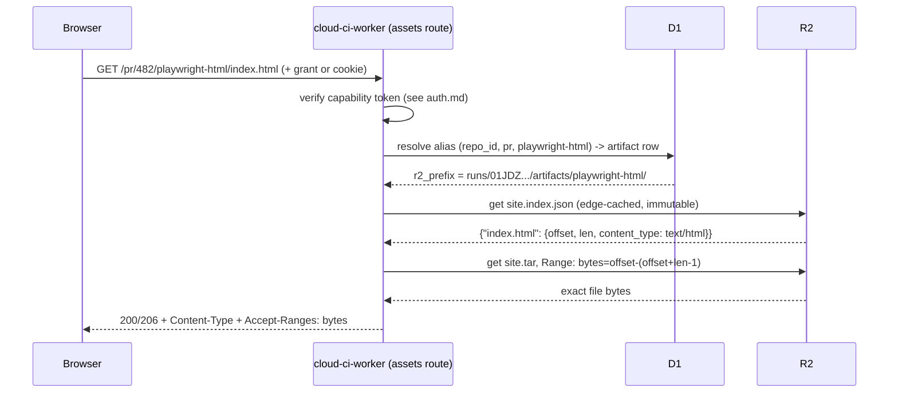

# Assets: artifact and report hosting

Status: **Proposed**

## Summary

Every run — managed or external — can produce three kinds of durable output beyond the
structured reports that feed analytics: arbitrary files (build output, logs excluded — see
[architecture](../architecture.md)), browsable HTML report sites (Vitest HTML, Playwright HTML
report, coverage HTML), and job caches (dependency directories restored between runs). All three
live in R2. This doc covers the R2 key layout, how bytes get from a job into R2 (shared with
[byo-ci](./byo-ci.md)), how browsable sites are served from an origin the dashboard cannot read
cookies from, stable "latest for this PR/branch" URLs, content-type/range handling, size limits,
retention, and the separate job-cache lifecycle (keys, restore-keys, eviction).

The load-bearing invariant, already stated in [architecture](../architecture.md): **report HTML
never shares an origin with the dashboard.** A Playwright or Vitest HTML report runs arbitrary JS
produced by the repo under test. If that JS executed on the dashboard's origin it could read the
viewer's session. Everything below is built around keeping that true even as reports move,
expire, and get re-aliased.

## Goals

- One R2 key layout for artifacts, sites, and reports, written by the one shared upload path
  ([ADR 0007](../adr/0007-one-upload-path.md)).
- Serve browsable HTML sites from a host that cannot read the dashboard's session, with
  short-lived, narrowly-scoped auth.
- Stable URLs for "latest site for PR #N" / "latest site for branch X" that survive re-runs.
- Correct `Content-Type`, `Content-Encoding`, and single-range `Range` handling for files served
  out of a packed site, not just whole objects.
- A size policy and retention/eviction policy for both artifacts and caches, enforced without
  relying on R2 bucket-wide lifecycle rules having per-repo granularity.
- Job-level caching (`cache.key` / `restore-keys` / eviction) on the same R2 account, isolated
  from served assets.

## Non-goals

- The ingest API's request/response shapes (endpoints, idempotency keys, resumable upload
  protocol) — that contract belongs to [byo-ci](./byo-ci.md); this doc only fixes the R2 key
  layout and the multipart part size those endpoints target.
- `.cloud-ci/pipeline.yml` schema for declaring artifacts/sites/cache — see
  [pipeline-config](./pipeline-config.md); examples below are illustrative, not authoritative.
- Access/OAuth session mechanics for the dashboard itself, GitHub OIDC/App auth — see
  [auth](./auth.md). This doc only defines the asset-host grant/cookie that auth.md's capability
  token rides in.
- Merge semantics for sharded blob reports (Playwright `blob`, Vitest blob) — see
  [parallelization](./parallelization.md). This doc only hosts the merge job's output site.

## User experience

```
# inside a job, after tests run
cloud-ci upload --site playwright-html=./playwright-report --retention-days 14
cloud-ci upload --site coverage-html=./coverage/html
cloud-ci upload --report junit=./test-results/junit.xml
cloud-ci upload --artifact build-output=./dist.tar.zst
```

Illustrative pipeline fragment (authoritative schema: [pipeline-config](./pipeline-config.md)):

```yaml
jobs:
  e2e:
    runner: standard-2
    steps:
      - run: npx playwright test
    artifacts:
      - site: playwright-html
        path: playwright-report/
      - report: junit
        path: test-results/junit.xml
    cache:
      - key: npm-${{ checksum("package-lock.json") }}
        restore-keys: [npm-]
        paths: [node_modules]
```

Resulting URLs (dedicated asset zone, not the dashboard's zone):

| What | URL |
| --- | --- |
| This run's Playwright report | `https://s-01jdz3x8.assets.example.com/` |
| Latest Playwright report for PR #482 | `https://assets.example.com/pr/482/playwright-html/` |
| Latest coverage for branch `main` | `https://assets.example.com/branch/main/coverage-html/` |
| Download a plain artifact | `https://assets.example.com/dl/run/01JDZ3.../build-output` |

The PR comment and dashboard link to the `pr/` / `branch/` aliases by default so links keep
working across re-runs; a run's own page also exposes the pinned per-run URL for sharing a result
that will not move.

## Design

### Why a separate host, and which flavor

[Universal SSL](https://developers.cloudflare.com/ssl/edge-certificates/universal-ssl/limitations/)
(verified 2026-04-30) only covers the apex and first-level subdomains on a full DNS setup — a
per-site hostname like `s-01jdz3x8.assets.example.com` is a *second*-level subdomain and needs
either Advanced Certificate Manager + Total TLS (wildcard `*.assets.example.com`) or a custom
wildcard certificate. [Custom Domains](https://developers.cloudflare.com/workers/configuration/routing/custom-domains/)
(verified 2026-09-29) do **not** support wildcard hostnames — they require an exact match — so the
per-site-subdomain flavor must be attached via a wildcard [Route](https://developers.cloudflare.com/workers/configuration/routing/routes/)
(`*.assets.example.com/*`), not a Custom Domain, with the zone's DNS holding one proxied wildcard
record pointing at an originless placeholder (`192.0.2.0`) since the Worker intercepts before DNS
resolution matters.

| Flavor | Isolation | Cost/ops | When |
| --- | --- | --- | --- |
| Per-site subdomain (`s-<id>.assets.example.com`) | True host isolation: a report's JS cannot even share a `Path=/` cookie with another report's grant, because cookies are host-scoped | Needs ACM + Total TLS (or an uploaded wildcard cert) and a wildcard Route | Recommended default |
| Shared host (`assets.example.com`, path-scoped `/s/<artifact_id>/...`) | Needs per-artifact cookie **names** and `Path=/s/<artifact_id>/` scoping — see Security — because `document.cookie` on a shared host is visible to any path whose Path attribute matches, not just same-origin requests | Single Custom Domain, Universal SSL covers it with zero extra config | Fallback for deployments that cannot provision wildcard TLS |

Both flavors are implemented by the same Worker code path reading the same R2 objects; the
flavor is a deploy-time config choice (`assets.hosting_mode: subdomain | path`), not a design
fork.

### R2 key layout

Two buckets: `cloud-ci-assets` (served to browsers, this doc) and `cloud-ci-cache` (never served
externally, read only by `cloud-ci agent`/`cloud-ci upload` through the ingest API — see Caching
below). Keys, agreed with [byo-ci](./byo-ci.md) so the same upload code writes them regardless of
run type:

| Kind | Key | Notes |
| --- | --- | --- |
| Site (browsable dir) | `runs/{run_id}/artifacts/{name}/site.tar` | **Uncompressed** ustar, built client-side by `cloud-ci-core`'s packer, multipart-uploaded in 32 MiB parts |
| Site index | `runs/{run_id}/artifacts/{name}/site.index.json` | `{path: {offset, len, content_type, content_encoding?, sha256}}`; `offset`/`len` are the exact content range (after that entry's header, including any GNU long-name extension header, before its block padding) — written in the same pass as the tar, never re-derived by reading tar headers back |
| Plain blob artifact | `runs/{run_id}/artifacts/{name}` | Single object; directories that aren't meant to be browsed are `name.tar.zst` instead of a site |
| Report (parsed by the Worker) | `runs/{run_id}/reports/{kind}/{file}` | junit.xml, lcov.info, etc.; small, direct `put()`, not tar'd |
| Cache tarball | `cache/{repo_id}/{cache_key}/{cache_version}.tar.zst` | Repo-scoped, not run-scoped — see Caching |

`run_id` is a ULID (per [architecture](../architecture.md)'s data model), so keys are unique
without a `repo_id` segment; retention and purge are driven from D1, not from R2 prefix listing
(see Retention below).

### Serving a site request



Alias resolution happens **per request**, not as a one-time redirect: relative links inside a
report (`./trace/abc.zip`, `./data/xyz.json`) must keep working under the alias path, so the
Worker maps `alias -> current r2_prefix` on every request rather than 302-ing to a canonical path
that the browser would then hold onto. `site.index.json` for a given prefix is immutable once the
artifact finishes uploading, so the Worker caches it in the Cache API keyed by `r2_prefix` with a
long TTL; alias-to-prefix lookups are not cached as long (bounded by the capability token's `exp`
anyway, typically ≤1h, so a 60s cache is enough to absorb a burst of requests for one page).

### Content-type and content-encoding

- Site files: `content_type` comes from `site.index.json`, assigned by the CLI packer at pack
  time from the file extension (standard web-asset table: html, css, js, json, svg, png, woff2,
  map, …), not sniffed by the Worker.
- Plain blobs/reports: the CLI sets `httpMetadata.contentType` on `put()`; on `get()` the Worker
  calls `object.writeHttpMetadata(headers)` to copy it (and any `contentDisposition`,
  `cacheControl`) onto the response, per the [R2 Workers API reference](https://developers.cloudflare.com/r2/api/workers/workers-api-reference)
  (fetched 2026-09-30).
- Every served object gets `X-Content-Type-Options: nosniff` — these are user-/framework-
  generated HTML served live from arbitrary repos; MIME sniffing across that boundary is not
  something to allow.
- Large, highly-compressible files the CLI packs into a site (big `trace.json`-style report data)
  may be pre-gzipped before tarring, with `content_encoding: "gzip"` recorded per-entry. Because
  each file is compressed independently (not the whole tar), the byte range extracted for that
  file is itself a complete gzip stream. The Workers runtime otherwise re-compresses response
  bodies even when a `Content-Encoding` header is already set unless the response is constructed
  with `encodeBody: "manual"` — confirmed against `workers-rs` 0.8: `Response::with_encode_body(EncodeBody::Manual)`
  (docs.rs/worker 0.8.7, `EncodeBody::{Automatic,Manual}`; cross-referenced against
  [cloudflare/workers-rs#567](https://github.com/cloudflare/workers-rs/issues/567), fetched
  2026-09-30). Files the CLI did not pre-compress are served with the default (automatic) body
  encoding, letting Cloudflare's normal edge brotli/gzip apply.
- Plain blob downloads get `Content-Disposition: attachment`; site files get `inline`. The
  dashboard links to sites with `target="_blank"`, not an iframe, so there is no need for a
  report-specific CSP/sandbox policy in v1 — the separate host plus host-scoped cookies are the
  isolation boundary, not frame sandboxing.

### Range requests

Both flavors of served object need `Range`:

- **Plain blob** (e.g. resuming a large download, or a video artifact): 1:1 passthrough —
  `bucket.get(key, { range })` where `range` is one of `worker::Range`'s three forms
  (`OffsetWithLength`, `OffsetToEnd`, `Suffix`), matching the [R2 ranged-reads contract](https://developers.cloudflare.com/r2/api/workers/workers-api-reference)
  ("3 variations of arguments ... offset (with or without length) or suffix", fetched 2026-09-30).
- **File inside a site** (e.g. Playwright's trace viewer seeking within a trace, or a browser
  resuming a partial fetch of a large report data file): the client's `Range: bytes=X-Y` is
  relative to the **logical file**, not the tar. The Worker translates it to an absolute range on
  `site.tar`: `tar_offset = entry.offset + X`, `length = min(Y, entry.len - 1) - X + 1`, rejecting
  (416) if `X >= entry.len`.
- Multi-range requests (`Range: bytes=0-10,20-30`) are not supported — R2's range option is a
  single range, not a list — and are answered with a full `200` body, which is spec-compliant
  fallback behavior for a server that cannot satisfy a multi-range request.
- Every GET/HEAD response on the assets host sets `Accept-Ranges: bytes`; partial responses are
  `206` with `Content-Range: bytes X-Y/total` where `total` is the file's logical length (from
  `site.index.json`, not the tar's object size).

### Stable aliases

`asset_aliases` (D1, see Data model) maps `(repo_id, kind, ref_value, label)` to the artifact that
currently backs it. On each run's completion, every `site`/`artifact` with a `label` upserts its
alias row for `(pr, <pr number>, label)` (if the run is for a PR) and `(branch, <branch name>,
label)` (if the run is for a branch head, e.g. `main`). Older runs' artifacts are not deleted by
this — the alias just stops pointing at them; the per-run pinned URL (`/dl/run/{run_id}/{name}`
and the per-site-subdomain form) keeps resolving until retention deletes the underlying object.

### Upload path (shared with byo-ci)

`cloud-ci upload` is the same binary and the same ingest calls whether invoked by `cloud-ci agent`
inside a managed container or by someone else's CI ([ADR 0007](../adr/0007-one-upload-path.md)).
This doc only fixes what that path writes:

- Directory marked `--site`: packed into `site.tar` + `site.index.json` by `cloud-ci-core`'s
  packer (shared, tested natively, no `worker` dependency — [architecture](../architecture.md)),
  uploaded via the ingest API's multipart wrapper around R2 `create_multipart_upload` /
  `resume_multipart_upload`, default part size 32 MiB.
- Single file or non-browsable directory (`--artifact`): one object, uploaded directly if it fits
  the inbound request body limit for the deployment's Cloudflare plan, else through the same
  multipart wrapper.
- `--report`: small, direct `put()`; the Worker also parses it synchronously into D1/analytics
  tables (not this doc's concern).

The exact endpoint shapes, idempotency keys, and resumability belong to
[byo-ci](./byo-ci.md); the two docs agree only on the R2 keys above and the 32 MiB part size.

## Data model

### D1 tables

```sql
create table artifacts (
  id            text primary key,        -- ULID
  run_id        text not null,
  job_id        text,
  kind          text not null,           -- 'site' | 'blob' | 'report'
  label         text,                    -- e.g. 'playwright-html'; null for ad-hoc names
  r2_prefix     text not null,           -- 'runs/{run_id}/artifacts/{name}/'
  size_bytes    integer not null,
  file_count    integer not null default 1,
  retention_days integer,                -- overrides repo default if set
  created_at    integer not null,
  expires_at    integer not null
);
create index artifacts_run on artifacts(run_id);
create index artifacts_expiry on artifacts(expires_at);

create table asset_aliases (
  repo_id     integer not null,
  kind        text not null,             -- 'pr' | 'branch'
  ref_value   text not null,             -- PR number or branch name
  label       text not null,
  artifact_id text references artifacts(id),
  updated_at  integer not null,
  primary key (repo_id, kind, ref_value, label)
);

create table cache_entries (
  repo_id        integer not null,
  cache_key      text not null,
  cache_version  text not null,
  r2_key         text not null,          -- cache/{repo_id}/{cache_key}/{cache_version}.tar.zst
  size_bytes     integer not null,
  created_at     integer not null,
  last_used_at   integer not null,
  restored_count integer not null default 0,
  primary key (repo_id, cache_key, cache_version)
);
create index cache_entries_lru on cache_entries(repo_id, last_used_at);
```

### R2 object size and request limits (govern the above)

Verified against the [R2 limits page](https://developers.cloudflare.com/r2/platform/limits/) and
[Workers limits page](https://developers.cloudflare.com/workers/platform/limits/), both fetched
2026-09-30:

| Limit | Value |
| --- | --- |
| Object size | 5 TiB |
| Single-request (non-multipart) upload | 4.995 GiB |
| Max multipart parts | 10,000 |
| Object key length | 1,024 bytes |
| Object metadata size | 8,192 bytes |
| Custom domains per R2 bucket | 100 |
| Worker inbound request body (Free/Pro) | 100 MB |
| Worker inbound request body (Business) | 200 MB |
| Worker inbound request body (Enterprise) | up to 5 GB (self-serve) |
| Worker response body | not enforced by Workers; CDN cache still caps at 512 MB (Free/Pro/Business) or 5 GB (Enterprise) — irrelevant here since asset responses are not edge-cached by default (capability-gated) |
| R2 delete | up to 1,000 keys per `delete_multiple` call |

The CLI's 32 MiB default part size is chosen to stay well under the inbound body limit on every
plan tier without a plan-aware branch in the client.

## Security considerations

- **Capability token** (defined in [auth](./auth.md)): HMAC-SHA256 keyed by
  `HKDF(CLOUD_CI_MASTER_KEY, info="cloud-ci/assets/v1")`, over claims `{repo_id, run_id or alias,
  path_prefix, sub, exp}`. This doc fixes the delivery mechanism: a short-lived (`exp` ≤ 60s)
  grant token rides once in a query parameter (`?g=...`) on first navigation to an asset-host URL;
  the Worker verifies it, mints a session token (`exp` ≤ 1h, same claim shape) into a cookie, and
  redirects to the same path with the query stripped. Subsequent requests on that host use only
  the cookie.
- **Cookie scoping, per hosting flavor:**
  - Per-site subdomain: cookie is `__Host-cc_asset` (`Secure`, `HttpOnly`, `SameSite=Lax`,
    `Path=/`), host-only (no `Domain` attribute). Because it is host-only, JS on
    `s-<other>.assets.example.com` cannot read it via `document.cookie` even though both hosts
    share a registrable domain — this is host isolation, not cross-site isolation, and it is
    sufficient because `__Host-` cookies are never sent cross-host regardless of `SameSite`.
  - Shared host: the same `Path=/` trick does not isolate between two artifacts served
    concurrently on `assets.example.com/s/<id-a>/` and `.../s/<id-b>/`, because a cookie's
    visibility to `document.cookie` follows the same path-matching rule as transmission — a
    `Path=/` cookie is visible to JS on every path of that host. The shared-host flavor therefore
    uses a per-artifact cookie **name** (`__Host-cc_asset_{artifact_id}`) scoped with
    `Path=/s/{artifact_id}/`, so one report's JS cannot read another concurrently-open report's
    session cookie on the same host.
- **Dashboard session never crosses.** The dashboard's own session cookie is scoped to the
  dashboard's host (or, in shared-Access-cookie deployments, to the dashboard's path); it is
  never set with a `Domain` attribute that would make it visible to `*.assets.example.com` or
  `assets.example.com`.
- **Origin check on the shared-host flavor.** Per [auth](./auth.md)'s threat model: because the
  shared-host flavor puts the dashboard and the asset host on the same registrable domain (even
  though different hosts/paths), the Worker checks `Sec-Fetch-Site`/`Origin` on any state-changing
  asset-host request (there are none planned for v1 — asset serving is read-only — but the check
  is cheap insurance against a future mutating endpoint being added to the same route table).
- **Grant-token replay window.** A 60-second grant token is not single-use (the token is
  stateless HMAC, not a server-tracked nonce); a captured grant URL is replayable until `exp`.
  Accepted risk, mitigated by the short window and by the token being scoped to a path prefix the
  bearer was already authorized to view.
- **Public repos.** Even when the underlying GitHub repo is public, the asset host still requires
  a grant/cookie by default — "public GitHub repo" does not imply "no login to view CI output" is
  the deployer's intent unless they opt in (`assets.public_for_public_repos: true`), because some
  pipelines intentionally keep CI output private (internal coverage numbers, etc.) even on an
  open-source repo.
- **Abuse/rate limiting.** The `?g=` exchange endpoint does cheap signature verification per
  request; it is still worth a Cloudflare Rate Limiting rule to bound brute-force/log-noise
  attempts, since the endpoint is unauthenticated by definition (that's the point of a grant).

## Failure modes

| Failure | Behavior |
| --- | --- |
| Grant token expired or signature invalid | 403, dashboard re-mints and retries once transparently (same flow as a normal re-auth) |
| Alias has no artifact yet (first run for a new PR not finished) | 404 with a body pointing back at the run's status page, not a bare 404 |
| `site.index.json` missing an entry for the requested path | 404; common cause is a report's client-side router requesting a path that was never a real file — falls back to serving the site's recorded `index.html` entry only if the pipeline marked it as an SPA-style site, otherwise a plain 404 |
| `site.tar` upload completed but `site.index.json` upload did not (multipart completed, sidecar PUT failed) | Artifact row is not inserted into D1 until both objects exist; a request against the alias/run therefore still resolves to the previous artifact (or 404 if none), never to a half-written one |
| R2 object expired via retention sweep but an alias or bookmarked per-run URL still points at it | 404; the retention sweep clears `asset_aliases` rows pointing at a deleted `artifact_id` in the same transaction as the D1 `artifacts` row delete, so this only affects external bookmarks, not in-app links generated after expiry |
| Cache restore finds no exact key and no `restore-keys` match | Job proceeds with an empty cache directory (same behavior as a cold cache), not an error |
| Cache entry corrupted/truncated (partial multipart never completed) | Never visible: cache rows are only inserted after multipart `complete` succeeds, same as artifacts |
| Range request past end of file | 416 `Range Not Satisfiable` with `Content-Range: bytes */{total}` |

## Retention and lifecycle

Retention is **not** driven by R2's native prefix-based lifecycle rules at per-repo granularity,
because the key layout (`runs/{run_id}/...`) has no `repo_id` segment to scope a prefix rule to —
see Design above for why that layout was kept. Instead:

- R2 [object lifecycle rules](https://developers.cloudflare.com/r2/buckets/object-lifecycles/)
  (verified 2026-04-21) are used only as an account-wide backstop on the `cloud-ci-assets` bucket:
  a hard expiry (e.g. 180 days) on the `runs/` prefix as a cost safety net if the application-level
  sweep ever stalls, and an `AbortIncompleteMultipartUpload` rule at 1 day (R2's bucket default is
  7 days; overridden shorter here since abandoned multipart uploads from crashed CI jobs are
  common and cheap to clean up fast).
- Actual per-repo retention is enforced by a daily cron Worker: for each repo, delete `artifacts`
  rows (and their R2 objects, via `delete_multiple` in batches of ≤1,000 keys) older than that
  repo's configured `retention_days` (default 30; pipeline/per-artifact override via
  `retention_days` as shown in the pipeline example above), clearing any `asset_aliases` row that
  pointed at a deleted artifact in the same D1 transaction.
- Reports that have already been parsed into D1/analytics rollups may get a shorter default
  (e.g. 7 days) for the raw file, since the structured data they fed into outlives them; this is a
  per-`kind` default, not a hardcoded rule, so pipeline-config can override it.

## Caching for jobs

Separate bucket (`cloud-ci-cache`), separate table (`cache_entries` above), separate lifecycle —
modeled on familiar `key`/`restore-keys`/eviction semantics so pipeline authors coming from other
CI systems do not have to relearn a new mental model:

- **Key**: an exact string the job computes (pipeline example above hashes a lockfile). Exact
  match restores that cache and only that cache.
- **Restore-keys**: an ordered fallback list, each treated as a **prefix** over existing
  `cache_key` values for the repo; on a `key` miss, the first restore-key with any matching
  entries wins, and among matches the most recently created (`created_at`) is restored. This is a
  warm-start, not a guarantee of content compatibility — the job's own build tooling is expected
  to treat a restore-key hit as "probably still useful," not "identical."
- **Cache version**: a separate dimension (`cache_version` in the key, e.g. bumped when the
  runner image or lockfile format changes) so an incompatible cache format doesn't need the `key`
  itself to change; old versions simply age out under the same eviction policy.
- **Write**: a cache is only written if the job's cache step explicitly says so (not implicit on
  every run) and only via the same multipart-wrapped upload path as artifacts, format
  `tar.zst` (symmetric compress-then-extract-whole; unlike sites, caches are never served
  byte-range, so there is no reason to keep them uncompressed).
- **Eviction**: LRU against a per-repo size cap (`cache.max_size_per_repo`, default 5 GiB
  [design default, not a platform limit]). The same daily cron that sweeps artifact retention also
  sweeps `cache_entries`: when a repo's total cached bytes exceed its cap, delete entries ordered
  by `last_used_at` ascending until back under the cap. `last_used_at` is bumped on every restore
  (not just on write), so a frequently-reused cache under a stable key survives longer than a
  one-off.

## Open questions

- Per-site wildcard-subdomain flavor needs Advanced Certificate Manager + Total TLS (or an
  uploaded wildcard cert) provisioned at deploy time — is that a hard requirement for v1, or does
  v1 ship with the shared-host flavor only and treat subdomains as a later upgrade? Affects the
  deploy docs/Terraform-equivalent more than this doc's serving logic, since both flavors share
  the same Worker code.
- Whether `assets.public_for_public_repos` should default true or false is a product call, not an
  engineering one; this doc assumes false (most conservative) pending that decision.
- SPA-style report fallback (serving `index.html` for an unknown path within a site) is mentioned
  in Failure modes as opt-in per pipeline config; neither Vitest's nor Playwright's HTML reporters
  currently need this (both are verified to be static multi-file sites, not client-side-routed
  SPAs — [Vitest reporters guide](https://vitest.dev/guide/reporters) and
  [vitest-dev/vitest#9971](https://github.com/vitest-dev/vitest/issues/9971), fetched 2026-09-30,
  describe the HTML reporter's output as a static site that must be served over HTTP rather than
  opened as `file://`, not as an SPA needing path fallback), so this may be dead code until a
  framework that does need it is added.
- Whether `site.index.json` itself should ever be served directly (for tooling that wants the
  manifest) or stays an internal implementation detail — currently the latter.
- Exact `cache.max_size_per_repo` default and whether it should scale with plan/instance tier is
  left to whoever owns pricing/plan tiers; 5 GiB here is a placeholder default.

## Alternatives considered

| Alternative | Why not |
| --- | --- |
| Expand sites into one R2 object per file at upload time | Matches naive intuition but multiplies small-object R2 write operations by file count (Playwright/coverage reports commonly have hundreds to low thousands of files) for no serving benefit over range-reads against one tar; the single-tar-plus-index approach (agreed with [byo-ci](./byo-ci.md)) gets identical per-file serving with one multipart upload instead of N single-object PUTs |
| R2 presigned S3-style URLs instead of a Worker-minted capability token | Would mean issuing R2/S3 credentials (scoped or not) to end users or to the dashboard's backend, outside the GitHub-permission-derived role model in [auth](./auth.md); the capability token keeps all authorization decisions in the Worker's own role logic and never hands out storage credentials |
| Redirect alias URLs to the canonical per-run path | Breaks relative links inside a report once the browser has navigated to the canonical URL and the alias is later repointed mid-session; per-request resolution avoids this at the cost of one D1/cache lookup per request |
| Compress the whole `site.tar` (gzip/zstd) for storage savings | Defeats independent byte-range extraction — a compressed tar's entries are not individually seekable without decompressing from the start — so only individual large files are pre-compressed by the CLI, not the archive as a whole |
| One shared bucket for assets and caches | Caches need LRU eviction and are never served to browsers; keeping them in a separate bucket makes the "assets bucket is the only thing the asset host touches" security boundary a structural fact rather than a convention that could be violated by a routing bug |
| Native R2 lifecycle rules as the sole retention mechanism | Would require baking `repo_id` into every key (to get per-repo prefix rules) or accepting one retention policy for the whole bucket; the D1-driven cron gets per-repo/per-artifact overrides without changing the key layout byo-ci already committed to |
