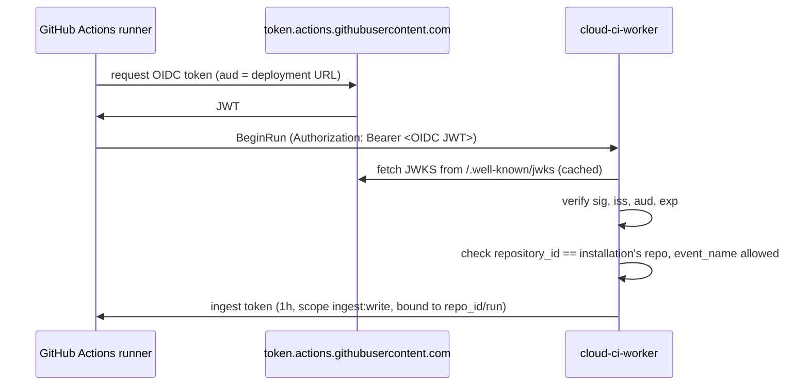
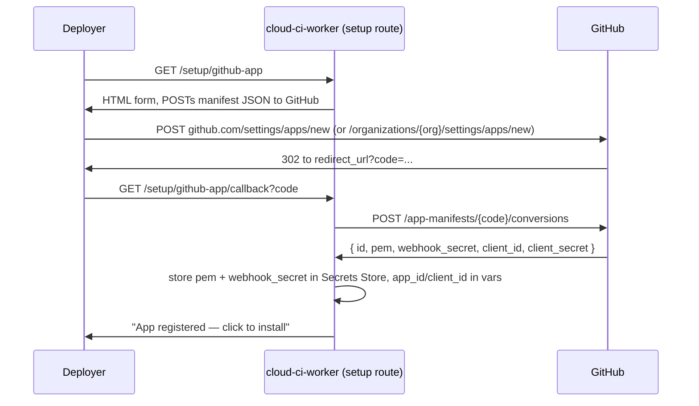

# Auth & permissions

Status: **Proposed**. See [ADR 0008](../adr/0008-auth-modes.md) for the decision this doc
details.

## Summary

Every request into `cloud-ci-worker` is either a **human** request (dashboard, PR comment slash command) or a **machine** request (GitHub Actions upload, BYO-CI upload, our own container agent, our own coordinator). Humans authenticate with Cloudflare Access or GitHub OAuth (deploy-time choice, either or both); machines authenticate with GitHub Actions OIDC, a scoped API token, or a per-job token minted by `RunCoordinator`. Every authenticated identity resolves to exactly one of three roles — **viewer**, **operator**, **admin** — evaluated per repository, and every action maps to a minimum role. GitHub access, including webhooks and the role lookup itself, goes through a single GitHub App, registered once per deployment via the manifest flow.

## Goals

- One role model (viewer / operator / admin), enforced the same way regardless of which human
  auth mode is active.
- Zero stored secrets for GitHub Actions callers — OIDC only.
- Every long-lived credential is revocable and stored in a form that is useless if the
  database leaks (hashed, not reversible).
- One GitHub App per deployment, requesting only the permissions the shipped feature set
  actually uses.
- Webhook and token verification happen before any other request handling; nothing touches D1,
  R2, or a Durable Object on behalf of an unverified caller.

## Non-goals

- Hosting an identity provider. Cloudflare Access or GitHub remain the identity source; we only
  verify what they issue.
- Per-action ACLs finer than the three roles (e.g. "can view logs but not cancel runs"). Three
  roles cover the feature set in [architecture.md](../architecture.md); a fourth role is an
  [open question](#open-questions), not a v1 feature.
- Multiple GitHub orgs per deployment — single-tenant per [ADR 0003](../adr/0003-single-tenant-deployment.md).
- Non-GitHub forges. The `Forge` trait in architecture.md leaves room; this doc assumes GitHub.
- Usage-based or billing-based access control.

## User experience

### Deploy-time configuration

```toml
# wrangler.toml (excerpt)
[vars]
AUTH_MODE = "access"                              # "access" | "github_oauth" | "both"
ACCESS_TEAM_DOMAIN = "https://acme.cloudflareaccess.com"
ACCESS_AUD = "32eafc7626e974616deaf0dc3ce63d7bcbed58a2731e84d06bc3cdf1b53c4228"
GITHUB_APP_ID = "123456"
GITHUB_APP_CLIENT_ID = "Iv1.8a61f9b3a7aba766"

[[secrets_store_secrets]]
binding = "GITHUB_APP_PRIVATE_KEY"
store_id = "a1b2c3d4e5f6a1b2c3d4e5f6a1b2c3d4"
secret_name = "github-app-private-key"

[[secrets_store_secrets]]
binding = "GITHUB_WEBHOOK_SECRET"
store_id = "a1b2c3d4e5f6a1b2c3d4e5f6a1b2c3d4"
secret_name = "github-webhook-secret"

[[secrets_store_secrets]]
binding = "CLOUD_CI_MASTER_KEY"
store_id = "a1b2c3d4e5f6a1b2c3d4e5f6a1b2c3d4"
secret_name = "cloud-ci-master-key"
```

`secrets_store_secrets` bindings and the `wrangler secrets-store secret create` / `store create`
commands are the account-level Secrets Store mechanism, distinct from per-Worker `wrangler
secret put` — see [Secret storage](#secret-storage)
(developers.cloudflare.com/secrets-store/integrations/workers, updated 2026-05-05).

When `AUTH_MODE = "both"`, a request is authenticated if either mode succeeds; the resulting
role is the one derived from whichever mode matched (a user who is both an Access-group member
and a GitHub collaborator is not required to reconcile two roles — Access is checked first,
then GitHub OAuth).

### Per-repo overrides

```yaml
# .cloud-ci/pipeline.yml (excerpt) — optional, defaults shown
auth:
  comment_commands: operator   # minimum role for /cloud-ci rerun, /cloud-ci cancel
  autofix: operator            # minimum role to request AI autofix (see ./ai.md)
```

See [pipeline-config.md](./pipeline-config.md) for the rest of the file format.

### CLI login

```sh
$ cloud-ci login
Open https://github.com/login/device and enter code WXYZ-1234
Waiting for authorization... done.
Logged in as octocat (operator on 4 repos, admin on 1)
Token written to ~/.config/cloud-ci/credentials (scope: query:read, all repos)

$ cloud-ci login --scope ingest:write --repo octo-org/widgets --name buildkite-prod --ttl 90d
Created token cc_tok_8f2a9c1e4b7d6a30f9e2c5b8a1d4f7e0...
Store this now — it will not be shown again.
```

`login` runs the GitHub device authorization flow against the deployment's GitHub App, then
exchanges the resulting GitHub user access token for a `cloud-ci`-scoped token (see
[Machine auth](#machine-auth)). The device flow requires **Enable Device Flow** to be turned on
for the App in its settings (docs.github.com/en/apps/maintaining-github-apps/modifying-a-github-app-registration,
accessed 2026-09-30); it is set during [GitHub App setup](#github-app-setup).

## Design

### Human auth: Cloudflare Access

When `AUTH_MODE` includes `access`, Access sits in front of the dashboard hostname and attaches
a signed JWT to every request as the `Cf-Access-Jwt-Assertion` header (and, for browser
requests, a `CF_Authorization` cookie — the header is authoritative since the cookie is not
guaranteed to be present)
(developers.cloudflare.com/cloudflare-one/.../validating-json, updated 2026-05-06).

Standard Access browser flow: an unauthenticated browser is redirected to the configured IdP,
then back to Access with a `CF_Authorization` cookie, then on to the Worker with both the
cookie and the `Cf-Access-Jwt-Assertion` header set. Verification, every request:

1. Reject if `Cf-Access-Jwt-Assertion` is missing (do not fall back to the cookie).
2. Fetch `https://<team>.cloudflareaccess.com/cdn-cgi/access/certs`, cached by `kid`; Access
   rotates its signing key roughly every 6 weeks and keeps the previous key valid for 7 days —
   match on `kid` against `public_certs`, never pin a key or read `public_cert` from a stale
   cache (same source as above).
3. Verify RS256 signature, `iss == ACCESS_TEAM_DOMAIN`, `aud == ACCESS_AUD`, `exp`/`nbf`.
4. Read `email` and, if present, the `groups` custom claim from the payload.

Access only places `groups` in the JWT if the IdP's `groups` SAML attribute or OIDC claim was
explicitly mapped when configuring the IdP in Zero Trust — Access does not add it
automatically — and the payload is trimmed (dropping configured claims from the end, groups
usually first) once the serialized `custom` claim exceeds roughly 1 KB, since the JWT also
rides in a browser cookie (developers.cloudflare.com/.../application-token, updated
2026-06-25). Because group membership can silently disappear from the JWT for a user in many
groups, the Worker does not trust `groups` in the JWT for the admin/operator boundary; it calls
`GET https://<team>.cloudflareaccess.com/cdn-cgi/access/get-identity` with the forwarded
`CF_Authorization` cookie and reads the untrimmed `idp` group list, cached 5 minutes per `sub`.
`email` and `sub` are used directly from the JWT (never trimmed).

Role mapping is deploy-time config, not a schema:

```toml
[access_role_map]
admin = ["eng-leads", "platform-team"]
operator = ["engineering"]
# anything else authenticated via Access and not listed is "viewer"
```

**Machine-to-Access**: Access also supports service tokens (`CF-Access-Client-Id` /
`CF-Access-Client-Secret` headers) for non-interactive callers
(developers.cloudflare.com/cloudflare-one/access-controls/service-credentials/service-tokens,
accessed 2026-09-30). cloud-ci does not use these: GitHub Actions callers use OIDC and BYO-CI
systems use scoped API tokens (below), both already scoped to this deployment without
provisioning anything in Access.

### Human auth: GitHub OAuth

Login uses the GitHub App's own user-to-server OAuth (standard web application flow; GitHub
Apps need no separate OAuth App registration): the browser is redirected to
`github.com/login/oauth/authorize`, GitHub redirects back with a `code`, the Worker exchanges
it at `/login/oauth/access_token` for a user access token, calls `GET /user` once to get a
verified `login`/`id`/`email`, upserts a `users` row, creates a session, and sets the session
cookie.

The Worker never stores the GitHub user access token past the callback: it is used once, to
call `GET /user` for a verified `login`/`id`, then discarded. Repo-level role resolution does
**not** reuse that token (it would need `read:org` scoped correctly and goes stale after 8
hours); instead the Worker calls the role-lookup endpoint below using the App's own
installation token, keyed on the GitHub login already captured.

Session storage is **D1 rows, not stateless signed cookies** — see
[Alternatives considered](#alternatives-considered) for why. The cookie holds only a random
256-bit session id; the session row is looked up by the SHA-256 hash of that id, so a leaked D1
export does not yield usable sessions:

```
Set-Cookie: __Host-cc_session=<base64url(32 random bytes)>; Secure; HttpOnly; SameSite=Lax; Path=/
```

### Role resolution (both modes, GitHub-derived)

For GitHub OAuth always, and for Access when `access_role_map` does not list any of the user's
groups, the role for a given repo comes from the user's GitHub permission on that repo:

```
GET /repos/{owner}/{repo}/collaborators/{username}/permission
Authorization: Bearer <installation access token>
```

returns `{ "permission": "admin"|"write"|"read"|"none", "role_name": "<exact role>" }`; this
endpoint only needs the App's mandatory `Metadata: read` permission and accepts an installation
token (docs.github.com/en/rest/collaborators/collaborators, accessed 2026-09-30). `permission`
collapses `maintain` into `write` and `triage` into `read`, but `role_name` reports the precise
role, which the brief's mapping needs to distinguish `maintain` from plain `write`:

| `role_name` | cloud-ci role |
| --- | --- |
| `read`, `triage` | viewer |
| `write` | operator |
| `maintain`, `admin` | admin |
| any custom repository role not listed above | fall back to `permission`: `admin`→admin, `write`→operator, else viewer |

Results are cached in D1 (`repo_role_cache`, below) with a 5-minute TTL per `(user, repo)` to
keep this off the hot path of every request; see [Failure modes](#failure-modes) for staleness
handling.

### Role model and permission matrix

| Action | Minimum role |
| --- | --- |
| View dashboard, run detail, PR comment contents | viewer |
| View hosted report sites, logs, artifacts (see [assets.md](./assets.md)) | viewer |
| View analytics, cost estimates, flaky-test history (see [analytics.md](./analytics.md)) | viewer |
| Re-run a job or run | operator |
| Cancel a run | operator |
| `/cloud-ci rerun`, `/cloud-ci cancel` PR comment commands (see [pr-comment.md](./pr-comment.md)) | operator (overridable, [per-repo overrides](#per-repo-overrides)) |
| Request AI autofix (see [ai.md](./ai.md)) | operator (overridable) |
| Trigger a BYO-CI ingest run manually from the dashboard | operator |
| Change repo settings: retention, concurrency limits, `runner: auto` bounds, feature toggles | admin |
| Purge artifacts / change asset retention (see [assets.md](./assets.md)) | admin |
| Issue, list, revoke scoped API tokens | admin |
| View/rotate per-repo config | admin |

Rotating the GitHub App's own private key, webhook secret, or `CLOUD_CI_MASTER_KEY` is a
deployment-operator action performed through Cloudflare (dashboard or `wrangler`), not a
cloud-ci role — anyone who can deploy the Worker already has that access, and no cloud-ci role
is meant to substitute for it.

### Machine auth

All three machine identities present credentials to the same ingest/query surface; only the
mechanism that produces a verified `(scope[], repo_id, run_id?)` tuple differs.

#### 1. GitHub Actions OIDC

A workflow using `cloud-ci upload` (see [byo-ci.md](./byo-ci.md)) requests an OIDC token with
`id-token: write` permission. The Worker verifies:



- **Issuer**: `https://token.actions.githubusercontent.com`; JWKS URI is published at `/.well-known/openid-configuration` (token.actions.githubusercontent.com/.well-known/openid-configuration, accessed 2026-09-30).
- **Audience**: the action step sets a custom `aud` (via `id-token: write` + `core.getIDToken(audience)`) equal to the deployment's own Worker URL, not GitHub's default repository-owner-URL audience — this is what scopes the token to *this* deployment and nothing else.
- **Repo binding**: rather than trust the `sub` claim's string format (collision-resistant only for repositories created after 2026-07-15, when GitHub began optionally issuing `owner_id`/`repo_id`-qualified subjects — docs.github.com/en/actions/reference/security/oidc, accessed 2026-09-30), the Worker checks the numeric `repository_id`/`repository_owner_id` claims against the `repos`/`installations` rows for this deployment's installation. Numeric IDs are never reused if a repo is renamed or transferred, closing the gap the legacy `sub` format has.
- `event_name` is checked against an allowlist (`push`, `pull_request`, `workflow_dispatch`, `schedule`) to reject tokens minted for unrelated job types [unverified — exact allowlist is a product decision, not a GitHub guarantee].

A verified OIDC token never touches D1; it produces a short-lived ingest token (below) and is
discarded.

#### 2. Scoped API tokens

For any other CI system (Buildkite, Jenkins, a laptop), `cloud-ci login` or
`POST /v1/tokens` (admin-only, dashboard) mints an opaque token:

```
cc_tok_<32 random bytes, base64url>
```

Only `sha256(token)` is stored, in `api_tokens.token_hash` (BLOB, 32 bytes) — the plaintext is shown once at creation and is not recoverable from the database, mirroring the GitHub webhook secret and the App's own credentials in never storing a secret anywhere it could be read back.
Each row carries a `scopes` array and an optional `repo_allowlist`; requests present `Authorization: Bearer cc_tok_...`, the Worker hashes and looks up the row, checks `revoked_at IS NULL` and `expires_at` (if set), and checks the requested action's scope against `scopes`.

| Scope | Grants |
| --- | --- |
| `ingest:write` | `BeginRun`, `UploadReport`, `UploadArtifact`, `FinishRun` for repos in the allowlist |
| `query:read` | Read-only query API (run/job/test history) for repos in the allowlist |
| `admin:tokens` | Issue and revoke other API tokens — only ever granted to a token owned by an admin-role user |

#### 3. Per-job tokens

`RunCoordinator` mints a token when starting a container for a job (or shard), passed into the
container as an environment variable, never logged:

```
typ=job, scope=["job:upload"], repo_id, run_id, job_id, shard?, exp = job deadline + 2min grace
```

It is single-use in the sense that a retried job attempt gets a freshly minted token — a leaked token from a crashed attempt authorizes nothing for the retry — and it only authorizes uploads for its own `(run_id, job_id, shard)`, never cross-job or cross-run access. The in-container `cloud-ci agent` uses it exactly like a BYO-CI API token against the same ingest RPCs ([byo-ci.md](./byo-ci.md)), which is the "same upload code path" invariant from [architecture.md](../architecture.md).

#### Token format (shared by scoped API tokens' session-equivalents, ingest tokens, and job tokens)

Ingest tokens (minted after OIDC verification) and job tokens share one opaque, stateless
format so `RunCoordinator` can mint and verify them without a D1 round trip:

```
<base64url(payload)>.<base64url(HMAC-SHA256(key, payload))>
payload = {v:1, typ, sub, repo_id, run_id?, job_id?, scope:[...], exp, jti}
key = HKDF-SHA256(CLOUD_CI_MASTER_KEY, info = "cloud-ci/" + typ + "/v1")
```

The `info` string namespaces keys per token type (`job`, `ingest`) so a job token can never be replayed as an ingest token even though both are structurally identical HMAC tokens. Long-lived API tokens deliberately do **not** use this format — they are opaque random values hashed in D1 (above), trading a D1 read per request for instant revocation, which matters for a credential that can live for months.

### GitHub App setup

The App is registered once per deployment via the [manifest
flow](https://docs.github.com/en/apps/sharing-github-apps/registering-a-github-app-from-a-manifest)
(accessed 2026-09-30), driven by a one-time setup command/page rather than manual form-filling:



All three steps must complete within one hour of the manifest `POST`
(docs.github.com/en/apps/sharing-github-apps/registering-a-github-app-from-a-manifest,
accessed 2026-09-30). The manifest:

```json
{
  "name": "cloud-ci (acme)",
  "url": "https://ci.acme.example",
  "hook_attributes": { "url": "https://ci.acme.example/webhooks/github" },
  "redirect_url": "https://ci.acme.example/setup/github-app/callback",
  "public": false,
  "default_permissions": {
    "contents": "read",
    "checks": "write",
    "pull_requests": "write",
    "issues": "write",
    "metadata": "read",
    "statuses": "write"
  },
  "default_events": [
    "push",
    "pull_request",
    "check_suite",
    "check_run",
    "issue_comment",
    "installation"
  ]
}
```

| Permission | Level | Used for |
| --- | --- | --- |
| Contents | read | Fetch `.cloud-ci/pipeline.yml` at a commit; read-only, never pushes (write is opt-in, see below) |
| Checks | write | Per-job GitHub Check Runs (always on, per [architecture.md](../architecture.md)) |
| Pull requests | write | Sticky PR comment ([pr-comment.md](./pr-comment.md)), suggested-changes reviews |
| Issues | write | `issue_comment` events carry `/cloud-ci` slash commands on PRs (PRs are issues in the GitHub API) |
| Metadata | read | Mandatory for every GitHub App; also backs the collaborator-permission role lookup above |
| Commit statuses | write | Legacy status API fallback where Check Runs are unavailable [unverified — may be droppable if Checks alone suffices] |

| Event | Why |
| --- | --- |
| `push` | Trigger managed runs, update PR-head-sha comment targeting |
| `pull_request` | Trigger managed runs, detect PR open/sync/close |
| `check_suite`, `check_run` | `rerequested` action drives re-run from GitHub's own UI |
| `issue_comment` | `/cloud-ci` slash commands |
| `installation`, `installation_repositories` | Track which repos the App can see; invalidate `repo_role_cache` and `repos` rows on suspend/uninstall/repo add-remove |

**Contents: write** and the ability to open PRs with the suggested-changes bot identity is requested only when a deployment opts into AI autofix's fix-PR mode at setup time ([ai.md](./ai.md)); it is not in the default manifest, keeping the default install's blast radius to "comment and check status," never "push code," matching the autofix invariant in architecture.md.

App-level authentication (fetching an installation token, or any `/app/*` endpoint) uses a self-signed JWT: `alg: RS256`, `iat` set 60 seconds in the past to tolerate clock drift, `exp` no more than 10 minutes out, `iss` = the App's client ID, signed with the stored private key via WebCrypto `crypto.subtle.sign` (docs.github.com/en/apps/creating-github-apps/authenticating-with-a-github-app/generating-a-json-web-token-jwt-for-a-github-app, accessed 2026-09-30). Installation access tokens obtained with that JWT expire after one hour (docs.github.com/en/apps/creating-github-apps/about-creating-github-apps/best-practices-for-creating-a-github-app, accessed 2026-09-30) and are cached per-installation in a small Durable Object (`InstallationTokenCache`, one per `installation_id`) rather than D1, re-minted on a timer a few minutes before expiry; they are never persisted to the relational store, limiting how long a D1 export could remain useful if it leaked.

### Secret storage

| Secret | Where | Why there |
| --- | --- | --- |
| GitHub App private key (PEM) | Secrets Store, `workers` scope binding | Account-level, encrypted, never readable again after creation; shared only by this Worker |
| GitHub webhook secret | Secrets Store | Same as above |
| `CLOUD_CI_MASTER_KEY` (HKDF root for job/ingest tokens and asset grants, see [assets.md](./assets.md)) | Secrets Store | Same as above; rotating it invalidates all outstanding job/ingest tokens, which is acceptable since they are minutes-to-hours lived |
| `ACCESS_AUD`, `GITHUB_APP_ID`, `GITHUB_APP_CLIENT_ID` | Worker `vars` | Not secret — public identifiers |
| Scoped API tokens | D1, `api_tokens.token_hash` (SHA-256) | Caller-controlled lifetime; must be revocable, so hashed-at-rest, not HMAC-derived |
| Session ids | D1, `sessions.id` (SHA-256 of the cookie value) | Same reasoning as API tokens — revocable, worthless if D1 leaks |

Secrets Store is an account-level store (distinct from per-Worker `wrangler secret put` variables), bound into the Worker via `secrets_store_secrets` in `wrangler.toml` and read with `await env.<BINDING>.get()`; creating or binding a secret requires the Super Administrator or Secrets Store Admin/Deployer role on the Cloudflare account (developers.cloudflare.com/secrets-store/integrations/workers, updated 2026-05-05). This means the same GitHub App private key is available to `cloud-ci-worker` without copy-pasting it into every environment's `wrangler secret put` separately, and the dashboard/API never has a code path that can read a secret value back out.

### Webhook signature verification

Every GitHub webhook delivery carries `X-Hub-Signature-256: sha256=<hex hmac>`, computed by
GitHub as `HMAC-SHA256(webhook_secret, raw_request_body)`. The Worker:

1. Reads the raw body bytes (before any JSON parsing).
2. Computes the same HMAC using `GITHUB_WEBHOOK_SECRET` via WebCrypto.
3. Compares in constant time (`crypto.subtle.verify` with an HMAC `CryptoKey`, which is
   constant-time by construction, rather than a manual byte comparison) — GitHub explicitly
   warns against `==`-style comparison for this check
   (docs.github.com/en/webhooks/using-webhooks/validating-webhook-deliveries, accessed
   2026-09-30).
4. Rejects with 401 before the body is parsed or any queue message is enqueued if the signature
   is missing or does not match.

```rust
// cloud-ci-worker, sketch
let sig = headers.get("x-hub-signature-256")?; // "sha256=<hex>"
let expected = hmac_sha256(&env.github_webhook_secret, &raw_body);
if !constant_time_eq(sig.strip_prefix("sha256=")?, &hex::encode(expected)) {
    return Response::error("invalid signature", 401);
}
```

## Data model

No R2 keys belong to this doc (see [assets.md](./assets.md) for the R2 layout). D1 tables:

| Table | Columns | Notes |
| --- | --- | --- |
| `users` | `id` (ULID PK), `github_user_id` (int, unique, nullable), `github_login` (text, nullable), `access_sub` (text, unique, nullable), `email`, `created_at`, `last_login_at` | One row per human identity regardless of which auth mode they used; `github_user_id`/`access_sub` are alternate keys, not both required |
| `sessions` | `id` (text PK, sha256 hex of cookie value), `user_id` (FK), `auth_mode` (`access`\|`github_oauth`), `created_at`, `expires_at`, `last_seen_at` | Deleted on logout or admin-triggered revoke |
| `repo_role_cache` | `user_id`, `repo_id` (PK pair), `role`, `checked_at` | TTL enforced at read time (`checked_at` + 5 min), not by a cron sweep |
| `api_tokens` | `id` (ULID PK), `token_hash` (BLOB 32), `name`, `scopes` (JSON array), `repo_allowlist` (JSON array of `repo_id`, null = all repos visible to `created_by`), `created_by` (FK `users.id`), `created_at`, `expires_at` (nullable), `last_used_at` (nullable), `revoked_at` (nullable) | `last_used_at` updated best-effort (not every request needs a write) for anomaly review |
| `installations` | `installation_id` (PK), `account_login`, `account_type`, `suspended_at` (nullable), `installed_at` | Updated from `installation`/`installation_repositories` webhooks |

`repos` itself (repo_id, installation_id, name) is owned by [architecture.md](../architecture.md)'s
core data model, not duplicated here.

## Security considerations / threat model

| Threat | Mitigation |
| --- | --- |
| Forged `Cf-Access-Jwt-Assertion` header sent directly to the Worker, bypassing Access | Worker validates signature/`iss`/`aud`/`exp` regardless of path, so a forged header without the account's Access private key fails; deployments SHOULD also make the dashboard hostname reachable only through the Access application (not a second, unprotected DNS record) so this is defense-in-depth, not the sole gate |
| Access JWT minted for a different Access application on the same Zero Trust team, replayed here | `aud` is checked against this specific application's AUD tag, which never changes unless the application is deleted/recreated |
| GitHub OAuth session cookie theft (XSS, log leakage) | `__Host-` prefix + `Secure` + `HttpOnly` + `SameSite=Lax`; session id is random and only its SHA-256 hash is stored, so a D1 leak alone does not yield a usable session |
| GitHub permission downgrade not reflected immediately (e.g. removed from a team) | `repo_role_cache` TTL is 5 minutes, bounding exposure; no webhook subscription forces immediate invalidation in v1 (see [Open questions](#open-questions)) |
| Forged webhook delivery | `X-Hub-Signature-256` HMAC verified in constant time before parsing; see [Webhook signature verification](#webhook-signature-verification) |
| OIDC token for a different, same-named repo (rename/recreate) | Checked against numeric `repository_id`/`repository_owner_id`, not the `repo:OWNER/REPO` string, closing the gap the legacy (pre-2026-07-15) `sub` format has |
| OIDC token audience broadened to GitHub's default (org URL) by a misconfigured workflow | Worker requires `aud` to equal this deployment's own URL exactly; GitHub's default audience is the repo-owner URL, which is shared across every deployment that org might run, so it is explicitly rejected |
| Scoped API token leaked (CI system log, env dump) | Hashed at rest, so leak-of-database does not expose it; leak-of-token is bounded by its `repo_allowlist` and `scopes`, and is revocable instantly via `revoked_at` |
| Per-job token leaked from inside the build container | Scoped to exactly one `(run_id, job_id, shard)`, expires at the job's deadline + 2 min, and a retried attempt gets a fresh token, so a leaked token has no value once the job (or its retry) finishes |
| `CLOUD_CI_MASTER_KEY` compromise | Rotatable via Secrets Store; invalidates all outstanding job/ingest tokens (minutes-to-hours old, cheap to re-mint) without touching `api_tokens` or `sessions`, which use independent hashing, not this key |
| GitHub App private key compromise | Stored only in Secrets Store (write-only after creation); rotated from the App's GitHub settings, which supports generating a new key alongside the old one during cutover [unverified — exact grace-period behavior for multiple active App keys not independently confirmed] |
| Shared-hostname asset serving leaking the dashboard session (cross-feature concern) | Addressed in [assets.md](./assets.md): hosted report HTML never runs on the dashboard's origin; in the shared-hostname fallback mode the Worker additionally checks `Origin`/`Sec-Fetch-Site` on state-changing asset-host requests, since that mode is same-registrable-domain even though the dashboard cookie is never sent there |

## Failure modes

| Failure | Behavior |
| --- | --- |
| Access `/cdn-cgi/access/certs` unreachable | Serve from the last successfully fetched JWKS (in-memory/cached) if still within its own cache window; if no cached JWKS exists, fail closed with 401 rather than skip verification |
| GitHub API rate-limited or down during role lookup | Serve the last cached `repo_role_cache` row if present, even if its TTL expired, rather than fail closed immediately; if no cached row exists, resolve to viewer (least privilege) and surface a banner in the dashboard |
| D1 unavailable | Sessions and API tokens cannot be validated; all authenticated requests fail closed (503), since there is no safe default for "is this session still valid" |
| Installation suspended or uninstalled | `installations.suspended_at` set from the webhook; role lookups for that installation's repos resolve to no access until reinstalled; outstanding sessions/tokens are not auto-revoked (next role-cache refresh catches it within 5 minutes) |
| Clock drift between edge and GitHub/Access issuers | All three token types carry `exp`/`nbf`/`iat`; the Worker applies no additional leeway beyond what each issuer already builds in (Access JWTs, GitHub App JWTs with the recommended 60s `iat` backdate) |

## Open questions

- Should Access `groups` resolution require the IdP's `groups` claim to be configured, or is an
  email-domain fallback acceptable for deployments that skip that IdP setup step?
- Is a 5-minute `repo_role_cache` TTL tight enough, or should `member`/`team` org webhooks be
  added to invalidate it immediately at the cost of two more webhook event subscriptions?
- Default `cloud-ci login` to the device flow (requires enabling it per-App) or a local-loopback
  web flow — device flow is simpler to document but requires an explicit App setting toggle.
- Does `CLOUD_CI_MASTER_KEY` need a dual-key rotation window (old+new both valid for an overlap
  period) given job/ingest tokens are short-lived, or is "old tokens just expire within the
  hour" sufficient?
- Is "Commit statuses: write" actually needed once Check Runs fully cover the status-reporting
  surface, or can it be dropped from the default manifest?

## Alternatives considered

- **Stateless signed session cookies instead of D1 `sessions` rows.** Rejected: revocation would
  need a deny-list, which is a database anyway, and GitHub-derived roles already require a D1
  cache regardless of session storage, so the stateless win is marginal while losing
  instant-revoke, which matters when an admin removes a compromised teammate.
- **A separate OAuth App for human login, alongside the GitHub App for webhooks/machine
  access.** Rejected: GitHub Apps have their own user-to-server OAuth flow, so a second app
  registration would only add a second client id/secret pair and a second install step for no
  functional gain.
- **JWTs (self-contained, verifiable without a DB read) for scoped API tokens, matching the
  job/ingest token format.** Rejected for long-lived tokens specifically: a token that can live
  for months must be revocable without rotating a shared signing key for everyone, so it is
  opaque-and-hashed instead; job/ingest tokens keep the HMAC format because their lifetime (an
  hour or less) makes the revocation gap irrelevant.
- **Model roles entirely through Cloudflare Access applications/policies (one Access app per
  role).** Rejected: forces every operator/admin action through a Zero Trust re-auth prompt and
  does not work at all in GitHub-OAuth-only deployments, which must stay fully usable without
  Access configured.
