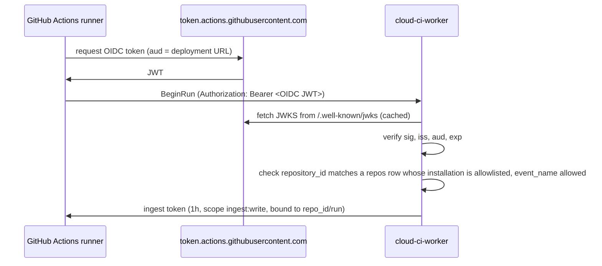
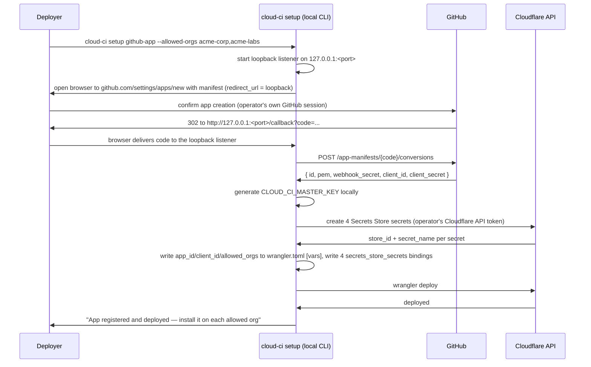

# Auth & permissions

Status: **Proposed**. See [ADR 0008](../adr/0008-auth-modes.md) for the decision this doc
details.

## Summary

Every request into `cloud-ci-worker` is either a **human** request (dashboard, PR comment slash
command) or a **machine** request (GitHub Actions upload, BYO-CI upload, our own container
agent, our own coordinator). Humans authenticate with GitHub OAuth (GitHub App user flow);
machines authenticate with GitHub Actions OIDC, a scoped API token, or a per-job token minted by
`RunCoordinator`. Every authenticated identity resolves to exactly one of three roles —
**viewer**, **operator**, **admin** — evaluated per repository. A single deployment can serve
**multiple GitHub orgs** at once, each through its own GitHub App installation, for companies
that split work across more than one org ([ADR 0003](../adr/0003-single-tenant-deployment.md)); all data is keyed by installation and repo
id, and a user's dashboard is scoped to the repos their GitHub permissions actually grant them
access to, across every installation this deployment has. GitHub access, including webhooks and
the role lookup itself, goes through a single GitHub App, registered once per deployment via the
manifest flow.

## Goals

- One role model (viewer / operator / admin), enforced identically for every repo regardless of
  which installation (org) it belongs to.
- Zero stored secrets for GitHub Actions callers — OIDC only.
- Every long-lived credential is revocable and stored in a form that is useless if the
  database leaks (hashed, not reversible).
- One GitHub App per deployment, requesting only the permissions the shipped feature set
  actually uses, installable into every org the deployer's company uses.
- Only orgs the deployer explicitly allowed at setup can ever create usable data in this
  deployment, even if the App's GitHub-side visibility is broader than that.
- Webhook and token verification happen before any other request handling; nothing touches D1,
  R2, or a Durable Object on behalf of an unverified caller.

## Non-goals

- Hosting an identity provider. GitHub remains the identity source; we only verify what it
  issues.
- Cloudflare Access/Zero Trust as a cloud-ci auth mode. Considered and rejected — see
  [ADR 0008](../adr/0008-auth-modes.md#alternatives-considered). Deployers who still want an
  IdP gate in front of a hostname can put Cloudflare Zero Trust there themselves; see
  [Deployment note](#deployment-note) below.
- Per-action ACLs finer than the three roles (e.g. "can view logs but not cancel runs"). Three
  roles cover the feature set in [architecture.md](../architecture.md); a fourth role is an
  [open question](#open-questions), not a v1 feature.
- Multi-company tenancy within one deployment. Multiple orgs under one deployment must belong to
  one company ([ADR 0003](../adr/0003-single-tenant-deployment.md)) — this doc's org allowlist narrows which orgs *can* onboard, it does
  not isolate orgs from each other the way separate deployments would.
- Non-GitHub forges. The `Forge` trait in architecture.md leaves room; this doc assumes GitHub.
- Usage-based or billing-based access control.

## User experience

### Deploy-time configuration

```toml
# wrangler.toml (excerpt)
[vars]
GITHUB_APP_ID = "123456"
GITHUB_APP_CLIENT_ID = "Iv1.8a61f9b3a7aba766"
GITHUB_ALLOWED_ORGS = "acme-corp,acme-labs"            # deployed allowlist, see below

[[secrets_store_secrets]]
binding = "GITHUB_APP_PRIVATE_KEY"
store_id = "a1b2c3d4e5f6a1b2c3d4e5f6a1b2c3d4"
secret_name = "github-app-private-key"

[[secrets_store_secrets]]
binding = "GITHUB_APP_CLIENT_SECRET"
store_id = "a1b2c3d4e5f6a1b2c3d4e5f6a1b2c3d4"
secret_name = "github-app-client-secret"

[[secrets_store_secrets]]
binding = "GITHUB_WEBHOOK_SECRET"
store_id = "a1b2c3d4e5f6a1b2c3d4e5f6a1b2c3d4"
secret_name = "github-webhook-secret"

[[secrets_store_secrets]]
binding = "CLOUD_CI_MASTER_KEY"
store_id = "a1b2c3d4e5f6a1b2c3d4e5f6a1b2c3d4"
secret_name = "cloud-ci-master-key"
```

`secrets_store_secrets` bindings and the `wrangler secrets-store secret create` / `store create`
commands are the account-level Secrets Store mechanism, distinct from per-Worker `wrangler
secret put` — see [Secret storage](#secret-storage)
(developers.cloudflare.com/secrets-store/integrations/workers, updated 2026-05-05).

`GITHUB_ALLOWED_ORGS` is the org allowlist: a comma-separated list of GitHub org (or user
account) logins the deployer names during [GitHub App setup](#github-app-setup). It is enforced
on every `installation` webhook — see [Multiple orgs and installations](#multiple-orgs-and-installations)
— independently of whatever install-time restriction the App's own GitHub-side visibility
provides, since a public App (needed when a company's orgs are not all under one GitHub
Enterprise account) can otherwise be installed by any GitHub account.

These values and binding declarations are deployment configuration, not mutable Worker
state. The `cloud-ci setup` CLI — run locally by the deployment operator, authenticated with
the operator's own GitHub session and Cloudflare API token — writes the identifiers and
allowlist to `wrangler.toml`, creates the account-level secrets using those Cloudflare
credentials, records each binding's `store_id` and `secret_name`, and runs `wrangler deploy`.
See [GitHub App setup](#github-app-setup) for the full flow. The running Worker only reads the
resulting vars and secret bindings; it has no runtime API to rewrite its own `vars` or bind a
Secrets Store secret, so no request handler — setup callback, dashboard, or otherwise — can
persist changes to them.

### Per-repo overrides

```yaml
# .cloud-ci/settings.yml (excerpt) — optional, defaults shown
commands:
  roles:
    rerun: operator      # /cloud-ci rerun, rerun checkbox, check-run action
    cancel: operator      # /cloud-ci cancel
    autofix: operator     # request AI autofix (see ./ai.md)
```

Values can only be raised (`operator` → `admin`), never lowered below `operator` — `viewer`
cannot invoke commands, so it is not a valid value here. `settings.yml` is always read from the
repo's default branch, same as every other `settings.yml` key, so no PR can raise or lower these
roles by editing the file on its own branch. See [settings.md](./settings.md#field-reference) for the
rest of the file format.

### CLI login

```sh
$ cloud-ci login
Open https://github.com/login/device and enter code WXYZ-1234
Waiting for authorization... done.
Logged in as octocat (operator on 4 repos, admin on 1)
Token written to ~/.config/cloud-ci/credentials (scope: query:read, all repos)

$ cloud-ci login --scope ingest:write --repo octo-org/widgets --name buildkite-prod --ttl 90d
Created token cc_tok_8f2a9c1e4b7d6a30f9e2c5b8a1d4f7e0...
Store this now — it will not be shown again.
```

`login` runs the GitHub device authorization flow against the deployment's GitHub App, then
exchanges the resulting GitHub user access token for a `cloud-ci`-scoped token (see
[Machine auth](#machine-auth)). The device flow requires **Enable Device Flow** to be turned on
for the App in its settings (docs.github.com/en/apps/maintaining-github-apps/modifying-a-github-app-registration,
accessed 2026-09-30); it is set during [GitHub App setup](#github-app-setup). `octocat`'s roles
are resolved per repo across every installation this deployment has, not just one org.

## Design

### Human auth: GitHub OAuth

Login uses the GitHub App's own user-to-server OAuth (standard web application flow; GitHub
Apps need no separate OAuth App registration): the browser is redirected to
`github.com/login/oauth/authorize`, GitHub redirects back with a `code`, the Worker exchanges
it at `/login/oauth/access_token` using `GITHUB_APP_CLIENT_ID` and the bound
`GITHUB_APP_CLIENT_SECRET` for a user access token, calls `GET /user` once to get a verified
`login`/`id`/`email`, upserts a `users` row, creates a session, and sets the session cookie.

The Worker never stores the GitHub user access token past the callback: it is used once, to
call `GET /user` for a verified `login`/`id`, then discarded. Repo-level role resolution does
**not** reuse that token (it would need `read:org` scoped correctly and goes stale after 8
hours); instead the Worker calls the role-lookup endpoint below using the token of the
installation that owns the target repo, keyed on the GitHub login already captured.

Session storage is **D1 rows, not stateless signed cookies** — see
[Alternatives considered](#alternatives-considered) for why. The cookie holds only a random
256-bit session id; the session row is looked up by the SHA-256 hash of that id, so a leaked D1
export does not yield usable sessions:

```
Set-Cookie: __Host-cc_session=<base64url(32 random bytes)>; Secure; HttpOnly; SameSite=Lax; Path=/
```

A session is not org-scoped: one login covers every installation this deployment has, and each
repo's role is resolved independently (below) at the time it is needed.

### Multiple orgs and installations

One GitHub App, one Worker deployment, many installations — one per org the company uses. Two
install paths, and a runtime allowlist that gates both:

- **Enterprise-owned App** (if the deployer has a GitHub Enterprise account): the App is
  registered under the enterprise, which restricts installation to orgs within that enterprise
  and authorization to enterprise members
  (docs.github.com/en/enterprise-cloud@latest/admin/managing-github-apps-for-your-enterprise/creating-github-apps-for-your-enterprise,
  accessed 2026-10-01) — GitHub itself does most of the gating here.
- **Public App owned by one org** (no Enterprise account, or orgs span more than one
  Enterprise): a private App "can only be installed on the account that owns the app"
  (docs.github.com/en/apps/creating-github-apps/registering-a-github-app/making-a-github-app-public-or-private,
  accessed 2026-10-01), so serving a second org requires making the App public, which lets *any*
  GitHub account install it. `GITHUB_ALLOWED_ORGS` is what keeps that safe: it is the only gate
  in this path.

**Discovery.** The `installation` and `installation_repositories` webhooks (subscribed in the
[manifest](#github-app-setup)) are the primary signal: `installation.created` upserts an
`installations` row *only if* the installing account's login is in `GITHUB_ALLOWED_ORGS`;
otherwise the Worker immediately calls `DELETE /app/installations/{installation_id}`
(docs.github.com/en/rest/apps/apps#delete-an-installation-for-the-authenticated-app, accessed
2026-10-01) to uninstall itself from the disallowed account and never creates rows for it.
`installation_repositories.added`/`removed` keep each installation's visible-repo set current.
Because webhook delivery is at-least-once but not guaranteed, a periodic reconcile job calls
`GET /app/installations` (paginated, App JWT auth) and diffs against the `installations` table,
catching any installation whose webhook was missed or whose delivery arrived while the Worker
was deploying.

**Data scoping.** Every row that is per-repo is also implicitly per-installation, since `repo_id`
only exists once per `(installation_id, repo)` pair in the `repos` table
([architecture.md](../architecture.md)). Nothing in this doc's tables (`repo_role_cache`,
`api_tokens.repo_allowlist`, `sessions`) needs its own `installation_id` column — joining through
`repo_id` is enough, and keeps queries from needing to special-case the single-org case.

**Role resolution per repo.** The lookup in [Role resolution](#role-resolution) always uses the
installation token that owns the target repo (looked up via `repos.installation_id`), never a
token from a different installation — an installation token is scoped by GitHub to only the
repos that installation can see, so using the wrong one simply 404s rather than leaking access.

**Dashboard scoping.** A signed-in user's repo list is the union, across every installation this
deployment has, of repos where `GET /repos/{owner}/{repo}/collaborators/{username}/permission`
(via that repo's installation token) returns a non-`none` permission. A user who is, say, an
`acme-corp` engineer and has no access to `acme-labs` simply sees zero `acme-labs` repos — there
is no separate "which orgs can this user see" step, it falls out of the per-repo check.

**Org allowlist changes.** `cloud-ci setup allowed-orgs --add <login>` (or `--remove`) is the
real write path: it edits `GITHUB_ALLOWED_ORGS` in `wrangler.toml` with the operator's own
Cloudflare credentials, and only when `--deploy` is passed does it also run `wrangler deploy`
(the same way [GitHub App setup](#github-app-setup) does for the initial value) — otherwise it
prints the diff and leaves deploying to the operator; either way there is no runtime admin action
that mutates the allowlist. Adding an org does not retroactively install anything — the org owner
still has to run the GitHub install flow, which then succeeds because the deployed allowlist no
longer rejects it. Removing an org from the allowlist does not uninstall it automatically (the
Worker only acts on `installation` webhooks); a deployer who wants it removed immediately also
uninstalls the App from that org in GitHub's UI, or the next full reconcile pass flags the
mismatch for manual follow-up [open question, below].

### Role resolution

The role for a given repo comes from the user's GitHub permission on that repo, looked up
through the repo's own installation:

```
GET /repos/{owner}/{repo}/collaborators/{username}/permission
Authorization: Bearer <installation access token>
```

returns `{ "permission": "admin"|"write"|"read"|"none", "role_name": "<exact role>" }`; this
endpoint only needs the App's mandatory `Metadata: read` permission and accepts an installation
token (docs.github.com/en/rest/collaborators/collaborators, accessed 2026-09-30). `permission`
collapses `maintain` into `write` and `triage` into `read`, but `role_name` reports the precise
role, which the brief's mapping needs to distinguish `maintain` from plain `write`:

| `role_name` | cloud-ci role |
| --- | --- |
| `read`, `triage` | viewer |
| `write` | operator |
| `maintain`, `admin` | admin |
| any custom repository role not listed above | fall back to `permission`: `admin`→admin, `write`→operator, else viewer |

Results are cached in D1 (`repo_role_cache`, below) with a 5-minute TTL per `(user, repo)` to
keep this off the hot path of every request; see [Failure modes](#failure-modes) for staleness
handling.

### Role model and permission matrix

| Action | Minimum role |
| --- | --- |
| View dashboard, run detail, PR comment contents | viewer |
| View hosted report sites, logs, artifacts (see [assets.md](./assets.md)) | viewer |
| View analytics, cost estimates, flaky-test history (see [analytics.md](./analytics.md)) | viewer |
| Re-run a job or run | operator |
| Cancel a run | operator |
| `/cloud-ci rerun`, `/cloud-ci cancel` PR comment commands (see [pr-comment.md](./pr-comment.md)) | operator (overridable, [per-repo overrides](#per-repo-overrides)) |
| Request AI autofix (see [ai.md](./ai.md)) | operator (overridable) |
| Trigger a BYO-CI ingest run manually from the dashboard | operator |
| Purge artifacts / change asset retention (see [assets.md](./assets.md)) | admin |
| Issue, list, revoke scoped API tokens | admin |

Rotating the GitHub App's own private key, webhook secret, OAuth client secret, or
`CLOUD_CI_MASTER_KEY` (new Secrets Store secret values via the operator's Cloudflare
credentials, then `wrangler deploy`), and changing `GITHUB_ALLOWED_ORGS` (via `cloud-ci setup
allowed-orgs`, above) or installing/uninstalling the App on an org, are deployment-operator
actions performed through Cloudflare and GitHub, not a cloud-ci role — anyone who can deploy
the Worker or administer the GitHub App already has that access, and no cloud-ci role is meant
to substitute for it.

### Machine auth

All three machine identities present credentials to the same ingest/query surface; only the
mechanism that produces a verified `(scope[], repo_id, run_id?)` tuple differs. Every call after
`BeginRun` — `StartJob`, `CreateUpload`, `CompleteUpload`, `SubmitReport`, `CompleteShard`, and
the raw upload-part `PUT` (data plane) — authenticates with the resulting ingest token and
cross-checks **both** its `repo_id` and `run_id` claims against the request's real owning run,
resolved independently via D1 (never trusted from the request itself): a token valid for one run
authorizes nothing for a different run, even under the same repo.

#### 1. GitHub Actions OIDC

A workflow using `cloud-ci upload` (see [byo-ci.md](./byo-ci.md)) requests an OIDC token with
`id-token: write` permission. The Worker verifies:



- **Issuer**: `https://token.actions.githubusercontent.com`; JWKS URI is published at `/.well-known/openid-configuration` (token.actions.githubusercontent.com/.well-known/openid-configuration, accessed 2026-09-30).
- **Audience**: the action step sets a custom `aud` (via `id-token: write` + `core.getIDToken(audience)`) equal to the deployment's own Worker URL, not GitHub's default repository-owner-URL audience — this is what scopes the token to *this* deployment and nothing else.
- **Repo binding**: rather than trust the `sub` claim's string format (collision-resistant only for repositories created after 2026-07-15, when GitHub began optionally issuing `owner_id`/`repo_id`-qualified subjects — docs.github.com/en/actions/reference/security/oidc, accessed 2026-09-30), the Worker checks the numeric `repository_id`/`repository_owner_id` claims against the `repos`/`installations` rows for this deployment — across every allowlisted installation, not just one. Numeric IDs are never reused if a repo is renamed or transferred, closing the gap the legacy `sub` format has.
- `event_name` is checked against an allowlist (`push`, `pull_request`, `workflow_dispatch`, `schedule`) to reject tokens minted for unrelated job types [unverified — exact allowlist is a product decision, not a GitHub guarantee].

A verified OIDC token never touches D1; it produces a short-lived ingest token (below) and is
discarded.

#### 2. Scoped API tokens

For any other CI system (Buildkite, Jenkins, a laptop), `cloud-ci login` or
`POST /v1/tokens` (admin-only, dashboard) mints an opaque token:

```
cc_tok_<32 random bytes, base64url>
```

Only `sha256(token)` is stored, in `api_tokens.token_hash` (BLOB, 32 bytes) — the plaintext is shown once at creation and is not recoverable from the database, mirroring the GitHub webhook secret and the App's own credentials in never storing a secret anywhere it could be read back.
Each row carries a `scopes` array and an optional `repo_allowlist` (repo ids, which may span
installations/orgs if the issuing admin has admin role on repos in more than one); requests
present `Authorization: Bearer cc_tok_...`, the Worker hashes and looks up the row, checks
`revoked_at IS NULL` and `expires_at` (if set), and checks the requested action's scope against
`scopes`.

| Scope | Grants |
| --- | --- |
| `ingest:write` | `BeginRun`, `UploadReport`, `UploadArtifact`, `FinishRun` for repos in the allowlist |
| `query:read` | Read-only query API (run/job/test history) for repos in the allowlist |
| `admin:tokens` | Issue and revoke other API tokens — only ever granted to a token owned by an admin-role user |

#### 3. Per-job tokens

`RunCoordinator` mints a token when starting a container for a job (or shard), passed into the
container as an environment variable, never logged:

```
typ=job, scope=["job:upload"], repo_id, run_id, job_id, shard?, exp = job deadline + 2min grace
```

It is single-use in the sense that a retried job attempt gets a freshly minted token — a leaked token from a crashed attempt authorizes nothing for the retry — and it only authorizes uploads for its own `(run_id, job_id, shard)`, never cross-job or cross-run access. The in-container `cloud-ci agent` uses it exactly like a BYO-CI API token against the same ingest RPCs ([byo-ci.md](./byo-ci.md)), which is the "same upload code path" invariant from [architecture.md](../architecture.md).

#### Token format (shared by scoped API tokens' session-equivalents, ingest tokens, and job tokens)

Ingest tokens (minted after OIDC verification) and job tokens share one opaque, stateless
format so `RunCoordinator` can mint and verify them without a D1 round trip:

```
<base64url(payload)>.<base64url(HMAC-SHA256(key, payload))>
payload = {v:1, typ, sub, repo_id, run_id?, job_id?, scope:[...], exp, jti}
key = HKDF-SHA256(CLOUD_CI_MASTER_KEY, info = "cloud-ci/" + typ + "/v1")
```

The `info` string namespaces keys per token type (`job`, `ingest`) so a job token can never be replayed as an ingest token even though both are structurally identical HMAC tokens. Long-lived API tokens deliberately do **not** use this format — they are opaque random values hashed in D1 (above), trading a D1 read per request for instant revocation, which matters for a credential that can live for months.

### GitHub App setup

The App is registered once per deployment via the [manifest
flow](https://docs.github.com/en/apps/sharing-github-apps/registering-a-github-app-from-a-manifest)
(accessed 2026-09-30), driven by `cloud-ci setup github-app`, a CLI the deployment operator
runs locally, authenticated with the operator's own GitHub browser session and the operator's
own Cloudflare API token (the same credential `wrangler` already uses). The CLI performs every
write itself — a Worker has no runtime API to rewrite its own `vars` or bind a new Secrets
Store secret, so persisting these credentials has to happen before `wrangler deploy`, not
inside a `fetch` handler. The operator passes `GITHUB_ALLOWED_ORGS` (the org logins they intend
to use) as a CLI argument before the manifest is ever sent, since the allowlist check on
`installation.created` needs it in place from the deployment that first registers the App:



The `code` never leaves the operator's machine — the manifest's `redirect_url` is a loopback
address, not the deployed Worker's hostname — and the conversion call, secret creation, and
`wrangler.toml` edit all happen in that same local process, so `pem`, `webhook_secret`, and
`client_secret` never cross a public URL, never reach Worker logs, and never appear in a
browser response; the browser only ever sees the final confirmation message. Until that first
`wrangler deploy` from setup lands, `GITHUB_APP_ID` and `GITHUB_ALLOWED_ORGS` are unset and the
four secret bindings do not exist, so the deployed Worker's webhook handler, OAuth callback,
and OIDC/ingest paths all fail closed (503, "not yet configured") — no `installation` can be
accepted and no human or machine caller can authenticate until an operator has actually
finished setup.

All three steps must complete within one hour of the manifest `POST`
(docs.github.com/en/apps/sharing-github-apps/registering-a-github-app-from-a-manifest,
accessed 2026-09-30). The manifest:

```json
{
  "name": "cloud-ci (acme)",
  "url": "https://ci.acme.example",
  "hook_attributes": { "url": "https://ci.acme.example/webhooks/github" },
  "redirect_url": "http://127.0.0.1:<port>/callback",
  "public": false,
  "default_permissions": {
    "contents": "read",
    "checks": "write",
    "pull_requests": "write",
    "issues": "write",
    "metadata": "read",
    "statuses": "write",
    "actions": "read"
  },
  "default_events": [
    "push",
    "pull_request",
    "check_suite",
    "check_run",
    "issue_comment",
    "installation",
    "installation_repositories",
    "workflow_run"
  ]
}
```

`public` starts `false`; the `cloud-ci setup github-app` CLI flips it to `true` only if the
deployer's orgs are not all under one GitHub Enterprise account — see
[Multiple orgs and installations](#multiple-orgs-and-installations) for why that is the only
case that needs it, and why `GITHUB_ALLOWED_ORGS` is mandatory as soon as it is.

| Permission | Level | Used for |
| --- | --- | --- |
| Contents | read | Fetch `.cloud-ci/settings.yml` and pipeline scripts at a commit; read-only, never pushes (write is opt-in, see below) |
| Checks | write | GitHub Check Runs created by pipeline scripts (see [pr-comment.md](./pr-comment.md)) |
| Pull requests | write | Sticky PR comment ([pr-comment.md](./pr-comment.md)), suggested-changes reviews |
| Issues | write | `issue_comment` events carry `/cloud-ci` slash commands on PRs (PRs are issues in the GitHub API) |
| Metadata | read | Mandatory for every GitHub App; also backs the collaborator-permission role lookup above |
| Commit statuses | write | Legacy status API fallback where Check Runs are unavailable [unverified — may be droppable if Checks alone suffices] |
| Actions | read | Required to receive `workflow_run` webhook deliveries, used to close a BYO CI run on completion ([byo-ci.md](./byo-ci.md)) |

| Event | Why |
| --- | --- |
| `push` | Trigger managed runs, update PR-head-sha comment targeting |
| `pull_request` | Trigger managed runs, detect PR open/sync/close |
| `check_suite`, `check_run` | `rerequested` action drives re-run from GitHub's own UI |
| `issue_comment` | `/cloud-ci` slash commands |
| `installation`, `installation_repositories` | Discover/allowlist-gate new installations (see [Multiple orgs and installations](#multiple-orgs-and-installations)); invalidate `repo_role_cache` and `repos` rows on suspend/uninstall/repo add-remove |
| `workflow_run` | `completed` deliveries close a BYO CI run correlated by `GITHUB_RUN_ID` ([byo-ci.md](./byo-ci.md)) |

**Contents: write** and the ability to open PRs with the suggested-changes bot identity is requested only when a deployment opts into AI autofix's fix-PR mode at setup time ([ai.md](./ai.md)); it is not in the default manifest, keeping the default install's blast radius to "comment and check status," never "push code," matching the autofix invariant in architecture.md.

App-level authentication (fetching an installation token, or any `/app/*` endpoint) uses a self-signed JWT: `alg: RS256`, `iat` set 60 seconds in the past to tolerate clock drift, `exp` no more than 10 minutes out, `iss` = the App's client ID, signed with the stored private key via WebCrypto `crypto.subtle.sign` (docs.github.com/en/apps/creating-github-apps/authenticating-with-a-github-app/generating-a-json-web-token-jwt-for-a-github-app, accessed 2026-09-30). Installation access tokens obtained with that JWT expire after one hour (docs.github.com/en/apps/creating-github-apps/about-creating-github-apps/best-practices-for-creating-a-github-app, accessed 2026-09-30) and are cached per-installation in a small Durable Object (`InstallationTokenCache`, one per `installation_id`) rather than D1, re-minted on a timer a few minutes before expiry; they are never persisted to the relational store, limiting how long a D1 export could remain useful if it leaked.

### Secret storage

| Secret | Where | Why there |
| --- | --- | --- |
| GitHub App private key (PEM) | Secrets Store, `workers` scope binding | Account-level, encrypted, never readable again after creation; shared only by this Worker |
| GitHub webhook secret | Secrets Store | Same as above |
| GitHub App OAuth client secret | Secrets Store | Needed to exchange the OAuth `code` for a user access token during [human login](#human-auth-github-oauth); same as above — never has a legitimate reason to be read back |
| `CLOUD_CI_MASTER_KEY` (HKDF root for job/ingest tokens and asset grants, see [assets.md](./assets.md)) | Secrets Store | Same as above; rotating it invalidates all outstanding job/ingest tokens, which is acceptable since they are minutes-to-hours lived |
| `GITHUB_APP_ID`, `GITHUB_APP_CLIENT_ID`, `GITHUB_ALLOWED_ORGS` | Worker `vars` | Not secret — public identifiers / an allowlist, not a credential; written by the `cloud-ci setup` CLI into `wrangler.toml`, read-only at runtime |
| Scoped API tokens | D1, `api_tokens.token_hash` (SHA-256) | Caller-controlled lifetime; must be revocable, so hashed-at-rest, not HMAC-derived |
| Session ids | D1, `sessions.id` (SHA-256 of the cookie value) | Same reasoning as API tokens — revocable, worthless if D1 leaks |

Secrets Store is an account-level store (distinct from per-Worker `wrangler secret put`
variables), bound into the Worker via `secrets_store_secrets` in `wrangler.toml` and read with
`await env.<BINDING>.get()`. Creating a secret requires the Super Administrator or Secrets
Store Admin role, and binding it into a Worker requires the Super Administrator or Secrets
Store Deployer role, on the Cloudflare account
(developers.cloudflare.com/secrets-store/integrations/workers, updated 2026-05-05). The
`cloud-ci setup` CLI does both steps with the operator's own Cloudflare API token — it creates
each of the four secrets above, writes the resulting `binding`/`store_id`/`secret_name` into
`wrangler.toml`, and runs `wrangler deploy` to bind them (see [GitHub App
setup](#github-app-setup)); the deployed Worker only ever reads them with
`await env.<BINDING>.get()` and has no code path that creates, rewrites, or reads a secret
value back out for display. This means the same GitHub App private key is available to
`cloud-ci-worker` without copy-pasting it into every environment's `wrangler secret put`
separately.

### Webhook signature verification

Every GitHub webhook delivery carries `X-Hub-Signature-256: sha256=<hex hmac>`, computed by
GitHub as `HMAC-SHA256(webhook_secret, raw_request_body)`. The Worker:

1. Reads the raw body bytes (before any JSON parsing).
2. Computes the same HMAC using `GITHUB_WEBHOOK_SECRET` via WebCrypto.
3. Compares in constant time (`crypto.subtle.verify` with an HMAC `CryptoKey`, which is
   constant-time by construction, rather than a manual byte comparison) — GitHub explicitly
   warns against `==`-style comparison for this check
   (docs.github.com/en/webhooks/using-webhooks/validating-webhook-deliveries, accessed
   2026-09-30).
4. Rejects with 401 before the body is parsed or any queue message is enqueued if the signature
   is missing or does not match.

```rust
// cloud-ci-worker, sketch
let sig = headers.get("x-hub-signature-256")?; // "sha256=<hex>"
let expected = hmac_sha256(&env.github_webhook_secret, &raw_body);
if !constant_time_eq(sig.strip_prefix("sha256=")?, &hex::encode(expected)) {
    return Response::error("invalid signature", 401);
}
```

## Data model

No R2 keys belong to this doc (see [assets.md](./assets.md) for the R2 layout). D1 tables:

| Table | Columns | Notes |
| --- | --- | --- |
| `users` | `id` (ULID PK), `github_user_id` (int, unique), `github_login`, `email`, `created_at`, `last_login_at` | One row per human identity |
| `sessions` | `id` (text PK, sha256 hex of cookie value), `user_id` (FK), `created_at`, `expires_at`, `last_seen_at` | Not org-scoped; deleted on logout or admin-triggered revoke |
| `repo_role_cache` | `user_id`, `repo_id` (PK pair), `role`, `checked_at` | TTL enforced at read time (`checked_at` + 5 min), not by a cron sweep; `repo_id` implies installation via `repos` |
| `api_tokens` | `id` (ULID PK), `token_hash` (BLOB 32), `name`, `scopes` (JSON array), `repo_allowlist` (JSON array of `repo_id`, null = all repos visible to `created_by`, which may span installations), `created_by` (FK `users.id`), `created_at`, `expires_at` (nullable), `last_used_at` (nullable), `revoked_at` (nullable) | `last_used_at` updated best-effort (not every request needs a write) for anomaly review |
| `installations` | `installation_id` (PK), `account_login`, `account_type`, `suspended_at` (nullable), `installed_at` | One row per allowlisted org; updated from `installation`/`installation_repositories` webhooks and the reconcile job |

`repos` itself (repo_id, installation_id, name) is owned by [architecture.md](../architecture.md)'s
core data model, not duplicated here.

## Security considerations / threat model

| Threat | Mitigation |
| --- | --- |
| GitHub OAuth session cookie theft (XSS, log leakage) | `__Host-` prefix + `Secure` + `HttpOnly` + `SameSite=Lax`; session id is random and only its SHA-256 hash is stored, so a D1 leak alone does not yield a usable session |
| GitHub permission downgrade not reflected immediately (e.g. removed from a team) | `repo_role_cache` TTL is 5 minutes, bounding exposure; no webhook subscription forces immediate invalidation in v1 (see [Open questions](#open-questions)) |
| Public App installed by a GitHub account outside the company (only relevant when `public: true`, see [Multiple orgs and installations](#multiple-orgs-and-installations)) | `GITHUB_ALLOWED_ORGS` checked on `installation.created` before any row is created; non-allowlisted installations are uninstalled immediately via the API, not merely ignored, so they cannot retry into a race |
| Role lookup for one org's user served from a different org's installation token | Role resolution always looks up `repos.installation_id` first and uses that installation's own token; a mismatched token 404s against GitHub rather than silently returning another org's permission |
| Forged webhook delivery | `X-Hub-Signature-256` HMAC verified in constant time before parsing; see [Webhook signature verification](#webhook-signature-verification) |
| OIDC token for a different, same-named repo (rename/recreate) | Checked against numeric `repository_id`/`repository_owner_id`, not the `repo:OWNER/REPO` string, closing the gap the legacy (pre-2026-07-15) `sub` format has |
| OIDC token audience broadened to GitHub's default (org URL) by a misconfigured workflow | Worker requires `aud` to equal this deployment's own URL exactly; GitHub's default audience is the repo-owner URL, which is shared across every deployment that org might run, so it is explicitly rejected |
| Scoped API token leaked (CI system log, env dump) | Hashed at rest, so leak-of-database does not expose it; leak-of-token is bounded by its `repo_allowlist` and `scopes`, and is revocable instantly via `revoked_at` |
| Per-job token leaked from inside the build container | Scoped to exactly one `(run_id, job_id, shard)`, expires at the job's deadline + 2 min, and a retried attempt gets a fresh token, so a leaked token has no value once the job (or its retry) finishes |
| `CLOUD_CI_MASTER_KEY` compromise | Rotatable via Secrets Store; invalidates all outstanding job/ingest tokens (minutes-to-hours old, cheap to re-mint) without touching `api_tokens` or `sessions`, which use independent hashing, not this key |
| GitHub App private key compromise | Stored only in Secrets Store (write-only after creation); rotated from the App's GitHub settings, which supports generating a new key alongside the old one during cutover [unverified — exact grace-period behavior for multiple active App keys not independently confirmed] |
| Shared-hostname asset serving leaking the dashboard session (cross-feature concern) | Addressed in [assets.md](./assets.md): hosted report HTML never runs on the dashboard's origin; in the shared-hostname fallback mode the Worker additionally checks `Origin`/`Sec-Fetch-Site` on state-changing asset-host requests, since that mode is same-registrable-domain even though the dashboard cookie is never sent there |

## Failure modes

| Failure | Behavior |
| --- | --- |
| GitHub API rate-limited or down during role lookup | Serve the last cached `repo_role_cache` row if present, even if its TTL expired, rather than fail closed immediately; if no cached row exists, resolve to viewer (least privilege) and surface a banner in the dashboard |
| D1 unavailable | Sessions and API tokens cannot be validated; all authenticated requests fail closed (503), since there is no safe default for "is this session still valid" |
| Installation suspended or uninstalled | `installations.suspended_at` set from the webhook; role lookups for that installation's repos resolve to no access until reinstalled; outstanding sessions/tokens are not auto-revoked (next role-cache refresh catches it within 5 minutes) |
| `installation.created` webhook missed for a disallowed org (delivery lost, Worker deploying) | The periodic `GET /app/installations` reconcile job (see [Multiple orgs and installations](#multiple-orgs-and-installations)) catches it on its next pass and uninstalls it then, rather than depending on the webhook alone |
| Clock drift between edge and GitHub issuers | All token types carry `exp`/`nbf`/`iat`; the Worker applies no additional leeway beyond what GitHub's own issuers already build in (App JWTs with the recommended 60s `iat` backdate) |

## Open questions

- Is a 5-minute `repo_role_cache` TTL tight enough, or should `member`/`team` org webhooks be
  added to invalidate it immediately at the cost of two more webhook event subscriptions?
- Default `cloud-ci login` to the device flow (requires enabling it per-App) or a local-loopback
  web flow — device flow is simpler to document but requires an explicit App setting toggle.
- Does `CLOUD_CI_MASTER_KEY` need a dual-key rotation window (old+new both valid for an overlap
  period) given job/ingest tokens are short-lived, or is "old tokens just expire within the
  hour" sufficient?
- Is "Commit statuses: write" actually needed once Check Runs fully cover the status-reporting
  surface, or can it be dropped from the default manifest?
- Should the reconcile job's "mismatch between `GITHUB_ALLOWED_ORGS` and live installations"
  case (an org removed from the allowlist but not yet uninstalled in GitHub) auto-uninstall, or
  only surface a dashboard banner for a deployment admin to act on? Auto-uninstall is more
  consistent with the `installation.created` path but is a more surprising default for an admin
  who only meant to pause, not remove, an org.
- How many installations is "a deployment" expected to carry before the per-repo role-cache and
  reconcile-job design needs a scalability pass — is there a soft cap worth documenting?

## Deployment note

Deployers MAY put the asset hostname (artifacts/reports, see [assets.md](./assets.md)) behind
Cloudflare Zero Trust themselves; that is out of band of cloud-ci auth and is not a cloud-ci
auth mode (see [Non-goals](#non-goals)).

## Alternatives considered

- **Stateless signed session cookies instead of D1 `sessions` rows.** Rejected: revocation would
  need a deny-list, which is a database anyway, and GitHub-derived roles already require a D1
  cache regardless of session storage, so the stateless win is marginal while losing
  instant-revoke, which matters when an admin removes a compromised teammate.
- **A separate OAuth App for human login, alongside the GitHub App for webhooks/machine
  access.** Rejected: GitHub Apps have their own user-to-server OAuth flow, so a second app
  registration would only add a second client id/secret pair and a second install step for no
  functional gain.
- **JWTs (self-contained, verifiable without a DB read) for scoped API tokens, matching the
  job/ingest token format.** Rejected for long-lived tokens specifically: a token that can live
  for months must be revocable without rotating a shared signing key for everyone, so it is
  opaque-and-hashed instead; job/ingest tokens keep the HMAC format because their lifetime (an
  hour or less) makes the revocation gap irrelevant.
- **Cloudflare Access as a cloud-ci auth mode** (verify the Access JWT, map IdP groups to
  roles). Rejected: a second human auth path to test and maintain, duplicating what GitHub
  permissions already express, and off-brand for a tool whose roles are already "who can touch
  this GitHub repo." See [ADR 0008](../adr/0008-auth-modes.md#alternatives-considered) for the
  full rationale; deployers who still want an IdP gate can front a hostname with Access
  themselves (see [Deployment note](#deployment-note)).
- **One GitHub App per org instead of one App installed into many orgs.** Rejected: multiplies
  the number of private keys, webhook secrets, and manifest registrations a deployer has to
  manage for what [ADR 0003](../adr/0003-single-tenant-deployment.md) treats as a single deployment; the allowlist plus per-installation
  tokens give the same isolation without the operational multiplication.
