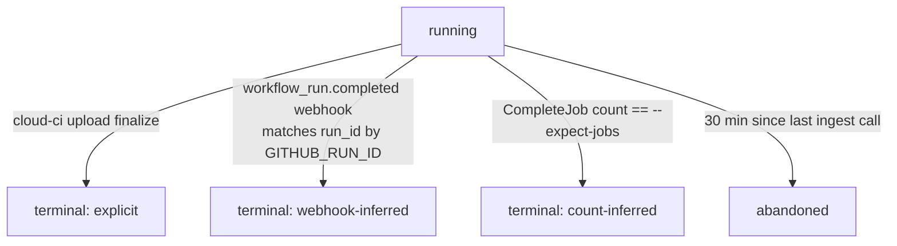

# Bring-your-own CI: ingest API, `cloud-ci upload`, external runs

Status: **Proposed**

## Summary

`cloud-ci` accepts CI results produced by *any* CI system — GitHub Actions, Buildkite, a
laptop — through a Connect RPC ingest API and the `cloud-ci upload` CLI. These are *external
runs*: a run whose jobs executed somewhere other than our own Cloudflare Containers, keyed by
`(repo, sha, run key, attempt)`. An external run still gets a `RunCoordinator` as its single
state writer; the coordinator just never schedules containers for it. Once a run's
first job lands, an external run looks identical to a managed run to every downstream
consumer: the PR comment, Check Runs, analytics, and (optionally) AI insights. This is the
same upload path our own `cloud-ci agent` uses inside containers ([ADR 0007](../adr/0007-one-upload-path.md)),
so it cannot silently regress.

Transport is not settled. "Connect RPC" here means the hand-routed Connect unary shape proposed
in [ADR 0002](../adr/0002-rust-cloudflare-worker.md), which depends on the Phase 0 "buffa on
wasm32" spike in the [roadmap](../roadmap.md). If that spike fails, the control plane keeps the
same method names and message shapes over plain JSON `POST`s; the data plane below is plain HTTP
either way.

This doc covers the ingest API shape, the CLI UX, run identity, auth, supported report
formats, upload mechanics and resumability, idempotency, finalize semantics, and how external
runs feed [pr-comment](./pr-comment.md) and [analytics](./analytics.md). Token *format* and
scopes are owned by [auth](./auth.md); this doc only names the scope it needs. Artifact
*serving* (site hosting, caching, retention) is owned by [assets](./assets.md); this doc only
specifies what gets written to R2 and in what shape.

## Goals

- One Connect RPC contract that both `cloud-ci agent` (managed runs) and `cloud-ci upload`
  (external runs) call.
- Resumable upload of large artifacts and reports without requiring the uploader to hold R2 or
  AWS credentials.
- Zero-config auth from GitHub Actions via OIDC; token-based auth from anywhere else.
- A run that never gets an explicit "done" signal still reaches a terminal state.
- Parity: an external run contributes to the PR comment, Check Runs, and analytics the same as
  a managed run, minus the signals a managed run can only produce from our own container
  (resource samples, rightsizing).

## Non-goals

- **Live log streaming for external runs.** The CI system that ran the job already has a log
  viewer (the Actions run page, the Buildkite build page); `cloud-ci` does not duplicate it.
  Ingest accepts reports and artifacts, not step-by-step stdout. A `CompleteJob` call may
  attach an `external_url` that the PR comment and dashboard link out to instead.
- **Executing anything.** BYO CI never schedules work; it only records what already happened.
- **OIDC trust for non-GitHub providers at launch.** Buildkite, CircleCI, GitLab CI, etc. all
  have their own OIDC issuers; this doc defines the token-validation *shape* generically
  (§ Auth) but only wires up the GitHub Actions issuer in phase 1. Adding another issuer is
  config, not a new code path, because of that shape.
- **Fork-PR OIDC trust.** GitHub does not grant `id-token: write` to workflows triggered by
  `pull_request` from a fork — the `GITHUB_TOKEN` and every requested permission are
  downgraded to read-only, and OIDC has no read form, so no token is issued (verified
  2026-09-30, [GitHub Docs: events that trigger workflows](https://docs.github.com/en/actions/reference/workflows-and-actions/events-that-trigger-workflows)).
  Fork contributions must use a scoped API token or `pull_request_target` (§ Security
  considerations); we do not work around GitHub's restriction.

## User experience

### When a pipeline config is and isn't involved

Managed runs are driven by `.cloud-ci/pipeline.yml` ([pipeline-config](./pipeline-config.md)).
External runs have no such file — the uploading CI system owns its own job definitions. An
external run's job list is whatever sequence of `StartJob`/`CompleteJob` calls the uploader
makes; there is no DAG, no `runner:` instance sizing, and no merge-barrier scheduling. (Native
report merging and framework blob merges still apply — see § Supported report formats and
[parallelization](./parallelization.md).)

### `cloud-ci upload`

```
cloud-ci upload [--job <name>] [--shard <i>/<n>]
                 [--report <kind>:<path>]...
                 [--artifact <name>=<path>]...
                 [--site <name>=<dir>]...
                 [--repo <owner>/<name>] [--sha <sha>]
                 [--run-key <key>] [--attempt <n>]
                 [--token <api-token> | (auto: GitHub Actions OIDC)]

cloud-ci upload finalize [--conclusion success|failure]
                          [--run-key <key>] [--attempt <n>]
```

`--report`, `--artifact`, and `--site` are repeatable and may be combined in one invocation or
spread across several (one per test command, say). Each invocation that is not a `finalize`
opens the run if it doesn't exist yet (`BeginRun` is an upsert — see § Idempotency) and starts
or reuses the named job.

Run-identity and auth flags are optional on GitHub Actions; the CLI auto-detects them from the
environment (§ Run identity). On any other CI system they are required, or sourced from
`CLOUD_CI_*` environment variables (`CLOUD_CI_REPO`, `CLOUD_CI_SHA`, `CLOUD_CI_RUN_KEY`,
`CLOUD_CI_ATTEMPT`, `CLOUD_CI_TOKEN`) so a shared CI template can set them once.

Example, outside GitHub Actions:

```
cloud-ci upload --job unit-tests \
  --report junit:./reports/junit.xml \
  --report lcov:./coverage/lcov.info \
  --repo acme/widgets --sha "$BUILDKITE_COMMIT" \
  --run-key "buildkite/$BUILDKITE_BUILD_ID" --attempt 1 \
  --token "$CLOUD_CI_TOKEN"

cloud-ci upload finalize --conclusion success \
  --repo acme/widgets --run-key "buildkite/$BUILDKITE_BUILD_ID" --attempt 1 \
  --token "$CLOUD_CI_TOKEN"
```

### GitHub Actions snippet

```yaml
name: CI
on: [push, pull_request]

permissions:
  contents: read
  id-token: write   # required for OIDC; no stored secret needed

jobs:
  test:
    runs-on: ubuntu-latest
    steps:
      - uses: actions/checkout@v4

      - name: Install cloud-ci CLI
        run: curl -fsSL https://<your-deployment>/install.sh | sh

      - name: Run tests
        run: npm test -- --reporter=junit --outputFile=reports/junit.xml

      - name: Upload results
        if: always()
        run: |
          cloud-ci upload --job test \
            --report junit:reports/junit.xml \
            --report lcov:coverage/lcov.info

      - name: Finalize run
        if: always()
        run: cloud-ci upload finalize --conclusion ${{ job.status }}
```

`--job test` runs once here; a matrix or sharded suite calls `cloud-ci upload` once per matrix
leg with distinct `--job`/`--shard` values and a single `finalize` in a final job gated on
`needs:` all legs — see [parallelization](./parallelization.md) for the matrix+split pattern.

## Design

### Control plane and data plane are different transports

| Plane | Transport | Why |
| --- | --- | --- |
| Control (begin run, start/complete job, create/complete upload, submit small reports, finalize) | Connect RPC, `POST /cloud_ci.ingest.v1.IngestService/<Method>` | Typed, versioned by the proto contract every language binding shares; small request/response bodies the Worker can buffer and validate as JSON/protobuf. |
| Data (upload part bytes) | Plain `PUT /ingest/v1/uploads/{upload_id}/parts/{n}` | A Connect unary RPC would require base64- or proto-bytes-encoding the payload and buffering the whole message before the handler sees it. A raw `PUT` lets the Worker stream the request body straight into an R2 multipart `uploadPart` call without holding the full part in memory, and keeps the CLI's upload code a plain HTTP client instead of a Connect streaming-RPC client (client-streaming Connect support on `wasm32` is unproven — see [ADR 0002](../adr/0002-rust-cloudflare-worker.md) and the Phase 0 spikes in the [roadmap](../roadmap.md) for the broader pattern of not betting ingest-critical code on unverified wasm32 capability). |

### `IngestService` (sketch)

```protobuf
// cloud_ci.ingest.v1
service IngestService {
  rpc BeginRun(BeginRunRequest) returns (BeginRunResponse);
  rpc StartJob(StartJobRequest) returns (StartJobResponse);
  rpc CreateUpload(CreateUploadRequest) returns (CreateUploadResponse);
  rpc CompleteUpload(CompleteUploadRequest) returns (CompleteUploadResponse);
  rpc SubmitReport(SubmitReportRequest) returns (SubmitReportResponse);
  rpc CompleteJob(CompleteJobRequest) returns (CompleteJobResponse);
  rpc FinalizeRun(FinalizeRunRequest) returns (FinalizeRunResponse);
  rpc GetRun(GetRunRequest) returns (GetRunResponse);
}
```

| RPC | Key fields | Notes |
| --- | --- | --- |
| `BeginRun` | `repo`, `sha`, `run_key`, `attempt`, `trigger` (push/pull_request/manual), `external_url` | Upsert on `(repo_id, sha, run_key, attempt)`. Returns `run_id` + current state. |
| `StartJob` | `run_id`, `job_name`, `shard` (`{index, total}` optional), `runner_label` (freeform, e.g. `ubuntu-latest`) | Returns `job_id`. Idempotent on `(run_id, job_name, shard)`. |
| `CreateUpload` | `job_id`, `kind` (report/artifact/site), `name`, `content_type`, `size_bytes`, `sha256` | Size ≤ 32 MiB → single-part, caller `PUT`s once. Larger → multipart; response includes `part_size_bytes` (fixed 32 MiB) and `part_count`. Dedupes on `(job_id, kind, name, sha256)` — see § Idempotency. |
| `CompleteUpload` | `upload_id`, `parts: [{number, etag}]` | Calls R2's multipart complete; validates part count/sizes against what `CreateUpload` reserved. |
| `SubmitReport` | `job_id`, `report_kind`, `name`, either `inline_data` (≤ 4 MiB) or `upload_id` | Parses the report into D1 (test cases, coverage lines, timings). Raw bytes are always kept in R2 regardless of path taken. |
| `CompleteJob` | `job_id`, `conclusion`, `external_url` | Terminal for the job; triggers the same Check-Run-update and comment-debounce path as a managed job (§ How external runs feed...). |
| `FinalizeRun` | `run_id`, `conclusion` (optional — inferred from job conclusions if omitted) | See § Finalize semantics. |
| `GetRun` | `repo`, `sha`, `run_key`, `attempt` | Lets the CLI resume: look up `run_id` and which jobs/uploads already exist before re-sending anything. |

### Run identity

An external run is keyed by `(repo_id, sha, run_key, attempt)` — the same tuple
[architecture.md](../architecture.md#data-model) uses for every run. `repo_id` is GitHub's
numeric repository id, not `owner/name` (renames happen). The other three fields:

| Field | Meaning | GitHub Actions default | Elsewhere |
| --- | --- | --- | --- |
| `sha` | Commit under test | `GITHUB_EVENT_PATH`'s `pull_request.head.sha` on `pull_request` events (not `GITHUB_SHA`, which is the ephemeral merge commit `refs/pull/N/merge` — verified 2026-09-30, [GitHub Docs](https://docs.github.com/en/actions/reference/workflows-and-actions/events-that-trigger-workflows)); otherwise `GITHUB_SHA` | Required flag / `CLOUD_CI_SHA` |
| `run_key` | Groups retries of "the same" run | `gha/$GITHUB_RUN_ID` | Required flag / `CLOUD_CI_RUN_KEY` |
| `attempt` | Distinguishes re-runs under one `run_key` | `$GITHUB_RUN_ATTEMPT` | Required flag / `CLOUD_CI_ATTEMPT`, defaults to `1` |

Re-running a GitHub Actions workflow increments `GITHUB_RUN_ATTEMPT` but keeps `GITHUB_RUN_ID`,
so attempts of the same `run_key` are distinct runs in `cloud-ci` (each gets its own row, its
own jobs, its own place in history) but the PR comment and analytics can still group them by
`run_key` when showing "retried" context. This mirrors how GitHub's own Checks UI treats
attempts.

### Auth

`BeginRun` is the only call that authenticates with something other than an ingest token,
because it's the one call made before a run-scoped token exists:

| Credential | Who | Validation |
| --- | --- | --- |
| GitHub Actions OIDC JWT | GitHub Actions jobs with `permissions: {id-token: write}` | `iss` = `https://token.actions.githubusercontent.com`; RS256 signature against the issuer's JWKS (cached, refetched on `kid` miss); `aud` = this deployment's exchange URL, requested explicitly via `actions/core`'s `getIDToken(audience)` (not the default owner-URL audience, so a token minted for `cloud-ci` can't be replayed at another OIDC relying party); `exp`/`nbf` checked; `repository_id` and `repository_owner_id` claims (not the `repository` name string — renames happen) matched against the GitHub App installation that owns the target repo. |
| Scoped API token | Any other CI system | Opaque token, hashed in D1, looked up and checked for the `ingest:write` scope and a repo allowlist containing the target `repo_id` — same token family as [auth](./auth.md)'s machine tokens. |

`claims_supported` for GitHub's OIDC issuer (verified 2026-09-30 against
`https://token.actions.githubusercontent.com/.well-known/openid-configuration`) includes
`repository_id`, `repository_owner_id`, `run_id`, `run_attempt`, `sha`, `ref`, `event_name`,
and `repository_visibility`, among others — enough to validate identity without an extra
GitHub API call. We deliberately validate on `repository_id`/`repository_owner_id` rather than
parsing the `sub` claim: GitHub is rolling out an "immutable" `sub` format
(`repo:OWNER@OWNER-ID/REPO@REPO-ID:ref:...`) for repositories created after 2026-07-15 while
older repositories keep the pre-existing format (verified 2026-09-30, [GitHub Docs: OIDC reference](https://docs.github.com/en/actions/reference/security/oidc#immutable-subject-claims));
matching on the dedicated ID claims sidesteps having to branch on which `sub` shape a given
repo uses.

Either path returns an **ingest token**: the same opaque HMAC-signed token format
`RunCoordinator`-minted job tokens use ([auth](./auth.md)), with `typ: "ingest"`, `scope:
["ingest:write"]`, and `repo_id`/`run_id` claims, 1-hour TTL. The CLI holds this token for the
rest of the run's calls and re-exchanges (re-runs `BeginRun` with a fresh OIDC JWT) if a job
outlives it — GitHub-issued OIDC JWTs are themselves short-lived [unverified exact TTL; not
documented as a fixed duration in GitHub's reference docs], so the exchange, not the original
JWT, is what the rest of the run relies on.

### Supported report formats

| Kind | Format | Merge strategy |
| --- | --- | --- |
| `JUNIT` | JUnit XML | Native: Worker parses and unions test cases across shards |
| `VITEST_JSON` | Vitest's `--reporter=json` output | Native |
| `PLAYWRIGHT_JSON` | Playwright's `--reporter=json` output | Native |
| `LCOV` | lcov tracefile | Native: line-hit union |
| `COBERTURA` | Cobertura XML | Native: line-hit union |
| `CLOUD_CI_TIMING` | Our own `{test, file, duration_ms}` JSON, written by `cloud-ci agent`/`cloud-ci upload` after any of the above is parsed | Feeds [parallelization](./parallelization.md)'s `split: timing` |
| `BENCH` | `{name, value, unit}` JSON | Native: latest-wins per name |
| `PLAYWRIGHT_BLOB` | Playwright's `--reporter=blob` shard output | Framework merge: `npx playwright merge-reports --reporter=html <dir>` run by a generated merge job (verified command 2026-09-30, [Playwright: Sharding](https://playwright.dev/docs/test-sharding)) |
| `VITEST_BLOB` | Vitest's `--reporter=blob` shard output | Framework merge: `vitest --merge-reports` over the directory of blob files (verified 2026-09-30, [Vitest: CLI](https://vitest.dev/guide/cli); blob file location changed across Vitest versions — pin the version in the generated merge job) |

Native formats are parsed into D1 test-case/coverage-line rows by `cloud-ci-core`
(`cloud-ci-worker` and `cloud-ci-cli` both depend on it, so parsing is identical on both
paths). Blob formats are opaque to us; their merge step runs as an ordinary job (managed, or
externally if the uploader already has a merge step) and its output is submitted the same way
as any other report.

### Upload mechanics and resumability

Fixed part size: **32 MiB**. Chosen as a decisive tradeoff: comfortably under every Cloudflare
plan's Worker request body limit (Free/Pro 100 MB, Business 200 MB, Enterprise 500 MB,
verified 2026-09-30, [Workers limits](https://developers.cloudflare.com/workers/platform/limits/)),
comfortably clears R2's 5 MiB multipart part-size floor (verified 2026-09-30, [R2 limits](https://developers.cloudflare.com/r2/platform/limits/)),
and keeps the retry unit small — a network blip loses at most one part, not the whole
artifact. The Worker never buffers a full part in memory: the `PUT` body streams directly into
the R2 binding's `uploadPart` call, so the 32 MiB figure is about plan portability and retry
granularity, not the Worker's 128 MB isolate memory ceiling.

Resumability:

1. The CLI computes `sha256` of the local file before uploading (streaming hash, not loaded
   whole into memory for large files).
2. `CreateUpload(job_id, kind, name, sha256, size)` — if a *completed* upload already exists
   for that `(job_id, kind, name, sha256)`, the Worker returns it immediately with no new parts
   to send (§ Idempotency). If an *incomplete* multipart upload exists for the same key (CLI
   crashed mid-upload, network died), the Worker returns the existing `upload_id` and the set
   of part numbers already received — tracked in the upload's own D1 row as parts land, not by
   querying R2's `ListParts` [unverified whether the R2 Workers-API binding exposes `ListParts`;
   tracking receipt ourselves avoids depending on it].
3. The CLI `PUT`s only the missing parts, then calls `CompleteUpload`.
4. R2 aborts genuinely abandoned incomplete multipart uploads after 7 days by default (verified
   2026-09-30, [R2: Upload objects](https://developers.cloudflare.com/r2/objects/upload-objects/)) —
   but a run's own 30-minute idle timeout (§ Finalize semantics) fires first, so a cleanup sweep
   ([assets](./assets.md) retention) explicitly aborts incomplete uploads belonging to
   `abandoned` runs instead of waiting on R2's default.

### Idempotency

- **`BeginRun`** is an upsert keyed on `(repo_id, sha, run_key, attempt)`: calling it twice
  (a CI step retried wholesale) returns the same `run_id` and current state, never a conflict.
- **`StartJob`** is idempotent on `(run_id, job_name, shard)`.
- **Uploads** are idempotent on `(job_id, kind, name, sha256)` — identical bytes re-sent after
  a retry are a no-op. Different bytes under the same `(job_id, kind, name)` (a job re-ran part
  of its suite and produced a corrected report) are *not* overwritten in place: they land as a
  new row, and the most recently completed one is canonical for parsing/merging/dashboard
  reads, while older rows stay in R2 for audit. This matches the invariant already stated in
  [architecture.md](../architecture.md#coordination-invariants): "every upload is idempotent on
  `(run, job/shard, report kind | artifact path, content hash)`" — the hash is part of the key,
  so distinct content is a distinct upload, not a conflict.
- **`CompleteJob`/`FinalizeRun`** are idempotent: calling either again with the same
  `conclusion` is a no-op; calling with a *different* conclusion after the job/run is already
  terminal is rejected (400), since a CI system shouldn't be able to flip a result after the
  fact without going through a new attempt.

### Finalize semantics

An external run has no scheduler to tell `RunCoordinator` when it's done, so there are four
ways a run reaches a terminal state, tried in this order:



1. **Explicit finalize.** `cloud-ci upload finalize --conclusion <success|failure>` calls
   `FinalizeRun`. This is the recommended path and the one shown in § GitHub Actions snippet.
2. **`workflow_run` webhook.** If `BeginRun` was called with `external_url` pointing at a
   GitHub Actions run (or the CLI auto-populated `GITHUB_RUN_ID`), the Worker correlates it
   against incoming `workflow_run` `completed` deliveries — which fire "regardless of whether
   the workflow was successful or unsuccessful" (verified 2026-09-30,
   [GitHub: Webhook events and payloads § workflow_run](https://docs.github.com/en/webhooks/webhook-events-and-payloads#workflow_run);
   requires the GitHub App to hold at least read-level `Actions` permission, same source) — and
   finalizes with `workflow_run.conclusion`. This is a safety net for workflows that don't add
   the explicit finalize step.
3. **`--expect-jobs N`** on `BeginRun`. Once `N` `CompleteJob` calls have landed, the run
   auto-finalizes. Useful for non-GitHub CI systems with no equivalent completion webhook and a
   fixed, known job count (e.g. a matrix build).
4. **Idle timeout.** `RunCoordinator` sets a DO alarm for 30 minutes after the most recent
   ingest call for the run. If it fires while the run is still open, the run moves to
   `abandoned` — already one of [architecture.md](../architecture.md#run-states)'s defined
   terminal states ("External run never finalized before its deadline"). A later ingest call
   for the same `run_key`/`attempt` after abandonment is rejected (400); the CI system must
   retry under a new `attempt`.

### How external runs feed PR comment & analytics

**PR comment / Check Runs.** `CompleteJob` and `FinalizeRun` enqueue the same debounced
comment-refresh message `RunCoordinator` emits for a managed job completing
([architecture.md](../architecture.md#core-flows) step 5) — the comment template doesn't
branch on `run.kind`. The one external-specific addition is a small "via GitHub Actions" (or
whatever `external_url`'s host implies) badge linking out, since there's no `cloud-ci`-native
log to link to instead. See [pr-comment](./pr-comment.md).

**Analytics.** Duration, critical-path, flaky-test, and slowest-test analysis all read from
report-supplied timestamps and per-test durations (`StartJob`/`CompleteJob` times, parsed
`CLOUD_CI_TIMING`/JUnit/Vitest/Playwright durations) — external runs supply all of that, so
they participate fully. Resource-sample analytics (cgroup CPU/memory, cost estimate, `runner:
auto` rightsizing) do not apply: there's no container we control to sample or size.
Analytics Engine rows for external runs are written with `kind=external` and omit the
`resource_*` fields entirely rather than zero-filling them, so rollups can exclude external
runs from averages that would otherwise be skewed. See [analytics](./analytics.md).

## Data model

D1 (extends [architecture.md](../architecture.md#data-model)'s run/job/report tables with
ingest-specific bookkeeping):

| Table | Key columns | Notes |
| --- | --- | --- |
| `runs` | `id`, `repo_id`, `sha`, `run_key`, `attempt`, `kind` (`managed`\|`external`), `external_url`, `state`, `expect_jobs` | `UNIQUE(repo_id, sha, run_key, attempt)` backs the `BeginRun` upsert. |
| `jobs` | `id`, `run_id`, `name`, `shard_index`, `shard_total`, `runner_label`, `state`, `external_url` | `UNIQUE(run_id, name, shard_index)`. |
| `uploads` | `id`, `job_id`, `kind`, `name`, `sha256`, `size_bytes`, `state` (`pending`\|`complete`), `received_parts` (bitset/count), `r2_key` | `UNIQUE(job_id, kind, name, sha256)` backs upload dedupe; `received_parts` lets `CreateUpload` answer "which parts do you have" without R2 `ListParts`. |
| `reports` | `id`, `job_id`, `kind`, `name`, `upload_id`, `created_at`, `is_canonical` | Newest row per `(job_id, kind, name)` flips `is_canonical`; parsed test-case/coverage rows reference the report row, not the raw upload. |

R2 keys:

| Content | Key |
| --- | --- |
| Report raw bytes | `runs/{run_id}/reports/{report_kind}/{name}` |
| Plain artifact (file or non-browsable dir, tarred) | `runs/{run_id}/artifacts/{name}` |
| Site artifact (browsable HTML dir) | `runs/{run_id}/artifacts/{name}/site.tar` + `runs/{run_id}/artifacts/{name}/site.index.json` — uncompressed tar, index maps relative path → `{offset, len, content_type, content_encoding?}` with `offset`/`len` pointing at exact file content (past the file's tar header, before its padding), so [assets](./assets.md) can serve any path as an R2 ranged read with no server-side expansion |

Upload key layout matches [assets](./assets.md) exactly (coordinated during design); this doc
only specifies what `cloud-ci upload` writes, not how it's served.

## Security considerations

- **Scope.** Ingest tokens (OIDC-exchanged or API-token-derived) carry `scope: ["ingest:write"]`
  and a `repo_id` claim; the Worker rejects any call whose target `repo_id` doesn't match.
  Neither credential can read, cancel, or modify anything outside ingest for that one repo.
- **Audience pinning.** The CLI requests a deployment-specific `aud` for its OIDC JWT rather
  than accepting GitHub's default (the repository owner's URL), so a JWT minted for one
  `cloud-ci` deployment cannot be replayed against a different Connect RPC audience or a
  different cloud provider's OIDC relying party.
- **Identity by ID, not name.** `repository_id`/`repository_owner_id` claims are checked, not
  the `repository` string — a repo rename or transfer can't retroactively authorize uploads
  that were scoped to the old name.
- **Fork PRs get no OIDC.** GitHub does not issue `id-token: write` tokens to workflows
  triggered by `pull_request` from a fork (§ Non-goals). Projects that need external-CI results
  from fork contributions must either issue those contributors nothing (status quo: fork PRs
  simply don't get BYO-CI data, only whatever the base-repo's own managed run produces) or
  adopt `pull_request_target` with an explicit, reviewed checkout of the PR head — a tradeoff
  inherent to `pull_request_target` generally, not specific to `cloud-ci`, and one we do not
  paper over.
- **Upload parts are keyed by an unguessable `upload_id` (ULID)** plus the bearer ingest token;
  a part PUT without a valid token for the owning run's `repo_id` is rejected before touching
  R2.
- **Part size cap enforced before touching R2.** The Worker rejects any part whose
  `Content-Length` exceeds 32 MiB at the HTTP layer, so an oversized or hostile upload never
  reaches the R2 binding.
- **No secrets stored for GitHub Actions callers.** OIDC means no long-lived credential exists
  for the common case; API tokens (non-GitHub CI) are hashed in D1 like every other machine
  token ([auth](./auth.md)).

## Failure modes

| Failure | Behavior |
| --- | --- |
| CLI crashes mid multipart upload | Next invocation recomputes `sha256`, calls `CreateUpload` again, gets the same `upload_id` back with already-received part numbers, uploads only what's missing. |
| Network drop mid-part | CLI retries that one `PUT`; re-uploading a part number before `CompleteUpload` simply overwrites it (standard multipart semantics). |
| `finalize` never called, no `workflow_run` webhook (non-GitHub CI, no `--expect-jobs`) | Run sits `running` until the 30-minute idle alarm fires, then moves to `abandoned`. |
| `workflow_run` webhook arrives for a run already explicitly finalized | No-op; `FinalizeRun` idempotency (§ Idempotency) absorbs it. |
| Two jobs in the same run race to `BeginRun` first | Both get the same `run_id` from the upsert; no duplicate run rows. |
| Caller's OIDC JWT `aud` doesn't match deployment | `BeginRun` rejects with 401 before any run is created. |
| Report bytes fail to parse (malformed JUnit XML, etc.) | Raw bytes are still stored in R2 and `reports.is_canonical` is set, but no test-case rows are written; the PR comment shows "report attached, unparsed" rather than silently dropping it. |
| Same `(job_id, kind, name)` uploaded with different content twice in one job (flaky re-run) | Both rows kept; newest is canonical (§ Idempotency) — not a merge, a replacement for display purposes. |

## Open questions

- Exact TTL of GitHub's issued OIDC JWTs is not pinned down in GitHub's reference docs
  [unverified] — affects only how aggressively the CLI needs to re-exchange for very long jobs
  (already handled by re-running `BeginRun`; this just affects how often).
- Whether the R2 Workers-API binding exposes `ListParts` for a multipart upload [unverified] —
  if it does, `uploads.received_parts` bookkeeping in D1 becomes a cross-check rather than the
  source of truth.
- Whether to support provider-specific OIDC issuers (GitLab CI, CircleCI) in a later phase, and
  whether that's config (issuer URL + claim-name mapping) or requires per-provider code beyond
  the generic shape in § Auth.
- Whether `--expect-jobs` should be inferable from a GitHub Actions matrix automatically (e.g.
  via the `workflow_run` payload's job count) instead of requiring the flag.

## Alternatives considered

| Alternative | Rejected because |
| --- | --- |
| Presigned R2 (S3-compatible) URLs, client uploads directly to R2 | Requires minting scoped S3-style credentials server-side (R2's S3 API uses account-wide access keys, so "scoped" means a Cloudflare API call per upload to generate one) for no benefit over proxying: the Worker still has to authenticate every call and track idempotency/dedupe state either way. It would also make `cloud-ci upload` an AWS-SigV4 client instead of a plain HTTPS + Connect-RPC client, for every non-Rust binding we might ever generate. |
| Connect client-streaming RPC for upload bytes | Avoids a second transport, but client-streaming support for `buffa`-generated bindings on `wasm32-unknown-unknown` is unproven (see the `buffa on wasm32` spike in [roadmap.md](../roadmap.md)); betting the ingest hot path on it is the kind of risk [ADR 0007](../adr/0007-one-upload-path.md) exists to avoid. |
| One RPC that accepts an entire report/artifact inline, no separate upload flow | Fine for small JUnit files, breaks for multi-hundred-MB Playwright HTML reports or coverage sites; `SubmitReport`'s inline-vs-upload split keeps the common case (small reports) a single call while large payloads still get chunking. |
| Variable part size (client picks, up to R2's 5 GiB max) | Simpler resumability math and a fixed 32 MiB Worker-side validation rule beat a few fewer round trips on very large files; also keeps part size well inside every Cloudflare plan's request body limit without per-deployment tuning. |
| Treat re-uploaded content under the same name as a hard conflict (reject) | Flaky re-runs within a job are common enough that rejecting them would make `cloud-ci upload` unusable from a retry loop; keeping both rows and picking the newest as canonical costs a little R2 storage for a lot of uploader-side simplicity. |
