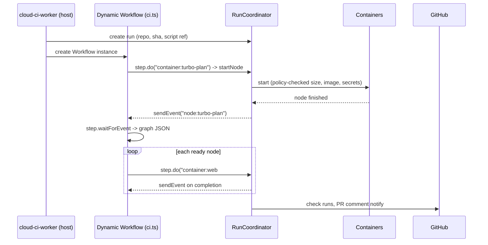

# Dynamic pipelines: CI as durable TypeScript workflows

Status: Proposed

> Every threshold, default, and API name here is a proposed starting point. Implementation is out
> of scope until the Phase 0 spikes in [the roadmap](../roadmap.md) land.

Related: [ADR 0009](../adr/0009-typescript-pipeline-workflows.md),
[pipeline-config](./pipeline-config.md), [parallelization](./parallelization.md),
[pr-comment](./pr-comment.md), [assets](./assets.md), [analytics](./analytics.md)

## Summary

A pipeline is a TypeScript **script** in `.cloud-ci/pipelines/<name>.ts`. It does not return a
static plan. It runs for the whole CI run: it starts containers, reads their results, decides
what to do next, and loops. The script can run `turbo run --dry=json` in a container, parse the
edges, and run each task in its own container as soon as its dependencies finish. That logic
lives in plain code using helpers from `@cloud-ci/pipeline`, not in a fixed engine feature.

Scripts run as **Dynamic Workflows**: a Cloudflare Workflow whose code is loaded at runtime into a
Dynamic Worker. Every side effect (starting a container, waiting for it, publishing a check) is a
durable step. If the isolate is recycled mid-run, the script is re-executed from the top, and
completed steps return their recorded results instead of running again
(developers.cloudflare.com/dynamic-workers/usage/dynamic-workflows, checked 2026-10-01).

`RunCoordinator` stays the single writer of run state. The script *requests* things through a
narrow API; the coordinator enforces policy (secrets, runner limits, concurrency) and records
facts.

The static `pipeline.yml` ([pipeline-config](./pipeline-config.md)) remains available. It is
executed by a built-in script, so there is one execution engine, not two.

## Goals

- Turborepo/mise graphs executed node by node across containers, written as ordinary code.
- Full control over steps, sidecars, retries, conditional work, and fan-out from inside the
  script.
- Per-check control over GitHub status reporting.
- Crash-safe: a recycled isolate or a redeploy of `cloud-ci-worker` never re-runs finished work.

## Non-goals

- Running the script in `cloud-ci-worker`'s own isolate. It runs in a Dynamic Worker that the
  host Worker loads; whether that sandbox isolates well enough is a Phase 0 spike.
- Letting the script grant itself secrets or bypass admin policy.
- Arbitrary npm imports in scripts in v1 (see [Open questions](#open-questions)).

## User experience

### Turborepo, one container per task

```ts
// .cloud-ci/pipelines/ci.ts
import { workflow, turbo } from "@cloud-ci/pipeline";

export default workflow({
  on: { pull_request: {}, push: { branches: ["main"] } },
  async run(ci) {
    const setup = ci.setup({
      image: "node:24",
      run: ["corepack enable", "pnpm install --frozen-lockfile"],
      snapshot: true, // reuse post-install state across this run's containers
    });

    const graph = await turbo.plan(ci, {
      setup,
      tasks: ["build", "lint", "test", "typecheck"],
      affected: ci.event.kind === "pull_request",
    });

    const build = ci.check("ci/build", { required: true });
    const test = ci.check("ci/test", { required: true });

    await turbo.execute(ci, graph, {
      setup,
      concurrency: 24,
      runner: (node) => (node.task === "build" ? "standard-2" : "auto"),
      check: (node) =>
        node.task === "build" ? build : ["test", "typecheck"].includes(node.task) ? test : null,
    });
  },
});
```

`turbo.execute` is ordinary library code, roughly:

```ts
export async function execute(ci, graph, opts) {
  const done = new Map<string, Promise<NodeResult>>();
  const runNode = (id: string): Promise<NodeResult> => {
    if (!done.has(id)) {
      done.set(id, (async () => {
        const deps = await Promise.all(graph.deps(id).map(runNode));
        if (deps.some((d) => !d.ok)) return ci.skip(id, "dependency failed");
        if (await ci.turboCache.has(graph.node(id).hash)) return ci.cached(id);
        return ci.container(id, {
          setup: opts.setup,
          runner: opts.runner(graph.node(id)),
          run: `turbo run ${graph.node(id).task} --filter=${graph.node(id).package}`,
          check: opts.check(graph.node(id)),
        });
      })());
    }
    return done.get(id)!;
  };
  await ci.limit(opts.concurrency, graph.ids().map((id) => () => runNode(id)));
}
```

Users who need something different copy or wrap it.

### Steps and sidecars

```ts
await ci.container("e2e", {
  setup,
  runner: "standard-3",
  sidecars: {
    postgres: { image: "postgres:17", env: { POSTGRES_PASSWORD: "ci" }, ready: "tcp:5432" },
  },
  steps: [
    { name: "migrate", run: "pnpm db:migrate" },
    { name: "playwright", run: "pnpm playwright test", reports: ["playwright-report/**"] },
  ],
});
```

### Conditional and dynamic work

```ts
if (ci.changedFiles.some((f) => f.startsWith("infra/"))) {
  const plan = await ci.container("tf-plan", { run: "terraform plan -out plan.bin" });
  await ci.container("tf-check", { run: "terraform show plan.bin", check: false });
}
```

## Design

### Execution model



Each `ci.container(id, spec)` call is two durable operations:

1. `step.do("start:" + id)` asks `RunCoordinator` to start the node. This returns quickly and is
   idempotent on `id`.
2. `step.waitForEvent("done:" + id)`. The coordinator sends the event when the node finishes.

Waiting in an event, rather than inside a long `step.do`, means a 40-minute test job does not hold
a step open, and the isolate can be recycled while containers run.

**Node ids are the replay key** and must be unique and stable within a run. The SDK rejects a
duplicate id at the call site. Library helpers derive ids from turbo `taskId`s.

**Steps are retried, so effects must be idempotent.** Workflows persists a step's result once it
succeeds, but a step that fails or times out is retried, and its side effect may already have
happened. The coordinator therefore treats `(run_id, node_id)` as an idempotency key:

| Situation | Coordinator behavior |
| --- | --- |
| `startNode` retried after the container already started | Returns the existing node; never starts a second container |
| `startNode` with the same id but a different spec hash | Rejected as nondeterministic; run fails |
| Completion event delivered twice | Workflows' `waitForEvent` consumes the first; the coordinator re-sends until the node is acknowledged, and the duplicate is harmless |
| Event arrives before the script waits for it | Supported by the protocol `[unverified: Workflows buffering of events sent before waitForEvent]`; if not, the coordinator re-sends on a timer until acknowledged |
| Run cancelled | Coordinator stops containers, marks nodes `cancelled`, and terminates the Workflow instance; late completion events for cancelled nodes are dropped |
| `waitForEvent` timeout (default: node timeout + 10 min) | Script sees a failed node with `timed out`; coordinator stops the container |

Step params and results must be RPC-serializable (per the Workflows API), so `ci.container`
returns a plain result object (status, exit code, durations, report and artifact ids), never a
live handle. Each node costs two steps, so the 10,000-step default allows about 5,000 nodes
minus `ci.check` and helper steps. The 2,000-node cap below keeps well clear of that.

### Determinism

On replay the script re-executes from the top, and completed steps return recorded values. Code
*between* steps must therefore make the same calls in the same order. Safe inputs are `ci.event`,
`ci.changedFiles`, `ci.readFile()` (at the run's sha), and step results. `Date.now()`,
`Math.random()`, and `fetch` (egress is blocked) are the hazards. The SDK lints for them, and the
coordinator detects divergence: a replayed start for an id it has never seen, after a completed
id was skipped, fails the run with `nondeterministic script`.

### Why the coordinator stays

The script decides *what* to run. `RunCoordinator` still:

- owns run/node state and is its only writer (D1 projection, Check Runs, PR comment notify);
- enforces policy the script cannot override: secret grants (none for fork PRs), runner min/max
  per repo, max concurrent containers, max nodes per run;
- starts and stops containers, mints per-node tokens, and receives agent uploads.

Without this split, a PR could edit its own script to request a production secret or 500
`standard-4` containers.

### Graph helpers

| Helper | Does |
| --- | --- |
| `turbo.plan(ci, opts)` | Runs `turbo run <tasks> --dry=json` in a container; returns a graph of `taskId`, `package`, `task`, `hash`, `outputs`, `dependencies` (fields per turborepo.dev/docs/reference/run, checked 2026-10-01) |
| `turbo.execute(ci, graph, opts)` | Dependency-ordered fan-out with cache-hit skipping and bounded concurrency (above) |
| `mise.plan(ci, opts)` | Same for mise tasks `[unverified: mise's machine-readable graph command and format]` |
| `graph.fromJson(json)` | Any tool's output in our graph JSON |
| `ci.limit(n, thunks)` | Concurrency limiter that is replay-safe (ordering is by call, not completion) |
| `ci.group(ids, spec)` | Run several nodes in one container to save startup cost |

Upstream outputs move through cloud-ci's Turborepo remote cache. Each node runs
`turbo run <task> --filter=<pkg>` without `--only`, so turbo restores upstream outputs from the
cache and runs just this task. `--only` would skip that restore (turborepo.dev/docs/reference/run,
checked 2026-10-01). Serving turbo's Remote Cache API (turborepo.dev/docs/openapi) from R2 is its
own compatibility project: auth, per-repo isolation, and read-only access for fork PRs so a PR
cannot poison artifacts that `main` trusts. Until it exists, the helpers fall back to cloud-ci
cache artifacts from declared `outputs`.

### Sidecars

Cloudflare Containers run one container per Durable Object instance. Whether two containers can
reach each other over a private network is `[unverified]`. v1 therefore runs sidecars as extra
processes inside the job's container: the agent starts them from their images' entrypoints
(image layers pulled into the job image at build time, or a multi-image runner image), waits for
`ready`, and tears them down after the steps. A sidecar that needs its own container is an open
question.

### Setup reuse

`ci.setup({ snapshot: true })` runs setup once, snapshots the container, and starts later nodes
from it. Snapshots are limited to 20 GB and kept 30 days
(developers.cloudflare.com/containers/platform/limits, checked 2026-09-30). Whether one
container can start from a snapshot another took is a Phase 0 spike. The fallback is a
lockfile-keyed package-store cache ([assets](./assets.md)).

### GitHub status checks

Checks are created by the script with stable names, not derived from node names:

- `ci.check(name, { required })` creates the check run immediately (`queued`), so branch protection
  sees it before any work starts. Nodes attach to it; its conclusion is the worst of its attached
  nodes, with cached counting as success. A check with no attached nodes when the script ends
  concludes `success` with "no matching tasks", or `failure` if the script itself failed.
- Nodes with `check: null` report no check run; they still appear in the PR comment and
  dashboard.
- The aggregate `cloud-ci` check is always reported and always safe to require.

Naming a required check after a discovered task is unsafe: if the task leaves the graph, GitHub
waits forever for it. `required` only drives documentation and dashboard warnings; GitHub branch
protection does the enforcing.

### Limits (proposed)

| Limit | Value | Reason |
| --- | --- | --- |
| Nodes per run | 2,000 | Coordinator state and UI |
| Workflow steps per run | Under the Workflows default of 10,000, configurable to 25,000 (developers.cloudflare.com/workflows/build/workers-api, checked 2026-10-01) | Each node costs about 2 steps |
| Script bundle | 1 MiB | Loaded on every replay |
| Concurrent containers | Repo policy, default 32 | Account-level container limits |

## Data model

| Store | Key | Contents |
| --- | --- | --- |
| D1 `runs` | `run_id` | adds `script_path`, `script_blob_sha`, `workflow_instance_id` |
| D1 `nodes` | `(run_id, node_id)` | status (`pending`, `cached`, `running`, `succeeded`, `failed`, `skipped`), spec hash, check name, timings |
| D1 `checks` | `(run_id, name)` | required flag, check run id, conclusion |
| D1 `node_history` | `(repo_id, node_id)` | p50/p95 duration, cache hit rate; feeds `runner: "auto"` and grouping |
| R2 `cloud-ci-assets` | `runs/{run_id}/script.js` | Bundled script as executed, for replay and audit |
| R2 `cloud-ci-cache` | `turbo/{repo_id}/{hash}` | turbo cache artifacts |

## Reruns

| Action | Behavior |
| --- | --- |
| Rerun run | New Workflow instance at the same sha; turbo cache makes completed nodes cheap or skipped |
| Rerun failed nodes | New instance with the previous run's succeeded node results injected; `ci.container` returns them without starting containers |
| Retry inside a run | Script-controlled (`retries` on `ci.container`); OOM retry one size up stays a coordinator policy |

## Security considerations

- Scripts come from the PR head, including forks. They run in a host-loaded Dynamic Worker with
  egress blocked and no bindings except the `ci` API. The Phase 0 spike must confirm this
  isolation. If it cannot, script support stays disabled and only `pipeline.yml` runs.
- Workflow instance metadata is readable by the Dynamic Worker, so it carries only ids, never
  tokens (per the caution in the Dynamic Workflows docs above).
- Secrets are requested by name in `ci.container({ secrets })` and granted by the coordinator
  per admin policy; fork PRs get none unless an admin approves the run.
- Container commands come from repo code, as in any CI; the isolation boundary for them is the
  container, not the script sandbox.

## Failure modes

| Failure | Behavior |
| --- | --- |
| Script throws | Run `failed`; running nodes are cancelled; `cloud-ci / script` check shows the stack trace |
| Nondeterministic replay | Run `failed` with the first diverging call |
| Isolate recycled or Worker redeployed | Workflow resumes; finished steps are not repeated |
| Container lost | Coordinator marks the node failed and sends its event; the script decides whether to retry |
| Script never awaits a started node | At script end, the coordinator cancels orphaned nodes |

## Open questions

1. Can workers-rs host the Worker Loader and Workflow bindings, or is the host side a small
   TypeScript module? `@cloudflare/dynamic-workflows` is a JS library, so a TS host is likely.
2. Container-to-container networking for real sidecars.
3. Cross-container snapshot restore and its speed compared with a cold install.
4. npm imports in scripts: resolve from the repo lockfile at plan time, or keep v1 to
   `@cloud-ci/pipeline` only?
5. Step pricing and latency of Workflows for runs with about 1,000 nodes.

## Alternatives considered

| Alternative | Why not |
| --- | --- |
| Static plan returned by `pipeline.ts`, expanded by adapters (previous draft) | Every new behavior (sidecars, conditional fan-out, custom retry) becomes an engine feature and a config key |
| Script runs inside a long-lived "orchestrator" container | Pays a container for the whole run; a crash loses orchestration state without hand-written checkpointing |
| Our own replay journal in `RunCoordinator` instead of Workflows | Re-implements durable execution that Workflows already provides |
| Starlark or Lua scripts | Neither runs in Dynamic Workflows; we would host and sandbox an interpreter ourselves |
