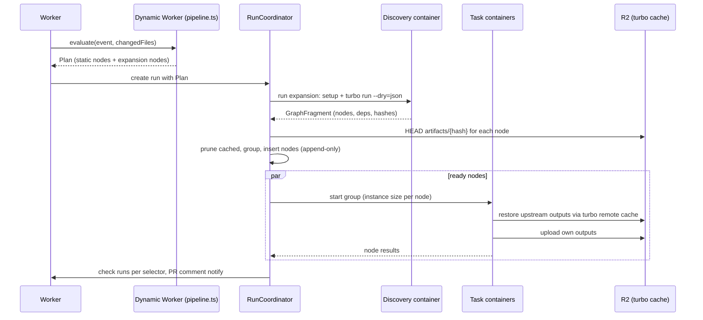

# Dynamic pipelines: programmable config and discovered task graphs

Status: Proposed

> Every threshold, default, and API name here is a proposed starting point. Implementation is out
> of scope until the Phase 0 spikes in [the roadmap](../roadmap.md) land.

Related: [ADR 0009](../adr/0009-typescript-pipeline-programs.md),
[pipeline-config](./pipeline-config.md), [parallelization](./parallelization.md),
[pr-comment](./pr-comment.md), [assets](./assets.md), [analytics](./analytics.md)

## Summary

Monorepos already describe their own task graph. Turborepo has `turbo.json`, mise has task
`depends`, Nx has its project graph. Copying that graph into a hand-written CI file is
redundant, and the copy goes stale. cloud-ci should read the repo's own graph and run each task
(or a small group of tasks) in its own container. Nodes start as soon as their dependencies
finish, and nodes whose result is already cached are skipped entirely.

That needs config that can compute things, not just declare them. Pipelines are therefore written
as **TypeScript programs** (`.cloud-ci/pipeline.ts`). A program does not run tasks; it
returns a **plan**, which is a task graph. Plans can be **expanded** at runtime by discovery steps
that read Turborepo, mise, or any tool that prints our graph JSON. The existing YAML format
stays as a static shorthand that compiles to the same plan.

## Goals

- Run each node of a Turborepo or mise graph in its own container, scheduled by dependency, with
  no hand-maintained copy of the graph.
- Skip nodes whose output is already cached, without starting a container.
- Let pipeline authors compute their plan with a real language: loops, conditionals, shared
  helpers, reading changed files.
- Per-task control over GitHub status checks: required, informational, or none.
- Keep the plan deterministic and recorded, so a rerun or retry executes the same graph.

## Non-goals

- Running arbitrary user code in `cloud-ci-worker`'s own isolate. `cloud-ci-worker` creates and
  calls a Dynamic Worker sandbox (or uses a container) for pipeline programs. Whether that
  sandbox isolates well enough is a Phase 0 spike, not an established fact.
- Re-implementing Turborepo's hashing. We use turbo's own hashes and cache protocol.
- A plugin system for third-party graph tools in v1. Turborepo and mise are built in; everything
  else uses the generic graph-JSON adapter.

## User experience

### Turborepo repo, one container per task

```ts
// .cloud-ci/pipeline.ts
import { pipeline, turbo } from "@cloud-ci/pipeline";

export default pipeline({
  on: { pull_request: {}, push: { branches: ["main"] } },
  setup: {
    image: "node:24",
    run: ["corepack enable", "pnpm install --frozen-lockfile"],
  },
  tasks: [
    turbo({
      tasks: ["build", "lint", "test", "typecheck"],
      affected: ({ event }) => event.kind === "pull_request",
      runner: (node) => (node.task === "build" ? "standard-2" : "auto"),
      group: "auto",
    }),
  ],
  checks: {
    "ci/build": { tasks: "*#build", required: true },
    "ci/test": { tasks: ["*#test", "*#typecheck"], required: true },
    "ci/lint": { tasks: "*#lint" },
  },
});
```

What happens on a PR:

1. The program is evaluated. `turbo(...)` returns a placeholder **expansion node**.
2. A discovery container checks out the sha, runs `setup`, and runs
   `turbo run build lint test typecheck --affected --dry=json`.
3. Discovery returns the graph (task ids, dependencies, hashes, outputs). The coordinator drops
   nodes whose hash is already in the remote cache, groups the rest, and inserts them into the run.
4. Each group runs in its own container. Upstream outputs arrive through turbo's remote cache
   (served by cloud-ci, see below).
5. The `ci/build`, `ci/test`, and `ci/lint` check runs report the aggregated result of the tasks
   their selectors match.

### Computing a plan by hand

```ts
import { pipeline, task } from "@cloud-ci/pipeline";

export default pipeline({
  tasks: async ({ changedFiles }) => {
    const apps = ["web", "admin", "api"].filter((app) =>
      changedFiles.some((f) => f.startsWith(`apps/${app}/`)),
    );
    return apps.map((app) =>
      task(`deploy-preview:${app}`, {
        run: `pnpm --filter ${app} deploy:preview`,
        check: false, // no GitHub status for previews
      }),
    );
  },
});
```

### mise repo

```ts
import { pipeline, mise } from "@cloud-ci/pipeline";

export default pipeline({
  tasks: [mise({ tasks: ["check"], outputs: { "//packages/*:build": ["target/**"] } })],
});
```

mise has no remote cache, so upstream outputs move as cloud-ci cache artifacts declared in
`outputs` (see [Moving outputs between containers](#moving-outputs-between-containers)).

### Static YAML still works

`.cloud-ci/pipeline.yml` ([pipeline-config](./pipeline-config.md)) compiles to the same plan
without a program. A repo has one of the two files; having both is a config error. YAML gains one
key for discovery so simple turbo repos never need TypeScript:

```yaml
jobs:
  ci:
    turbo: { tasks: [build, lint, test], affected: true }
```

## Design

### Plan, expansion, execution



**Plan** is a protobuf message (`cloud_ci.v1.Plan`): nodes with id, command, image/setup,
runner, dependencies, outputs, check settings, and optionally an `Expansion` (adapter + args +
an optional mapping callback). It replaces the YAML-only `Pipeline` message as the contract
`RunCoordinator` executes. `pipeline-config.md`'s YAML maps onto it field by field.

**Expansion is append-only.** An expansion node resolves once into a `GraphFragment`. The
coordinator validates it (no cycles, every dependency resolves to an existing or new node,
node cap) and appends it. Existing nodes never change. This keeps the coordinator's rule that
inputs record facts and the coordinator decides, and it means a retry of the run replays the
recorded fragment instead of re-discovering a different graph.

Fragments can contain further expansion nodes (for example, a `build` task whose output lists
test files to shard), capped at a depth of 3 (proposed).

### Where pipeline programs run

| Option | Startup | Repo access | Sandbox | Verdict |
| --- | --- | --- | --- | --- |
| Dynamic Workers (Worker Loader binding) | Milliseconds | Only through APIs we pass in (changed files, file reads via GitHub API) | Cloudflare isolate, egress controllable | **Default** for evaluating `pipeline.ts` |
| Discovery container | Container cold start + checkout + setup | Full checkout, can run `turbo`/`mise` | Container | **Required** for graph discovery |
| Inside `cloud-ci-worker` | None | Same as Dynamic Worker | None; user code shares our secrets | Rejected |

Dynamic Workers have been in open beta since 2026-03-24 and execute code supplied at runtime in a
sandboxed isolate, with outbound network access that the host Worker can block or intercept
(developers.cloudflare.com/changelog/post/2026-03-24-dynamic-workers-open-beta and
developers.cloudflare.com/dynamic-workers/usage/egress-control, checked 2026-10-01). Whether the
Worker Loader binding is callable from workers-rs is `[unverified]`; if not, a small TypeScript
module in `cloud-ci-worker` owns that one call, the same fallback ADR 0005 uses for containers.

The program is bundled (esbuild, in the Worker or ahead of time by `cloud-ci plan` locally) from
`.cloud-ci/` only. Imports outside `.cloud-ci/` and npm imports other than `@cloud-ci/pipeline`
are config errors in v1. Without that rule, evaluating the plan would require a package install.

**Determinism.** Egress is blocked; the program receives everything it may depend on as input
(`event`, `repo`, `sha`, `changedFiles`, `readFile(path)` backed by the GitHub contents API at
the sha). The evaluated plan is stored in R2 with the run, and reruns use the stored plan.
`Date.now()` and `Math.random()` are not removed but are documented as making plans
non-reproducible.

**Limits (proposed).** 50 ms CPU and 128 MiB per evaluation; 2,000 nodes per run after
expansion; plan message ≤ 4 MiB.

### Graph adapters

| Adapter | Discovery command | Node identity | Cache-hit pruning | Output transfer |
| --- | --- | --- | --- | --- |
| `turbo` | `turbo run <tasks> [--affected] [--filter …] --dry=json` | `taskId` (`pkg#task`) | Yes: turbo `hash` vs cloud-ci's turbo cache | turbo remote cache |
| `mise` | `mise tasks deps --json` or equivalent `[unverified: exact command and JSON shape]` | `//path:task` | Only if the task declares `sources`/`outputs` and we hash them `[unverified]` | cloud-ci cache artifacts from declared `outputs` |
| `graph` (generic) | Any command printing `GraphFragment` JSON to stdout | Caller-defined | If the caller supplies `hash` | Declared `outputs` |

The `--dry=json` fields used are `taskId`, `task`, `package`, `hash`, `command`, `outputs`,
`dependencies`, and `dependents`, as documented at turborepo.dev/docs/reference/run (checked
2026-10-01). Each adapter also accepts a `map(node) => node | null` callback, evaluated in a
second Dynamic Worker call with the discovered graph as input, to set `runner`, `check`,
`group`, or drop nodes.

### Turborepo remote cache served by cloud-ci

`cloud-ci-worker` implements Turborepo's Remote Cache API (OpenAPI spec at
turborepo.dev/docs/openapi, checked 2026-10-01), backed by the `cloud-ci-cache` R2 bucket under
`turbo/{repo_id}/{hash}`. Task containers get `TURBO_API` pointed at the deployment and
`TURBO_TOKEN` set to their job token. That gives us three things:

1. **Pruning.** Before scheduling, the coordinator checks which node hashes already exist. Cached
   nodes are marked `cached` and never start a container.
2. **Output transfer.** A node runs `turbo run <task> --filter=<pkg>` *without* `--only`. turbo
   resolves its upstream tasks, finds them in the remote cache (they finished earlier in this run
   or a previous one), restores their outputs, and runs only this task. turbo's own `--only` flag
   would skip the restore, so it is not used (turborepo.dev/docs/reference/run, `--only`,
   checked 2026-10-01).
3. **Local developer speedup** as a side effect: developers can point `TURBO_API` at the same
   deployment with an API token scoped `cache:read`.

If an upstream node's cache entry is missing when a dependent runs, turbo rebuilds it inside the
dependent's container. The result is still correct but slower. The agent reads turbo's run
summary, records an `unexpected_cache_miss` event, and [analytics](./analytics.md) surfaces it.
The usual cause is an environment variable difference between containers.

### Grouping: how many containers

One container per node maximizes parallelism, but each container pays startup, checkout, and
`setup` (dependency install) time. Grouping strategies:

| `group` | Behavior |
| --- | --- |
| `node` | One container per node |
| `package` | All selected tasks of one package in one container, run by turbo in its own order |
| `auto` (default) | Per node, except nodes whose historical p50 duration is below the measured per-container overhead for this repo. Those are bin-packed together along dependency chains, so a group never waits on a node outside itself mid-run |
| `{ by: (node) => string }` | Custom key from the program |

Overhead is measured per repo from analytics (container start → setup done). Until history
exists, `auto` behaves like `package`.

**Setup reuse.** Paying `pnpm install` in 40 containers is the main cost of fan-out. Two
mitigations, both proposed:

- Restore the package-manager store from a cache keyed by lockfile hash (already in
  [assets](./assets.md) caching).
- Container snapshots taken after `setup`, keyed by `(image, setup hash, lockfile hash)`, and
  restored for every node of the run. Snapshots are limited to 20 GB and retained 30 days
  (developers.cloudflare.com/containers/platform/limits, checked 2026-09-30). Whether a
  coordinator can start a container from a snapshot taken by another container is
  `[unverified]` and is a Phase 0 spike.

### GitHub status checks

Check runs are opt-in per node and per selector, because discovered graphs can have hundreds of
nodes and GitHub branch protection matches required checks **by name**:

- A required check named after a discovered task becomes a trap. If the task disappears from
  the graph (renamed, or not affected by this PR), the check is never reported and the PR blocks
  forever. If a different task takes the name, it passes vacuously.
- **Selector checks** fix this. A `checks` entry has a stable name and a task selector (glob over
  node ids). It is always reported for every run, even when it matches nothing, in which case it
  is `success` with summary "no matching tasks". Its conclusion is the worst conclusion among
  matched nodes, with `cached` counting as success.

| Node/selector setting | GitHub effect |
| --- | --- |
| `checks: { name: { tasks, required: true } }` | One check run per run; listed in docs as safe for branch protection |
| `checks: { name: { tasks } }` | Same check run, documented as informational |
| node `check: true` | One check run named after the node; never recommended for branch protection |
| node `check: false` (default for discovered nodes) | No check run; still in the PR comment and dashboard |
| `checks: false` at pipeline level | Only the always-on `cloud-ci` aggregate check |

"Required" is not enforced by us. GitHub branch protection enforces it. The flag controls
documentation, dashboard warnings when a required selector matches nothing for many runs, and
whether the check is created before discovery finishes (`queued`) so that branch protection sees
it immediately.

The single `cloud-ci` aggregate check stays always-on as the one name that is always safe to
require. This adjusts [pr-comment](./pr-comment.md), which currently assumes one check run per
job.

## Data model

| Store | Key | Contents |
| --- | --- | --- |
| R2 `cloud-ci-assets` | `runs/{run_id}/plan.pb` | Evaluated plan as initially returned |
| R2 `cloud-ci-assets` | `runs/{run_id}/fragments/{expansion_id}.pb` | Each recorded `GraphFragment` |
| R2 `cloud-ci-cache` | `turbo/{repo_id}/{hash}` | turbo cache artifacts |
| D1 `nodes` | `(run_id, node_id)` | status (`pending`, `cached`, `running`, `succeeded`, `failed`, `skipped`), group id, hash, timings |
| D1 `node_history` | `(repo_id, node_id)` | rolling p50/p95 duration, cache hit rate; feeds `group: auto` and runner sizing |
| D1 `check_selectors` | `(run_id, name)` | selector, required flag, check run id, conclusion |

## Security considerations

- `pipeline.ts` comes from the PR head, including fork PRs. It is intended to run only in a
  host-orchestrated Dynamic Worker with egress blocked, no secrets, and no bindings except the
  read-only inputs we pass. The Phase 0 Dynamic Workers spike must confirm this isolation before
  managed runs depend on it.
- Secrets reach task containers only, under the rules already in
  [pipeline-config](./pipeline-config.md) (no secrets for fork PRs unless an admin approves).
- The turbo cache is scoped per repo. A fork-PR run gets `cache:read` only, so it cannot poison
  artifacts that trusted runs restore. Without that rule, a malicious PR could upload a tampered
  `build` output under a hash that main later trusts.
- Discovery output is untrusted input. It is validated against size and node caps, and command
  strings from turbo are executed only inside that repo's containers.

## Failure modes

| Failure | Behavior |
| --- | --- |
| Program throws or exceeds limits | `cloud-ci / config` check fails with the stack trace or limit; no containers start |
| Discovery container fails | Expansion node fails. Dependents are `skipped`; selector checks matching nothing report failure, not vacuous success, when their expansion failed |
| Discovered graph has a cycle or exceeds caps | Expansion fails with the offending ids |
| Upstream cache entry missing | Dependent rebuilds it (correct, slower) and an `unexpected_cache_miss` is recorded |
| Node hash collision across repos | Impossible by key layout (`repo_id` prefix) |

## Open questions

1. Can workers-rs call the Worker Loader binding, or does it need a TypeScript shim?
2. Can a container start from another container's snapshot, and how fast is restore compared with
   a cold `pnpm install`?
3. What is mise's machine-readable graph output today, and is it stable?
4. Should `pipeline.ts` be allowed npm dependencies (resolved from the repo's lockfile during
   discovery), or does the v1 rule hold?
5. Lua or Starlark as a second program language: worth it only if users ask (see ADR 0009).

## Alternatives considered

| Alternative | Why not |
| --- | --- |
| Run each turbo task with `--only` and ship outputs as cloud-ci artifacts | Duplicates turbo's cache protocol and its output-glob semantics; the remote cache already does this |
| One container per package regardless of task size | Loses most of the parallelism a large graph offers |
| Re-discover the graph on every retry | A retry could run a different graph than the one that failed |
| Evaluate `pipeline.ts` in the discovery container only | Adds a container cold start before every run, including runs that need no discovery |
| Per-node check runs by default | Unsafe for branch protection (see above) and noisy on large graphs |
