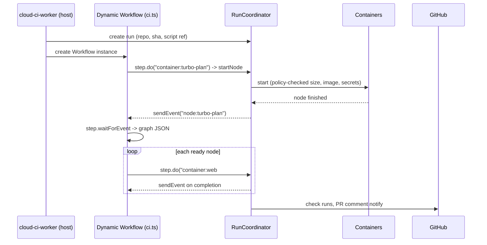

# Dynamic pipelines: CI as durable TypeScript workflows

Status: Proposed. [ADR 0009](../adr/0009-typescript-pipeline-workflows.md), which this design
implements, is **Accepted**; this document's defaults and APIs are still proposals.

> Every threshold, default, and API name here is a proposed starting point. Implementation is out
> of scope until the Phase 0 spikes in [the roadmap](../roadmap.md) land.

Related: [ADR 0009](../adr/0009-typescript-pipeline-workflows.md),
[ADR 0010](../adr/0010-pluggable-executors.md), [settings](./settings.md),
[parallelization](./parallelization.md), [pr-comment](./pr-comment.md), [assets](./assets.md),
[analytics](./analytics.md), [auth](./auth.md)

## Summary

A pipeline is a TypeScript **script** in `.cloud-ci/pipelines/<name>.ts` — one file per pipeline
(`ci.ts`, `deploy.ts`, `maintenance.ts`). Each file declares its own `on:` triggers and runs as
its own Dynamic Workflow instance; several pipeline files can run for the same commit (e.g.
`ci.ts` on `pull_request`, `deploy.ts` on `push` to `main`), independently of each other. There is
no YAML pipeline format. The only static file is `.cloud-ci/settings.yml`
([settings](./settings.md)): non-executable repo config — PR comment behavior, check naming
defaults, concurrency policy (`concurrency.repository`, `concurrency.pipelines`,
`concurrency.pipeline`), cache/retention preferences, and which secrets a pipeline may request.
settings.yml cannot start a container or run code; it only narrows what pipeline scripts are
allowed to do.

A pipeline script does not return a static plan. It runs for the whole CI run: it starts
containers, reads their results, decides what to do next, and loops. The script can run
`turbo run --dry=json` in a container, parse the edges, and run each task in its own container as
soon as its dependencies finish. That logic lives in plain code using helpers from
`@cloud-ci/pipeline-sdk` and its integration modules (`@cloud-ci/pipeline-sdk/turbo`,
`@cloud-ci/pipeline-sdk/mise`), not in a fixed engine feature.

Scripts run as **Dynamic Workflows**: a Cloudflare Workflow whose code is loaded at runtime into a
Dynamic Worker. Every side effect (starting a container, waiting for it, publishing a check) is a
durable step. If the isolate is recycled mid-run, the script is re-executed from the top, and
completed steps return their recorded results instead of running again
(developers.cloudflare.com/dynamic-workers/usage/dynamic-workflows, checked 2026-10-01).

`RunCoordinator` stays the single writer of run state. The script *requests* things through a
narrow API; the coordinator enforces policy (secrets, runner limits, concurrency) and records
facts.

## Goals

- One pipeline file per workflow, each with its own triggers; multiple pipelines can run against
  the same commit without coordinating with each other.
- Turborepo/mise graphs executed node by node across containers, written as ordinary code.
- Full control over steps, sidecars, retries, conditional work, and fan-out from inside the
  script.
- Checks created explicitly and named by the script, not implied by job names.
- Crash-safe: a recycled isolate or a redeploy of `cloud-ci-worker` never re-runs finished work,
  and never silently drops a completion that arrived mid-crash.

## Non-goals

- Running the script in `cloud-ci-worker`'s own isolate. It runs in a Dynamic Worker that the
  host Worker loads; whether that sandbox isolates well enough is a Phase 0 spike.
- Letting the script grant itself secrets or bypass admin policy.
- Arbitrary npm imports in scripts in v1 (see [Open questions](#open-questions)).

## User experience

### Turborepo, one container per task

```ts
// .cloud-ci/pipelines/ci.ts
import { workflow } from "@cloud-ci/pipeline-sdk";
import { turbo } from "@cloud-ci/pipeline-sdk/turbo";

export default workflow({
  on: { pull_request: {}, push: { branches: ["main"] } },
  async run(ci) {
    const toolchain = ci.snapshot("toolchain", {
      files: ["mise.toml", "mise.lock"],
      run: "mise install",
    });
    const deps = ci.snapshot("deps", {
      from: toolchain,
      files: ["**/package.json", "pnpm-lock.yaml", "pnpm-workspace.yaml"],
      run: "pnpm install --frozen-lockfile",
    });

    const graph = await turbo.plan(ci, {
      snapshot: deps,
      tasks: ["build", "lint", "test", "typecheck"],
      affected: ci.event.kind === "pull_request",
    });

    const build = ci.check("ci/build", { required: true });
    const test = ci.check("ci/test", { required: true });
    const typecheck = ci.check("ci/typecheck", { required: true });

    await turbo.execute(ci, graph, {
      snapshot: deps,
      concurrency: 24,
      runner: (node) => (node.task === "build" ? "standard-2" : "auto"),
      check: (node) => {
        if (node.task === "build") return build;
        if (node.task === "test") return test;
        if (node.task === "typecheck") return typecheck;
        return null;
      },
    });
  },
});
```

### Discovery and triggers

`on` can be the static object shown above, or a function:

```ts
export default workflow({
  on: (ctx) => ctx.event.kind === "pull_request" && !ctx.labels.includes("skip-ci"),
  async run(ci) {
    /* ... */
  },
});
```

`ctx` carries read-only event data: `event` (kind, repo, sha, ref), `changedFiles`, `branch`,
`labels` — the same data the script sees as `ci.event`/`ci.changedFiles` during a run — and
nothing else: no network, no secrets. Discovery evaluates `on` without ever calling `run`: for the
static form it just reads the object; for the function form it loads the script once per event
into a Dynamic Worker isolate with egress blocked and a CPU budget
`[unverified: exact CPU budget]`, and calls `on(ctx)`. A function that throws, times out, or
exceeds the budget means the pipeline does not run for that event, and discovery reports it as a
`cloud-ci / config` failure annotation naming the file. Other pipeline files are not affected.
The static form stays the fast path: the host can decide to start a pipeline without
spinning up an isolate at all, and can cache the decision by the script's blob sha.

`turbo.execute` is ordinary library code, roughly:

```ts
export async function execute(ci, graph, opts) {
  const done = new Map<string, Promise<NodeResult>>();
  const runNode = (id: string): Promise<NodeResult> => {
    if (!done.has(id)) {
      done.set(id, (async () => {
        const deps = await Promise.all(graph.deps(id).map(runNode));
        if (deps.some((d) => !d.ok)) return ci.skip(id, "dependency failed");
        if (await ci.turboCache.has(graph.node(id).hash)) return ci.cached(id);
        return ci.container(id, {
          snapshot: opts.snapshot,
          runner: opts.runner(graph.node(id)),
          run: `turbo run ${graph.node(id).task} --filter=${graph.node(id).package}`,
          check: opts.check(graph.node(id)),
        });
      })());
    }
    return done.get(id)!;
  };
  await ci.limit(opts.concurrency, graph.ids().map((id) => () => runNode(id)));
}
```

Users who need something different copy or wrap it.

### One check per package

`turbo.execute`'s `check` callback can also fan out to one check per package instead of one check
per task, using the `turbo.checkPerTask` helper:

```ts
const packageTests = turbo.checkPerTask(ci, graph, {
  task: "test",
  name: "{{ package }}#test",
  required: true,
});

await turbo.execute(ci, graph, {
  snapshot: deps,
  concurrency: 24,
  check: (node) => (node.task === "test" ? packageTests(node) : null),
});
```

`turbo.checkPerTask` walks `graph` for nodes matching `task`, creates one `ci.check` per distinct
package the first time it sees that package (named by filling the `{{ package }}` MiniJinja
template, e.g. `package1#test`, `package2#test`), and returns a lookup function that
`turbo.execute`'s `check` callback uses to map each node to its package's check. Because `graph` is
already resolved by `turbo.plan`, the full set of packages — and so the full set of checks — is
known up front. `turbo.checkPerTask` can call `check.seal()` on each check after it attaches that
package's nodes, so a package check need not wait for the whole script to finish (see
[Check sealing](#check-sealing)).

### Steps and sidecars

```ts
await ci.container("e2e", {
  snapshot: deps,
  runner: "standard-3",
  sidecars: {
    postgres: { image: "postgres:17", env: { POSTGRES_PASSWORD: "ci" }, ready: "tcp:5432" },
  },
  steps: [
    { name: "migrate", run: "pnpm db:migrate" },
    { name: "playwright", run: "pnpm playwright test", reports: ["playwright-report/**"] },
  ],
});
```

### Conditional and dynamic work

```ts
if (ci.changedFiles.some((f) => f.startsWith("infra/"))) {
  const plan = await ci.container("tf-plan", { run: "terraform plan -out plan.bin" });
  await ci.container("tf-check", { run: "terraform show plan.bin", check: false });
}
```

### Splitting tests across shards

Sharding is a library helper, not a core primitive — it reuses the same deterministic split
algorithm as `cloud-ci split` ([parallelization](./parallelization.md)). `ci.shard` takes a
required `split` strategy (`"timing"`, `"file"`, or `"count"`) and a required count spec (a plain
integer, or `{ min, max, target }`); the engine resolves the actual shard count and per-shard file
assignment and gives each shard container a `{{ files }}` template variable (a list), plus
`{{ shard.index }}` and `{{ shard.total }}` — no shell glue in `run`, just MiniJinja templating.

A migration-backed suite only needs to migrate the database once. Run the migration as a plain
`ci.container` with its own `postgres` sidecar, snapshot that sidecar's data volume once the
migration finishes, then start each shard's own `postgres` sidecar `from:` that snapshot instead of
sharing one live sidecar across shards:

```ts
const test = ci.check("ci/e2e", { required: true });

const migrated = await ci.container("migrate", {
  snapshot: deps,
  sidecars: {
    postgres: { image: "postgres:17", env: { POSTGRES_PASSWORD: "ci" }, ready: "tcp:5432" },
  },
  run: "pnpm db:migrate",
});

const pgSnapshot = ci.snapshot("postgres-migrated", {
  from: migrated,
  sidecar: "postgres",
  volume: "/var/lib/postgresql/data",
});

const shards = await ci.shard("e2e", {
  snapshot: deps,
  split: "timing",
  count: { min: 2, max: 8, target: "5m" },
  sidecars: {
    postgres: { image: "postgres:17", from: pgSnapshot, ready: "tcp:5432" },
  },
  run: 'npx playwright test {{ files | join(" ") }} --reporter=blob',
  reports: [{ type: "playwright-blob", merge: "html" }],
  check: test,
});
```

Each shard starts its own `postgres` from the post-migration snapshot, so restoring it is a
filesystem copy, not a fresh `pnpm db:migrate` run, and no shard depends on another shard's sidecar
still being alive. That sidesteps needing one live sidecar reachable from many containers at once:
whether two Cloudflare Containers can reach each other over a private network at all is
`[unverified]` (see [Sidecars](#sidecars)) — a snapshot-per-shard sidecar never needs that, since
each shard's `postgres` lives inside that shard's own container next to the test runner. Whether a
container can start a sidecar from a snapshot another container's sidecar took, and how that
compares in speed with a cold `postgres` start, is a Phase 0 spike (see
[Open questions](#open-questions)); if sidecar-snapshot restore turns out as slow as a cold start,
per-shard migration is the fallback — slower, but needs nothing new.

`ci.shard` resolves the shard count and per-shard file assignment (timing-aware or round-robin,
same algorithm and same `test_timings` data as `cloud-ci split`), starts one `ci.container` per
shard — each with its own sidecars, if given — from the snapshot, and runs the generated merge step
once every shard reaches a terminal state. Resolving the shard count attaches all shards to the
check, so the check can report `in_progress` with a known total; it does not seal the check (see
[Check sealing](#check-sealing)). See [parallelization](./parallelization.md)
for split strategies, the merge barrier, and OOM-retry semantics — `ci.shard` is the
dynamic-pipelines entry point into that same design, not a separate one.

## Design

### Execution model



Each `ci.container(id, spec)` call is two durable operations:

1. `step.do("start:" + id)` asks `RunCoordinator` to start the node. This returns quickly and is
   idempotent on `id`.
2. `step.waitForEvent("done:" + id)`. The coordinator sends the event when the node finishes.

Waiting in an event, rather than inside a long `step.do`, means a 40-minute test job does not hold
a step open, and the isolate can be recycled while containers run.

**Node ids are the replay key** and must be unique and stable within a run. The SDK rejects a
duplicate id at the call site. Library helpers derive ids from turbo `taskId`s.

**Steps are retried, so effects must be idempotent.** Workflows persists a step's result once it
succeeds, but a step that fails or times out is retried, and its side effect may already have
happened. The coordinator therefore treats `(run_id, node_id)` as an idempotency key:

| Situation | Coordinator behavior |
| --- | --- |
| `startNode` retried after the container already started | Returns the existing node; never starts a second container |
| `startNode` with the same id but a different spec hash | Rejected as nondeterministic; run fails |
| Completion event delivered twice | The coordinator tracks delivery per `(run_id, node_id)` and keeps re-sending until the script acknowledges it — `ack` is recorded on the node by the next step after `waitForEvent`; `waitForEvent` itself only ever surfaces the first delivery to the script, so a duplicate send is harmless |
| Isolate crashes after consuming the completion event but before the next step persists it | The event is un-acked until that next step runs, so the coordinator has no record of an ack and re-sends the completion on its next attempt instead of treating the node as done; the script's `ack` is what closes the gap |
| Event arrives before the script waits for it | Supported by the protocol `[unverified: Workflows buffering of events sent before waitForEvent]`; if not, the coordinator re-sends on a timer until acknowledged |
| Run cancelled | Coordinator stops containers, marks nodes `cancelled`, and terminates the Workflow instance; late completion events for cancelled nodes are dropped |
| `waitForEvent` timeout (default: node timeout + 10 min) | Script sees a failed node with `timed out`; coordinator stops the container |

Step params and results must be RPC-serializable (per the Workflows API), so `ci.container`
returns a plain result object (status, exit code, durations, report and artifact ids), never a
live handle. Each node costs two steps, so the 10,000-step default allows about 5,000 nodes
minus `ci.check` and helper steps. The 2,000-node cap below keeps well clear of that.

### Determinism

On replay the script re-executes from the top, and completed steps return recorded values. Code
*between* steps must therefore make the same calls in the same order. Safe inputs are `ci.event`,
`ci.changedFiles`, `ci.readFile()` (at the run's sha), and step results. `Date.now()`,
`Math.random()`, and `fetch` (egress is blocked) are the hazards. The SDK lints for them, and the
coordinator detects divergence: a replayed start for an id it has never seen, after a completed
id was skipped, fails the run with `nondeterministic script`.

### Why the coordinator stays

The script decides *what* to run. `RunCoordinator` still:

- owns run/node state and is its only writer (D1 projection, Check Runs, PR comment notify);
- enforces policy the script cannot override: secret grants (none for fork PRs), runner min/max
  per repo, the `concurrency.repository`/`concurrency.pipelines`/`concurrency.pipeline` caps from
  [settings.yml](./settings.md) (a script's own `ci.limit` can only narrow further, never raise
  it), max nodes per run;
- starts and stops containers, mints per-node tokens, and receives agent uploads.

Without this split, a PR could edit its own script to request a production secret or 500
`standard-4` containers.

### Graph helpers

| Helper | Does |
| --- | --- |
| `turbo.plan(ci, opts)` | Runs `turbo run <tasks> --dry=json` in a container; returns a graph of `taskId`, `package`, `task`, `hash`, `outputs`, `dependencies` (fields per turborepo.dev/docs/reference/run, checked 2026-10-01) |
| `turbo.execute(ci, graph, opts)` | Dependency-ordered fan-out with cache-hit skipping and bounded concurrency (above) |
| `turbo.checkPerTask(ci, graph, opts)` | Creates and memoizes one `ci.check` per distinct value of a grouping key (default `package`) among a task's nodes, named via a MiniJinja template like `"{{ package }}#test"`; returns a lookup function for `turbo.execute`'s `check` callback (see [One check per package](#one-check-per-package)) |
| `mise.plan(ci, opts)` | Same for mise tasks `[unverified: mise's machine-readable graph command and format]` |
| `graph.fromJson(nodes)` | Builds cloud-ci's generic graph from an array already in cloud-ci's own node shape (`{ id, package, task, hash, dependencies, outputs }`); the primitive `turbo.plan`/`mise.plan` call internally after parsing their own tool's output |
| `graph.fromGraph(rawNodes, mapFn)` | Escape hatch for tools without a built-in integration module (Nx, Bazel, Pants, a custom script that prints JSON): calls `mapFn` over each of the other tool's own raw nodes to produce cloud-ci's node shape, then `graph.fromJson`s the result. Parsing the other tool's output format is the caller's job via `mapFn` — cloud-ci does not understand Nx/Bazel/Pants output itself |
| `ci.shard(id, opts)` | Deterministic test splitting, per-shard containers, and merge barrier, reusing the `cloud-ci split` algorithm ([parallelization](./parallelization.md)) |
| `ci.limit(n, thunks)` | Concurrency limiter that is replay-safe (ordering is by call, not completion); the per-call half of concurrency control — repo-wide caps come from settings.yml (see Limits below) |
| `ci.group(ids, spec)` | Run several nodes in one container to save startup cost |

`turbo` and `mise` are separate entry points (`@cloud-ci/pipeline-sdk/turbo`,
`@cloud-ci/pipeline-sdk/mise`), not exports of the core package. A script that only needs
`graph.fromJson`/`graph.fromGraph` and the generic `ci` API imports just `@cloud-ci/pipeline-sdk`
and does not bundle turbo- or mise-specific code.

Upstream outputs move through cloud-ci's Turborepo remote cache. Each node runs
`turbo run <task> --filter=<pkg>` without `--only`, so turbo restores upstream outputs from the
cache and runs just this task. `--only` would skip that restore (turborepo.dev/docs/reference/run,
checked 2026-10-01). Serving turbo's Remote Cache API (turborepo.dev/docs/openapi) from R2 is its
own compatibility project: auth, per-repo isolation, and read-only access for fork PRs so a PR
cannot poison artifacts that `main` trusts. Until it exists, the helpers fall back to cloud-ci
cache artifacts from declared `outputs`.

### Sidecars

Cloudflare Containers run one container per Durable Object instance. Whether two containers can
reach each other over a private network is `[unverified]`. v1 therefore runs sidecars as extra
processes inside the job's container: the agent starts them from their images' entrypoints
(image layers pulled into the job image at build time, or a multi-image runner image), waits for
`ready`, and tears them down after the steps. A sidecar that needs its own container — for example
one shared live sidecar reachable from several shard containers at once — is an open question; see
[Splitting tests across shards](#splitting-tests-across-shards) for the snapshot-per-shard
workaround that avoids needing it for the migrate-once case.

### Layered snapshots

Snapshots are layered, like Docker layers, so a source-only change doesn't invalidate the
toolchain or dependency install:

```ts
const toolchain = ci.snapshot("toolchain", {
  files: ["mise.toml", "mise.lock"],
  run: "mise install",
});
const deps = ci.snapshot("deps", {
  from: toolchain,
  files: ["**/package.json", "pnpm-lock.yaml", "pnpm-workspace.yaml"],
  run: "pnpm install --frozen-lockfile",
});
```

Each layer is keyed by a hash of `(parent key, copied files, commands)`. A node sets
`snapshot: deps` (the property is named `snapshot`; its value is a snapshot task, not a boolean)
to start from that layer's filesystem. Layers are long-lived across runs — reused whenever their
key is unchanged, not rebuilt per run — so a source-only commit reuses both the `toolchain` and
`deps` layers and only pays for copying source into the per-task containers. Layers are limited
to 20 GB and kept 30 days (developers.cloudflare.com/containers/platform/limits, checked
2026-09-30). Whether one container can start from a snapshot another took, and cross-container
restore speed versus a cold install, are Phase 0 spikes; the fallback is a lockfile-keyed
package-store cache ([assets](./assets.md)).

`ci.snapshot` can also capture a sidecar's data volume instead of the job container's own
filesystem:
`ci.snapshot(name, { from: containerResult, sidecar: "postgres", volume: "/var/lib/postgresql/data" })`
snapshots that volume as it stood when `containerResult`'s container finished, so a later
`ci.container`/`ci.shard` call can start its own `postgres` sidecar `from:` that snapshot instead
of a cold `postgres:17` plus a fresh migration. Same 20 GB/30-day limits and same cross-container
restore open question as above; see [Splitting tests across shards](#splitting-tests-across-shards)
for the worked example.

### GitHub status checks

Checks are opt-in: nothing is created unless the script asks for it, and names are chosen by the
script, not derived from node or task names. There is no aggregate or rollup check — the only
infra-created check is the settings check `cloud-ci / config` (settings.yml and pipeline-file
discovery errors; see [settings](./settings.md)). Branch protection names the script-created
checks directly.

- `ci.check(name, { required })` creates the check run immediately (`queued`), so branch
  protection sees it before any work starts. Nodes attach to it via `check: build` on
  `ci.container`; its conclusion is the worst of its attached nodes, with cached counting as
  success.
- Nodes with `check: null` (or omitted) report no check run; they still appear in the PR comment
  and dashboard — this is how a noisy check stays hidden without losing visibility elsewhere.
- Check names are MiniJinja templates (e.g. `"{{ pipeline }}/build"`) rendered in pipeline
  code; there is no settings.yml name template.

Naming a required check after a discovered task is unsafe: if the task leaves the graph, GitHub
waits forever for it. `required` only drives documentation and dashboard warnings; GitHub branch
protection does the enforcing.

#### Check sealing

A check's member set — the nodes attached to it — is fixed once the check is *sealed*. Before
sealing, the check stays `queued`/`in_progress` on GitHub no matter how many attached nodes have
already finished; this is what stops a check from going green on 1 of 1 attached nodes and then
flipping back to pending when the script attaches a second node later. Sealing happens:

- automatically, when the script's `run` function finishes scheduling — i.e. `run` returns and
  every scheduling call it made has resolved — the default for a check sized once a full plan is
  known, e.g. `turbo.execute`'s `check` mapping over an already-resolved `graph`;
- never by `ci.shard` itself: resolving the shard count only attaches the shards as members (they
  are not exposed before that point), and the check still seals by one of the two other rules;
- explicitly, via `check.seal()`, when a script needs a check to conclude before the script itself
  finishes (see the always-on check below).

Attaching a node to an already-sealed check is a script error; the coordinator fails the run. A
sealed check with no attached members concludes `success` with a "no matching tasks" summary,
unless the script itself failed, in which case it concludes `failure`.

#### An always-on required check

A required check that must exist on every run, even when nothing relevant changed, seals itself
immediately with an explicit conclusion instead of waiting on a node:

```ts
const docsLint = ci.check("ci/docs-lint", { required: true });

if (ci.changedFiles.some((f) => f.endsWith(".md"))) {
  await ci.container("docs-lint", { snapshot: deps, run: "pnpm lint:docs", check: docsLint });
} else {
  docsLint.seal({ conclusion: "skipped", summary: "no markdown files changed" });
}
```

GitHub's branch protection treats a required check's `skipped` conclusion (like `neutral`) the
same as `success` — required status checks must reach `successful`, `skipped`, or `neutral` before
a PR can merge (docs.github.com/repositories/configuring-branches-and-merges-in-your-repository/
managing-protected-branches/about-protected-branches, "Require status checks before merging",
checked 2026-10-01) — so a PR with no markdown changes is not blocked waiting on `ci/docs-lint`.

### Limits (proposed)

| Limit | Value | Reason |
| --- | --- | --- |
| Nodes per run | 2,000 | Coordinator state and UI |
| Workflow steps per run | Under the Workflows default of 10,000, configurable to 25,000 (developers.cloudflare.com/workflows/build/workers-api, checked 2026-10-01) | Each node costs about 2 steps |
| Script bundle | 1 MiB | Loaded on every replay |
| Concurrent containers | `concurrency.pipeline` in [settings.yml](./settings.md), default 32, caps containers for one pipeline run; `concurrency.pipelines` caps concurrent pipeline runs for the repo; `concurrency.repository` caps containers across all runs of the repo. A script's own `ci.limit` can only lower the per-run cap further, never raise it | Account-level container limits |

## Concurrency

A pipeline file can declare a concurrency group and whether a newer run in that group should
cancel one already in flight:

```ts
export const concurrency = { group: "{{ ref }}", cancelSuperseded: true };
```

Discovery reads this export the same way it reads `on` — without calling `run` — so the
coordinator knows the group and cancellation policy before starting the Workflow instance.
`group` is a MiniJinja template rendered against the triggering event (`{{ ref }}`,
`{{ pull_request.number }}`, ...); two runs of the same pipeline file with the same rendered group
serialize, and if `cancelSuperseded` is true, a newer run cancels the older one in the group (same
cancellation behavior as a manual [rerun](#reruns)). This is per-pipeline-file policy: it narrows
execution within a run, never the repo-wide caps. Those caps —
`concurrency.repository`/`concurrency.pipelines`/`concurrency.pipeline` — are enforced by the
coordinator from [settings.yml](./settings.md) regardless of what a pipeline file declares (see
[Limits](#limits-proposed) above).

## Data model

| Store | Key | Contents |
| --- | --- | --- |
| D1 `runs` | `run_id` | adds `script_path`, `script_blob_sha`, `workflow_instance_id` |
| D1 `nodes` | `(run_id, node_id)` | status (`pending`, `cached`, `running`, `succeeded`, `failed`, `skipped`), spec hash, check name, timings |
| D1 `checks` | `(run_id, name)` | required flag, check run id, conclusion |
| D1 `node_history` | `(repo_id, node_id)` | p50/p95 duration, cache hit rate; feeds `runner: "auto"` and grouping |
| R2 `cloud-ci-assets` | `runs/{run_id}/script.js` | Bundled script as executed, for replay and audit |
| R2 `cloud-ci-cache` | `turbo/{repo_id}/{hash}` | turbo cache artifacts |

A commit that triggers two pipeline files (e.g. `ci.ts` on `pull_request` and `deploy.ts` on
`push`) creates two independent `run_id`s with the same `sha` but different `script_path`; they
are not coordinated with each other beyond sharing the PR comment's run list
([pr-comment](./pr-comment.md)).

## Reruns

| Action | Behavior |
| --- | --- |
| Rerun run | New Workflow instance at the same sha; turbo cache makes completed nodes cheap or skipped |
| Rerun failed nodes | New instance with the previous run's succeeded node results injected; `ci.container` returns them without starting containers |
| Retry inside a run | Script-controlled (`retries` on `ci.container`); OOM retry one size up stays a coordinator policy |

## Security considerations

- Scripts come from the PR head, including forks. They run in a host-loaded Dynamic Worker with
  egress blocked and no bindings except the `ci` API. The Phase 0 spike must confirm this
  isolation; if it cannot, this design does not ship (see
  [ADR 0009](../adr/0009-typescript-pipeline-workflows.md)).
- Workflow instance metadata is readable by the Dynamic Worker, so it carries only ids, never
  tokens (per the caution in the Dynamic Workflows docs above).
- Secrets are requested by name in `ci.container({ secrets })` and granted by the coordinator
  per admin policy, narrowed per pipeline by [settings.yml](./settings.md); fork PRs get none
  unless an admin approves the run.
- Credentials for non-default executors (AWS keys, kubeconfig) live in Secrets Store and are
  never passed to scripts or jobs — see [ADR 0010](../adr/0010-pluggable-executors.md).
- Container commands come from repo code, as in any CI; the isolation boundary for them is the
  container, not the script sandbox.

## Failure modes

| Failure | Behavior |
| --- | --- |
| Script throws | Run `failed`; running nodes are cancelled; every unsealed check the script created concludes `failure` with the stack trace in its summary |
| Nondeterministic replay | Run `failed` with the first diverging call |
| Isolate recycled or Worker redeployed | Workflow resumes; finished steps are not repeated |
| Container lost | Coordinator marks the node failed and sends its event; the script decides whether to retry |
| Script never awaits a started node | At script end, the coordinator cancels orphaned nodes |

## Open questions

1. Can workers-rs host the Worker Loader and Workflow bindings, or is the host side a small
   TypeScript module? `@cloudflare/dynamic-workflows` is a JS library, so a TS host is likely.
2. Container-to-container networking for real sidecars.
3. Cross-container snapshot restore and its speed compared with a cold install.
4. npm imports in scripts: resolve from the repo lockfile at plan time, or keep v1 to
   `@cloud-ci/pipeline-sdk` only?
5. Step pricing and latency of Workflows for runs with about 1,000 nodes.

## Alternatives considered

| Alternative | Why not |
| --- | --- |
| Static plan returned by `pipeline.ts`, expanded by adapters (previous draft) | Every new behavior (sidecars, conditional fan-out, custom retry) becomes an engine feature and a config key |
| Script runs inside a long-lived "orchestrator" container | Pays a container for the whole run; a crash loses orchestration state without hand-written checkpointing |
| Our own replay journal in `RunCoordinator` instead of Workflows | Re-implements durable execution that Workflows already provides |
| Starlark or Lua scripts | Neither runs in Dynamic Workflows; we would host and sandbox an interpreter ourselves |
| Built-in `parallel:`/sharding engine feature (previous draft) | Same reasoning as every other engine feature: `ci.shard` keeps split strategy, runner choice, and merge logic in script code and reuses the `cloud-ci split` algorithm, rather than adding a second, YAML-only sharding config |
