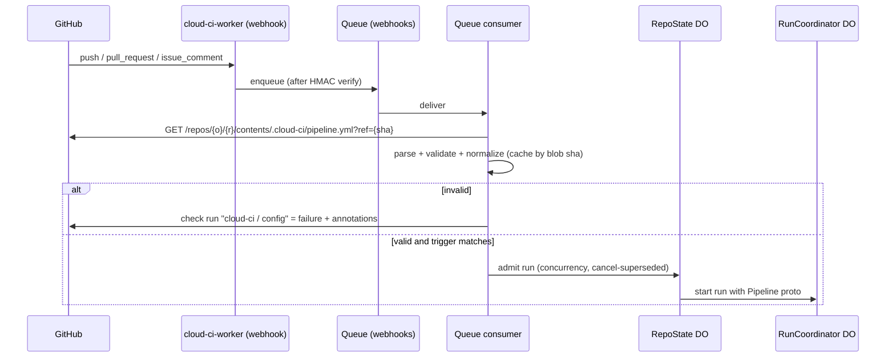

# Pipeline configuration (`.cloud-ci/pipeline.yml`)

Status: Proposed

> If ADR 0009 is accepted, this YAML format becomes the static option, executed by a built-in
> script. Pipelines can instead be TypeScript scripts that orchestrate containers directly,
> including Turborepo/mise graphs.
> See [dynamic-pipelines](./dynamic-pipelines.md) and
> [ADR 0009](../adr/0009-typescript-pipeline-workflows.md).

Related: [../architecture.md](../architecture.md), [./parallelization.md](./parallelization.md), [./analytics.md](./analytics.md), [./pr-comment.md](./pr-comment.md), [./ai.md](./ai.md), [./auth.md](./auth.md), [./assets.md](./assets.md), [./byo-ci.md](./byo-ci.md)

## Summary

A repository opts into managed runs by committing `.cloud-ci/pipeline.yml`. The file uses a small YAML format of our own. It describes triggers, a DAG of jobs, the commands each job runs, the image and runner each job uses, the secrets, caches, artifacts, and reports each job declares, sharding, and per-repo toggles for the PR comment and AI features. On every triggering event, `cloud-ci-worker` fetches the file at the exact commit sha through the GitHub contents API, validates it, and normalizes it into the `cloud_ci.v1.Pipeline` protobuf message from `cloud-ci-proto`. `RunCoordinator` executes that message. The YAML is only an input format; the proto is the contract.

The format is deliberately not GitHub Actions syntax. There is no `uses:`, no `${{ }}` expression language, and no marketplace actions. Repos that need those keep GitHub Actions and report into cloud-ci via [bring your own CI](./byo-ci.md).

## Goals

- One file, readable without documentation, that covers the full feature set: DAG, autoscaled runners, sharding, report merge, and the PR comment and AI toggles.
- Deterministic: the same file at the same sha always normalizes to the same `Pipeline` message. No runtime evaluation of user code in the Worker.
- Errors point to a line and column and appear as a failed `cloud-ci / config` check run on the commit.
- First-class fields for the things cloud-ci has opinions about: `runner: auto`, `parallel`, `reports`, and `artifacts` with `type: site`.
- Secure defaults for fork PRs, secrets, and autofix.

## Non-goals

- Compatibility with GitHub Actions, GitLab CI, or CircleCI syntax, including partial compatibility.
- An expression or templating language. Conditional logic is limited to declarative filters.
- Build matrices in v1. Use YAML anchors, or `parallel` for test sharding. See Open questions.
- Sidecar services (databases) or Docker-in-Docker in v1. One container per job.
- Multiple pipeline files per repo or `include:` of remote files in v1.

## User experience

### Annotated full example

```yaml
version: 1                       # required; only 1 is accepted
name: web                        # optional; shown in dashboard and check-run prefix

triggers:                        # "triggers", not "on" (YAML 1.1 parses bare `on` as boolean true)
  push:
    branches: [main, "release/*"]    # glob on branch name; omit = all branches
    tags: ["v*"]                     # omit = tag pushes ignored
    paths_ignore: ["docs/**", "**/*.md"]
  pull_request:
    branches: [main]                 # base branch filter
    types: [opened, synchronize, reopened, ready_for_review]   # this is the default
    drafts: false                    # skip draft PRs (default true = run on drafts)
    forks: no_secrets                # no_secrets | approval | skip  (read from DEFAULT branch)
  manual:
    inputs:
      deploy_env: { type: choice, options: [staging, production], default: staging }
      verbose:    { type: boolean, default: false }
  schedule:
    - cron: "0 6 * * 1-5"            # 5-field, always UTC, min interval 15m
      branch: main

concurrency:
  group: pr                          # ref | pr | none ; default: pr for PRs, ref otherwise
  cancel_superseded: true            # cancel older in-flight run of the same group
  limit: 4                           # max concurrent managed runs for this repo

pr_comment:
  enabled: true                      # repo-level master switch is in dashboard settings
  sections: [summary, tests, coverage, timings, artifacts, ai]

ai:
  summaries: true                    # Workers AI failure summary in PR comment
  suggestions: true                  # perf suggestions from analytics
  autofix: review                    # off | review | pull_request | push (read from DEFAULT branch)

defaults:
  image: node22                      # name from the deployment image catalog
  runner: { auto: true, min: basic, max: standard-3, initial: basic }
  timeout_minutes: 30
  env:
    CI_LOG_LEVEL: info

jobs:
  install:
    steps:
      - run: pnpm install --frozen-lockfile
    cache:
      - key: { prefix: pnpm, files: [pnpm-lock.yaml] }
        paths: [~/.local/share/pnpm/store]
        policy: pull-push            # pull-push | pull | push
    artifacts:
      - name: node_modules
        path: node_modules/
        retention_days: 1

  lint:
    needs: [install]
    download: [install.node_modules] # <job>.<artifact>; job must be in transitive needs
    runner: basic                    # fixed instance type
    steps:
      - run: pnpm lint

  unit:
    needs: [install]
    download: [install.node_modules]
    steps:
      - name: Vitest
        run: pnpm vitest run --reporter=junit --outputFile=reports/junit.xml --coverage
    reports:
      - { type: junit, path: "reports/*.xml" }
      - { type: coverage, format: lcov, path: coverage/lcov.info }
    artifacts:
      - { name: coverage-html, path: coverage/, type: site, when: always }

  e2e:
    needs: [install]
    download: [install.node_modules]
    image: playwright
    runner: standard-2
    secrets: [E2E_LOGIN_PASSWORD]    # repo secret first, then granted deployment secret
    parallel:
      shards: auto                   # 1..64, or auto
      split: timing                  # timing | file | count
      files: "tests/e2e/**/*.spec.ts"
      min: 2                         # auto bounds, default 2
      max: 12                        # auto bounds, default 16
      target: 5m                     # auto: pick shard count so each shard runs ~5m; default 10m
      fail_fast: false               # cancel remaining shards on first failure; default false
      merge:
        runner: basic                # instance type for the generated e2e/merge job; default basic
    steps:
      - run: pnpm playwright test --reporter=blob $(cloud-ci split)
      - name: Upload traces on failure
        when: on_failure             # on_success (default) | on_failure | always
        run: tar czf traces.tgz test-results/
    reports:
      - { type: playwright-blob, path: blob-report/, merge: html }   # reporter for the generated merge job
    artifacts:
      - { name: traces, path: traces.tgz, when: on_failure, retention_days: 7 }

  deploy:
    needs: [lint, unit, e2e]
    filters:
      events: [push, manual]
      branches: [main]
    runner: standard-1
    secrets: [CLOUDFLARE_API_TOKEN]
    timeout_minutes: 15
    steps:
      - run: pnpm deploy --env "${CLOUD_CI_INPUT_DEPLOY_ENV:-staging}"
```

### Minimal example

```yaml
version: 1
triggers: { push: { branches: [main] }, pull_request: {} }
jobs:
  test:
    steps:
      - run: cargo test --workspace
```

With no `image`, the job uses the deployment's `default` image (built from `cloud-ci-runner-image`). With no `runner`, it uses the deployment default (`auto`, min `basic`, max `standard-4`, initial `standard-2`).

## Design

### Fetching the config



- Request: `GET /repos/{owner}/{repo}/contents/.cloud-ci/pipeline.yml?ref={sha}` with an installation token (`contents: read`). The default JSON media type returns `sha` (the blob sha) and base64 `content`. Files of 1 MB or smaller support all features of this endpoint. Files between 1 and 100 MB need the `raw` or `object` media type (verified 2026-09-30, https://docs.github.com/en/rest/repos/contents). We cap config at 256 KiB, so the JSON form always works.
- `ref` is always a commit sha, never a branch name, so a push that lands between webhook and fetch cannot swap the config. For `pull_request`, the sha is `pull_request.head.sha`. Fetching a fork head sha through the base repo's contents API is `[unverified]`. If it fails, fall back to `GET /repos/{o}/{r}/git/blobs` after resolving the tree via `refs/pull/{n}/head`.
- Parse cache: D1 `pipeline_configs` keyed by `(repo_id, blob_sha)` stores the normalized proto bytes or the error list. Identical files across commits parse once.
- `404`: the repo has no managed pipeline. No check run is created. External runs still work.
- Every run stores its normalized `Pipeline` in R2 at `runs/{run_id}/pipeline.pb`. Reruns (`check_run.rerequested`, `/cloud-ci rerun`, dashboard) reuse it and never refetch.
- Policy keys come from the default branch. `triggers.pull_request.forks`, `ai.autofix`, and `concurrency.limit` are read from the config at the default-branch head, fetched the same way and cached by blob sha. A PR cannot widen its own fork policy, enable autofix for itself, or raise its own concurrency. If the default branch has no config, the defaults apply (`forks: no_secrets`, `autofix: off`).

### Triggers

| Trigger | Source event | Filters | Notes |
| --- | --- | --- | --- |
| `push` | `push` webhook | `branches`, `branches_ignore`, `tags`, `tags_ignore`, `paths`, `paths_ignore` | Branch deletions (`deleted: true`) are ignored. Without `tags`, tag pushes are ignored. |
| `pull_request` | `pull_request` webhook | `branches` (base), `types`, `drafts`, `forks`, `paths`, `paths_ignore` | Default `types`: `opened, synchronize, reopened, ready_for_review`. `closed` cancels in-flight runs for the PR regardless of config. |
| `manual` | Dashboard "Run pipeline" (operator role), `/cloud-ci run [k=v ...]` PR comment (write permission), query API | `inputs` (`string`, `boolean`, `choice`; ≤ 20 inputs) | Inputs are exposed as `CLOUD_CI_INPUT_<UPPER_NAME>`. Validated against declared types before the run is created. |
| `schedule` | `RepoState` DO alarm | `cron` (5 fields, UTC), `branch` (default: repo default branch) | ≤ 10 entries per repo, minimum interval 15 min. The config is re-fetched at the branch head when the alarm fires. |

Path filters compare against the changed files. For `push`, that is the union of `commits[].added/modified/removed` in the payload. For `pull_request`, it is `GET /pulls/{n}/files`, which caps at 3000 files `[unverified]`. If the list is truncated, the filter counts as matched (fail-open toward running). Globs use gitignore-style `**` semantics.

Schedules do not map to Worker Cron Triggers, because an account allows 5 (Free) or 250 (Paid) Cron Triggers in total (verified 2026-09-30, https://developers.cloudflare.com/workers/platform/limits/). Instead, when a `push` to the default branch changes the config blob sha, the consumer sends the parsed `schedule` list to that repo's `RepoState`. `RepoState` persists it and sets one DO alarm for the earliest next fire time. A single deployment-wide Cron Trigger (`*/15 * * * *`) re-arms any `RepoState` whose alarm was lost. The schedule `branch` must exist when the alarm fires. If it does not, the occurrence is skipped and the miss is logged.

### Jobs and the DAG

- `jobs` is a map. Job ids match `^[a-z][a-z0-9_-]{0,62}$`. They appear as the check-run name `cloud-ci / {name|"pipeline"} / {job_id}`.
- `needs: [ids]` defines edges. The graph must be acyclic and every id must exist. A job without `needs` is a root.
- A job starts once all of its needs are terminal and the job's `when` is satisfied. `when` can be `on_success` (default: all needs succeeded or were skipped by filters), `on_failure` (at least one need failed), or `always`.
- `filters` (`events`, `branches`, `paths`) are evaluated once, at run creation. A filtered-out job is `skipped`, and skipped counts as success for dependents. No expressions exist beyond these.
- `download: [job.artifact]` restores named artifacts from upstream jobs before step 1. The source job must be a transitive dependency, so the artifact is guaranteed to exist or the dependent is skipped.
- `checkout` (job-level, default `{ depth: 1, submodules: false, lfs: false }`, or `false`): the agent clones the sha with a repo-scoped, read-only installation token minted per job. The token is not exposed to steps.
- `timeout_minutes`: default 60, maximum 360 (a deployment setting). On expiry the agent sends SIGTERM, waits a 30 s grace period, then `RunCoordinator` destroys the container.

### Steps

Each step is `run` (required) plus optional `name`, `env`, `working_directory`, `shell` (`bash` default, run as `bash -eo pipefail <file>`, or `sh`), `timeout_minutes`, `continue_on_error`, and `when` (`on_success` | `on_failure` | `always`, relative to earlier steps in the same job). Steps run sequentially in one container and share the filesystem. A job may have at most 100 steps. Logs stream to `RunCoordinator`. The agent collects reports and artifacts after the last step, according to each declaration's own `when`.

Built-in environment variables: `CI=true`, `CLOUD_CI=true`, `CLOUD_CI_RUN_ID`, `CLOUD_CI_JOB_ID`, `CLOUD_CI_SHA`, `CLOUD_CI_REF`, `CLOUD_CI_BRANCH`, `CLOUD_CI_EVENT`, `CLOUD_CI_PR_NUMBER` (PR runs), `CLOUD_CI_SHARD_INDEX` / `CLOUD_CI_SHARD_TOTAL` (1-based, sharded jobs), `CLOUD_CI_RUNNER` (resolved instance type), and `CLOUD_CI_INPUT_*`.

### Image

Cloudflare Containers using the `durable_object` scheduling policy select images from a named image map defined at deploy time (up to 100 names). Those images must be digest-pinned references in the Cloudflare managed registry or be built from a Dockerfile. Direct references to external registries are not supported for that policy (verified 2026-09-30, https://developers.cloudflare.com/containers/guides/image-management/). So `image:` is a catalog name, not an OCI reference:

- The deployment config (the Wrangler `images` map) defines names such as `default`, `node22`, and `playwright`. Each catalog image must contain the `cloud-ci` binary as its entrypoint. The supported pattern is `FROM <anything>` followed by `COPY --from=cloud-ci-runner-image /usr/local/bin/cloud-ci`.
- An unknown name fails validation and lists the available names. The catalog is read from `ctx.container.images` through the container shim (see [../architecture.md](../architecture.md)).
- Adding an image needs a redeploy. Whether `ctx.container.start({image})` accepts an arbitrary registry digest that is not in the map is `[unverified]`. If it does, a later version can allow `image: registry.cloudflare.com/...@sha256:...`.

### Runner

| Form | Meaning |
| --- | --- |
| `runner: standard-2` | Fixed instance type: one of `lite`, `basic`, `standard-1`..`standard-4`. |
| `runner: auto` | Shorthand for `{ auto: true, min: basic, max: standard-4, initial: standard-2 }`, the deployment-wide default bounds. |
| `runner: { auto: true, min: basic, max: standard-4, initial: basic }` | Rightsized within explicit bounds. `initial` is the instance used before any execution history exists; it defaults to `min`. Requires `min` ≤ `initial` ≤ `max` in the order `lite < basic < standard-1 < standard-2 < standard-3 < standard-4`. |
| `runner: { custom: { vcpu: 3, memory_gib: 10, disk_gb: 16 } }` | Custom, fixed shape — not combinable with `auto`. Requires 1–4 vCPU, ≤ 12 GiB, ≤ 20 GB disk, and ≥ 3 GiB per vCPU (limits per the design brief). Whether runtime `start({instance})` accepts custom specs is `[unverified]`. |

Instance sizes come from the design brief: lite 1/16 vCPU 256 MiB; basic 1/4 vCPU 1 GiB; standard-1 1/2 vCPU 4 GiB; standard-2 1 vCPU 6 GiB; standard-3 2 vCPU 8 GiB; standard-4 4 vCPU 12 GiB. `lite` is accepted, but validation warns that 256 MiB is too small for most toolchains. With no execution history, a job starts at `initial`; once enough runs exist, rightsizing picks the smallest size whose p95 duration and peak memory fit comfortably within bounds, and an OOM at any size retries the job once at one size up, never above `max`. `auto` rightsizing only ever selects among the named `min..max` ladder; it never produces or adjusts a `custom` shape, since `custom` is a static per-job declaration with no size range to search. Both are specified in [./analytics.md](./analytics.md). For shards, the runner applies per shard.

### Env and secrets

- `env` maps at three levels: `defaults.env`, job `env`, and step `env`. The innermost level wins. Values are literal strings. `$VAR` is expanded by the shell, not by cloud-ci. Each value is limited to 32 KiB.
- `secrets: [NAME, ...]` (job-level only) is the complete list of secrets delivered to that job. Undeclared secrets are never present. Names match `^[A-Z][A-Z0-9_]{0,63}$`.
- Resolution order for each name:
  1. **Per-repo secret**: stored in D1 `repo_secrets`, encrypted with AES-256-GCM. The key is derived through HKDF from the Workers secret `SECRETS_MASTER_KEY` and the `repo_id`. Repo admins set secrets in the dashboard. Values are write-only and never returned by the API.
  2. **Deployment secret**: a Workers secret named `CI_SECRET_<NAME>`, set with `wrangler secret put`. It is usable by a repo only if a D1 `secret_grants` row grants it. Workers allows 64 (Free) / 128 (Paid) variables per Worker, at 5 KB each (verified 2026-09-30, https://developers.cloudflare.com/workers/platform/limits/). For that reason deployment secrets are meant for a few org-wide credentials, and most secrets should be per-repo.
- A declared name that resolves nowhere fails the job before the container starts, with the error `secret NAME not found in repo or granted deployment secrets`.
- Delivery: the agent fetches the resolved values from `RunCoordinator` over its per-job token at job start. The values are held in memory and injected into each step's environment. The agent masks every value of 4 or more bytes, plus its base64 form, in the log stream before upload.
- Fork PRs follow `forks` from the default-branch config:
  - `no_secrets` (default): the run proceeds, and any job that declares `secrets` is `skipped` with a reason.
  - `approval`: the run waits in `RepoState` until a user with write permission comments `/cloud-ci approve`. The approval is pinned to the head sha, so a new push requires a new approval.
  - `skip`: fork PRs never run.

### Cache

```yaml
cache:
  - key: { prefix: cargo, files: [Cargo.lock, rust-toolchain.toml] }
    paths: [~/.cargo/registry, target/]
    policy: pull-push
    restore_prefixes: [cargo-]      # optional fallbacks, longest match newest first
```

- The effective key is `{prefix}-{first 16 hex of sha256(concat(sha256(file) for file in files sorted))}`. Without `files`, the key is `{prefix}`. There is no templating. `prefix` matches `^[a-z0-9][a-z0-9._-]{0,63}$`.
- Scope: entries are written under the run's ref scope (`branch:<name>` or `pr:<n>`). Reads try the run's own scope first, then the PR base branch, then the default branch. PR and fork runs never write to branch scopes.
- Storage: R2 `cache/{repo_id}/{scope}/{key}.tar.zst`, with metadata in D1 `cache_entries`. Limits: 5 GiB per entry and 20 GiB per repo, evicted least-recently-used by the retention cron (deployment settings). Container snapshots as a warm-cache alternative are an open question in [./analytics.md](./analytics.md).

### Artifacts and reports

| Field | Artifacts | Reports |
| --- | --- | --- |
| identity | `name` (unique per job, `^[a-z0-9][a-z0-9._-]{0,63}$`) | `type` + `path` |
| `path` | file, directory, or glob | file, directory, or glob |
| `type` | `file` (default) or `site` (HTML dir served on asset host, see [./assets.md](./assets.md)) | `junit`, `vitest-json`, `playwright-json`, `playwright-blob`, `vitest-blob`, `coverage` (`format: lcov`/`cobertura`), `benchmark`, `timings` |
| `when` | `on_success` (default) / `on_failure` / `always` | `always` (default) / `on_success` / `on_failure` |
| extra | `retention_days` (1..deployment max), `index` (site entry file, default `index.html`) | `merge` (blob types only: reporter for the generated merge job, e.g. `html`; see `parallel.merge` for that job's execution config) |

The agent uploads both through `cloud-ci upload`, the same code path BYO CI uses ([./byo-ci.md](./byo-ci.md)). If a report path matches nothing, the agent logs a warning but the job does not fail; `required: true` turns that into a failure. Blob reports (`playwright-blob`, `vitest-blob`) in a sharded job generate a `<job>/merge` job that depends on every shard. By default it runs `npx playwright merge-reports --reporter <merge> <dir>` (verified 2026-09-30, https://playwright.dev/docs/test-sharding) or `npx vitest --merge-reports <dir>` (verified 2026-09-30, https://vitest.dev/guide/reporters) and uploads the result as a `site` artifact; `parallel.merge.runner`, `.setup`, and `.command` control its instance type, pre-merge steps, and the exact command. See [./parallelization.md](./parallelization.md).

### Parallel

`parallel` (job-level):

| Field | Type | Default | Notes |
| --- | --- | --- | --- |
| `shards` | int 1..64, or `auto` | `auto` | fixed shard count, or computed |
| `split` | `timing` \| `file` \| `count` | `timing` | strategy `cloud-ci split` uses |
| `files` | glob or list of globs | required when `split` is `file` or `timing` | universe of files to divide |
| `min` | int | `2` | lower bound for `auto` |
| `max` | int | `16` | upper bound for `auto` |
| `target` | duration | `10m` | `auto` only: pick a shard count so each shard runs about `target`, by history |
| `fail_fast` | bool | `false` | cancel the remaining shards in the group on the first shard failure |
| `merge.runner` | instance type | `basic` | instance type for the generated `<job>/merge` job |
| `merge.setup` | step[] | `[]` | steps run in the merge job before the merge command |
| `merge.command` | string | generated | overrides the generated merge command entirely |

`cloud-ci split` reads the universe and `CLOUD_CI_SHARD_INDEX` / `CLOUD_CI_SHARD_TOTAL`, then prints this shard's files. With `auto`, the shard count resolves to `clamp(ceil(historical_total_duration / target), min, max)` at run creation, falling back to `min` when there is no history. Shards form one shard group with one check run per shard. Dependents wait at the `RunCoordinator` merge barrier. Full semantics, including `fail_fast` propagation and the source of historical timing, are in [./parallelization.md](./parallelization.md).

### `pr_comment` and `ai`

- `pr_comment: true | false | { enabled, sections }`. It is effective only if the repo's dashboard setting allows PR comments. The dashboard is the master switch, and the config can only narrow it. Check runs per job are always created. Behavior is in [./pr-comment.md](./pr-comment.md).
- `ai: false | { summaries, suggestions, autofix }`. `summaries` and `suggestions` are read from the head config. `autofix` is read only from the default-branch config:
  - `off` (default)
  - `review`: a suggested-changes review
  - `pull_request`: a fix PR
  - `push`: push to the PR branch. This also requires the repo dashboard opt-in and is never allowed for protected branches or fork PRs.

  See [./ai.md](./ai.md).

### Concurrency and cancel-superseded

`RepoState` enforces these settings when it admits a run.

- `group`:
  - `pr`: key `pr:<n>`. The default for `pull_request`.
  - `ref`: key `ref:<name>`. The default for `push`.
  - `none`: each run is its own group.

  Manual and schedule runs use `ref`.
- `cancel_superseded`: defaults to `true` for PR groups and `false` for ref groups. When a new run is admitted to a group, `RepoState` tells the older in-flight run's `RunCoordinator` to cancel. Cancellation means SIGTERM, a 30 s grace period, then destroying the containers. Cancelled check runs conclude `cancelled`. If `cancel_superseded` is `false`, runs in the group queue first-in-first-out.
- `limit`: the maximum number of concurrent managed runs for the repo, 1..50, default 10. It is read from the default branch. Admitted runs are also bound by the deployment-wide container cap. Queued runs show `queued` check runs.

### Field reference

| Path | Type | Default | Constraint |
| --- | --- | --- | --- |
| `version` | int | required | `1` |
| `name` | string | `pipeline` | `^[a-z0-9][a-z0-9_-]{0,31}$` |
| `triggers` | map | required | ≥ 1 of `push`, `pull_request`, `manual`, `schedule` |
| `triggers.push.{branches,branches_ignore,tags,tags_ignore,paths,paths_ignore}` | string[] | all branches, no tags | `x` and `x_ignore` mutually exclusive |
| `triggers.pull_request.types` | enum[] | see Triggers | subset of `opened, synchronize, reopened, ready_for_review, labeled` |
| `triggers.pull_request.drafts` | bool | `true` | |
| `triggers.pull_request.forks` | enum | `no_secrets` | `no_secrets`, `approval`, `skip`; default-branch only |
| `triggers.manual.inputs.<name>` | object | | `type` ∈ `string, boolean, choice`; `choice` needs `options` |
| `triggers.schedule[]` | `{cron, branch}` | | ≤ 10; ≥ 15 min interval |
| `concurrency` | `{group, cancel_superseded, limit}` | see above | `limit` 1..50 |
| `pr_comment` | bool \| object | `true` | sections ⊆ `summary, tests, coverage, timings, artifacts, ai` |
| `ai` | bool \| object | `{summaries: true, suggestions: true, autofix: off}` | |
| `defaults.{image,runner,timeout_minutes,env}` | | deployment defaults | same as job fields |
| `jobs` | map | required | 1..100 jobs |
| `jobs.<id>.needs` | string[] | `[]` | existing ids, acyclic |
| `jobs.<id>.when` | enum | `on_success` | `on_success, on_failure, always` |
| `jobs.<id>.filters` | `{events, branches, paths}` | none | events ⊆ trigger names |
| `jobs.<id>.image` | string | `default` | name in image catalog |
| `jobs.<id>.runner` | string \| object | `auto` | see Runner |
| `jobs.<id>.timeout_minutes` | int | 60 | 1..360 |
| `jobs.<id>.checkout` | bool \| object | `{depth: 1}` | `depth` 0 (full)..10000 |
| `jobs.<id>.env` / `steps[].env` | map<string,string> | | key `^[A-Za-z_][A-Za-z0-9_]*$`, no `CLOUD_CI_` prefix |
| `jobs.<id>.secrets` | string[] | `[]` | ≤ 50 |
| `jobs.<id>.cache[]` | object | | ≤ 10 per job |
| `jobs.<id>.download` | string[] | `[]` | `<job>.<artifact>` in transitive needs |
| `jobs.<id>.artifacts[]` / `reports[]` | object | | ≤ 20 each |
| `jobs.<id>.parallel` | object | none | see Parallel |
| `jobs.<id>.steps[]` | object | required | 1..100; `run` non-empty |

### Validation rules

Validation runs in three passes: YAML, schema, and semantic. All errors are collected (up to 50) instead of stopping at the first. Each error carries `line:col` and is posted as an annotation on the `cloud-ci / config` check run.

1. YAML 1.2 core schema, so `on`/`yes`/`no` are strings. Duplicate map keys are errors. Anchors and aliases are allowed, with alias expansion capped at 10,000 nodes (billion-laughs guard). Merge keys (`<<`) are allowed. Multi-document files are rejected.
2. Unknown keys are errors, not warnings, so typos like `need:` cannot silently pass. Each error suggests the nearest known key.
3. The DAG must be acyclic (the error names the cycle), every `needs`/`download` reference must exist, and `download` must be in transitive needs.
4. `image` must be in the catalog. `runner` bounds must be ordered. A custom runner must be within limits.
5. `parallel.files` is required when `split` is `file` or `timing`. Blob report types in a non-sharded job are accepted, and `merge` is ignored with a warning.
6. Secret names are syntax-checked only. Existence is checked at job start, so missing secrets do not fail validation of unrelated jobs.
7. Cron is parsed with 5 fields. Intervals under 15 minutes are errors.
8. Limits: 256 KiB file, 100 jobs, 100 steps per job, and at most 256 containers per run when every job's maximum shard count is expanded.

The parser lives in a pure-Rust module that does no I/O and is shared by the Worker and the CLI (see Open questions). A JSON Schema is generated from the same Rust types (`schemars` `[unverified]` for our serde setup) and published at `https://<deployment>/schema/pipeline.v1.json` for editor completion.

## Data model

```sql
CREATE TABLE pipeline_configs (repo_id INTEGER, blob_sha TEXT, pipeline_pb BLOB, errors_json TEXT,
  parsed_at INTEGER, PRIMARY KEY (repo_id, blob_sha));
CREATE TABLE repo_schedules (repo_id INTEGER, idx INTEGER, cron TEXT, branch TEXT,
  config_blob_sha TEXT, next_fire_at INTEGER, PRIMARY KEY (repo_id, idx));
CREATE TABLE repo_secrets (repo_id INTEGER, name TEXT, ciphertext BLOB, nonce BLOB, key_version INTEGER,
  updated_by TEXT, updated_at INTEGER, PRIMARY KEY (repo_id, name));
CREATE TABLE secret_grants (secret_name TEXT, repo_id INTEGER, PRIMARY KEY (secret_name, repo_id));
CREATE TABLE cache_entries (repo_id INTEGER, scope TEXT, key TEXT, size_bytes INTEGER,
  created_at INTEGER, last_hit_at INTEGER, PRIMARY KEY (repo_id, scope, key));
```

R2 keys: `runs/{run_id}/pipeline.pb` (immutable per run) and `cache/{repo_id}/{scope}/{key}.tar.zst`. `RepoState` holds the authoritative schedule and concurrency state. D1 `repo_schedules` is a mirror for the dashboard.

## Security considerations

- The config is untrusted input from anyone who can open a PR. The parser has bounded sizes and alias expansion, and nothing in the config is evaluated by the Worker.
- Policy keys (`forks`, `autofix`, `concurrency.limit`) come only from the default branch. A PR that edits them sees the old values until merge.
- Secrets reach only jobs that declare them, never reach jobs from fork PRs without explicit approval pinned to the sha, and are masked in logs. Masking is best-effort, and a step that prints transformed secrets can leak them; this is documented.
- The checkout token is read-only, scoped to one repo, and never exported to steps. Steps that need GitHub access must declare a secret.
- PR-scope caches cannot poison branch or default-branch caches, because writes are scope-restricted.
- Catalog-only images prevent a PR from pointing a job at an arbitrary image.

## Failure modes

| Failure | Behavior |
| --- | --- |
| Contents API 5xx / rate limited | Queue retry with backoff (max 5); then `cloud-ci / config` check run `failure` with "could not fetch config" |
| Config invalid | `cloud-ci / config` = `failure` with annotations; no jobs created |
| No config at sha | No managed run; external runs unaffected |
| Image removed from catalog after run start | Not-yet-started jobs fail with `image_not_found`; rerun uses stored proto and fails the same way until redeployed |
| Schedule alarm lost | Re-armed by the 15-minute safety Cron Trigger; at most one occurrence delayed, never double-fired (`next_fire_at` checked) |
| Approval pending forever | Fork runs in `approval` wait expire after 7 days and conclude `cancelled` |

## Open questions

1. Is `ctx.container.start({image})` usable with arbitrary Cloudflare-registry digests outside the deploy-time map, and with custom instance specs? That determines whether `image:` and `runner.custom` can be widened.
2. Shared parser location: a new `cloud-ci-pipeline` crate, or a module in `cloud-ci-proto-rust`? Local validation (`cloud-ci lint`) would need one of them, and neither is in the planned package list.
3. Should `pull_request` runs test the head sha (proposed) or GitHub's merge commit (`refs/pull/{n}/merge`)? Merge commits catch semantic conflicts but are recomputed asynchronously by GitHub.
4. Build matrices: add `matrix:` in v2, or keep YAML anchors as the answer?
5. YAML crate: `serde_yaml` is archived. Candidates are `serde_yaml_ng` and `saphyr`. Both need checking for YAML 1.2 core-schema behavior and span reporting on wasm32 `[unverified]`.

## Alternatives considered

| Alternative | Decision | Reason |
| --- | --- | --- |
| GitHub Actions workflow syntax | Rejected | Implied compatibility we cannot deliver: `uses:` needs the Actions runtime, marketplace, and Node/Docker action execution; `${{ }}` contexts (`github`, `secrets`, `matrix`, `needs`) are a large expression language to evaluate untrusted input against; `runs-on` labels do not map to instance types or `auto`; no concept of reports, merge jobs, or sites. Users with Actions workflows use BYO CI instead and keep their syntax. |
| Read `.github/workflows/*.yml` and run a subset | Rejected | Double-triggers alongside GitHub Actions and fails confusingly on the unsupported subset. |
| Programmable config (Starlark, TypeScript) | Rejected for v1 | Would require sandboxed evaluation of untrusted code in the Worker. Non-deterministic output complicates caching and reruns. |
| `${{ }}`-style templating for keys/conditions | Rejected | Structured `filters`, `when`, and cache `key.files` cover the needed cases with no evaluator. Shell expansion handles the rest. |
| `on:` as the trigger key | Rejected | YAML 1.1 parsers read `on` as boolean `true`, so the familiar key confuses tooling. `triggers:` is unambiguous. |
| Config stored in the dashboard (D1) instead of the repo | Rejected | Pipelines must be versioned with the code and reviewable in PRs. Repo-level policy that must not be PR-editable lives in dashboard settings or is read from the default branch. |
| Map each schedule to a Worker Cron Trigger | Rejected | The 250-per-account cap and redeploy-to-change. `RepoState` alarms scale per repo. |
